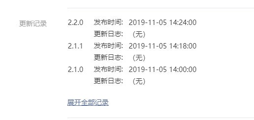
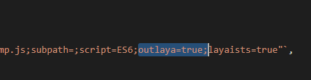
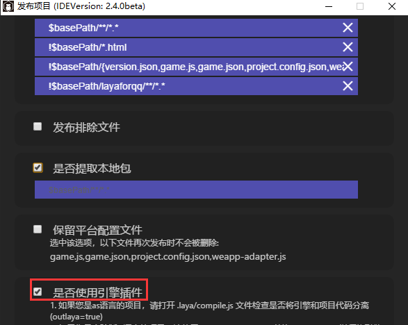
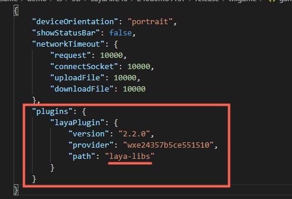

## LayaAir2.x微信小游戏引擎插件使用说明

 *IDEversion：2.4.0beta        Date：2019-11-11*

从微信7.0.7版本开始，微信小游戏通用引擎插件面向开发者开放，该插件内置了LayaAir 1.0系列与LayaAir2.0系列的正式版。

使用了小游戏引擎插件的产品，当玩家首次体验的游戏中包括了该插件，那所有使用该引擎插件相同版本的游戏，都无需再次加载，直接调用已加载的微信公共插件库中的引擎版本使用。

与从本地包加载引擎的原模式相比，引擎插件模式无疑会增强用户玩游戏时的加载体验。并且，随着微信7.0.7及以后版本的普及，未来可以只使用引擎插件，不再使用本地包中的引擎库。这样一来，还可以减少本地包中的引擎空间占用。对于寸土寸金的本地包而言，这无疑也是一大好处。

下面我们就针对引擎插件的使用，进行详细说明。


### 1、微信引擎插件支持哪些引擎版本

在微信引擎插件中，Layabox仅提供LayaAir正式版本引擎。

LayaAir 2.x引擎，当前支持2.0.1、2.0.2、2.1.0、2.1.1、2.2.0。

未来官网中的正式版本推出后，会在两周后同步更新到微信插件中。开发者也可以通过关注微信官网中的引擎插件更新纪录，来查看插件中的引擎版本是否已更新。

**LayaAir 2.x 引擎插件更新纪录查询地址为：**

https://mp.weixin.qq.com/wxopen/pluginbasicprofile?action=intro&appid=wx70d8aa25ec591f7a&token=&lang=zh_CN

打开链接后，找到更新纪录一栏，如下图所示，即可找到。

 

> 注：纪录中最早的1.0.0版本是引擎方对接微信插件调试时所用，开发者要忽视该版本。


### 2、旧版本IDE创建的项目适配

LayaAir引擎的插件库使用，只要是使用了2.4.0及以上版本IDE创建的项目，不需要开发者作任何修改，只要在发布时勾选了使用引擎插件，都会自动都适配好。

对于旧项目，TS与JS语言的项目，也是不需要开发者作任何修改，从2.4.0版本IDE开始，在编译和发布时就自动适配好。

LayaAir IDE 2.2.0以前版本创建的AS项目，由于引擎库JS与项目JS是在一起的。而使用引擎插件的前提是引擎库与项目库要分开，所以对于AS旧项目，要手动调整一下编译参数。否则，发布的时候就会报错。

#### AS版旧项目适配

如果你的项目是2.2.0 IDE版本之前创建的，需要用LayaAirIDE 2.4.0或更高版本打开之前的项目，再打开`.laya/compile.js` ，搜一下`asconfig.json;`在其后增加配置参数`outlaya=true;`如下图所示。

 

编译配置信息保存好之后，再次编译，引擎与项目的JS就会分离了。


### 3、如何使用引擎插件

#### 3.1 下载支持引擎插件的IDE版本

LayaAir IDE 2.4.0 beta版开始，IDE发布功能中内置了引擎插件的模块。方便开发者快捷使用引擎插件，所以开发者必须需要升级IDE到2.4.0 beta或更高版本。

LayaAir IDE 下载地址为： [https://ldc2.layabox.com/layadownload/?type=layaairide](https://ldc2.layabox.com/layadownload/?type=layaairide ) 

#### 3.2 LayaAirIDE中发布时勾选使用

当开发者在LayaAirIDE中发布微信小游戏的时候，勾选`是否使用引擎插件`的功能模块选项，如下图所示。

 

勾选后，发布的微信小游戏版本，会自动配置好引擎插件的相关配置。然后和普通发布小游戏的流程一样就可以了。

这里，我们为大家讲解一下，勾选后，LayaAir IDE做了哪些事。

##### 3.2.1 自动生成了引擎插件的本地目录

我们会发现，发布后的微信小游戏目录与没用引擎插件的目录相比，多了一个`laya-libs`目录。如下图所示。

 

这个多出来的`laya-libs`目录就是引擎插件本地版目录，这个目录的作用是为了兼容微信7.0.7以下版本用的。如果玩家的微信是低版本，则自动使用本地包引擎插件目录`laya-libs`下的引擎插件，如果是微信7.0.7及以上版本。这个目录则不会使用。

假如我们不考虑兼容7.0.7以下的版本用户，那是不是可以删除这个目录以减小本地包体的大小呢。可以的，如果要删除这个目录，把game.json里的`"path"`字段删除即可。这样就可以达到减小包体的目的。但是，我们不建议大家现阶段删除，毕竟低版本的微信普及也没有那么快，为了兼容性，先保留一阵。等以后普及率高了再考虑删除。

##### 3.2.2 修改了 game.json

除了多创建了一个`laya-libs`，IDE还修改了game.json。插件的使用全靠这里。如下图所示。

 

我们可以看到game.json里多了plugins（插件）配置。

```
version字段的内容是版本号，字段必须保留
provider是引擎插件提供者appId，千万不要动这里。
path字段，如果不考虑兼容7.0.7以下的用户和不需要使用本地版插件进行调试，可以删除本字段。
```

如果大家要想使用引擎插件，plugins这里的信息大家最好不要手工改，发布时IDE会自动生成，改了之后，会影响大家对于引擎插件的使用。


### 4、微信开发者工具中的配置

#### 4.1  调试基础库版本

微信开发者工具，点开详情，本地设置，调试基础库至少要2.9.0及以上版本才可以使用引擎插件。

 

#### 4.2 什么时候使用本地插件

本地设置里有一个选项 `使用本地的插件`，一般情况下不用勾选。如下图所示。

 

不勾选的时候，默认会采用引擎方提供的微信小游戏内置公用版本引擎插件库，只有在7.0.7以下版本才会读本地`laya-libs`目录下的引擎库。

一旦勾选，就会只采用本地`laya-libs`目录下的引擎库，而不再使用微信小游戏内置的公用版本引擎插件库。

除非是怀疑公用版本可能存在BUG，才需要勾选开启本地插件，通过本地与公用版本的对比，用于排查问题，或者真的有BUG，使用本地临时修改的版本。（一般是不需要的，引擎插件库只上传LayaAir引擎稳定版本，且会在官网更新后一两周才同步到引擎插件库）


### 5、FAQ

#### 5.1、插件版引擎中包括哪些引擎库？

微信插件版引擎，并非是官网中引擎库的全部。

LayaAir 2.x引擎 包括的库为：

```typescript
laya.ani.js
laya.core.js
laya.d3.js
laya.html.js
laya.particle.js
laya.ui.js
laya.webgl.js 	//仅在LayaAir2.1.0之前的版本存在 
laya.d3Plugin.js	//仅在LayaAir2.2.0之前的版本存在 
laya.filter.js 		//仅在LayaAir2.2.0之前的版本存在 
```

对于这些，开发者知道即可，后续可能会有所变化，不需要管太多，之前不用插件的时候怎么开发还是怎么开发。哪怕不知道引擎插件库包括哪些，也不影响使用。LayaAir会自动识别哪些库属于引擎插件库。不在插件库里的，引擎也会自动处理引用关系。

#### 5.2、开放域中可以使用引擎插件吗？

开放域中目前还不可以使用引擎插件。未来也许可以，微信小游戏支持团队的相关工作人员，已经在调测相关功能了。具体推出时间可以关注微信小游戏的消息与文档。

#### 5.3、LayaAir旧版本引擎在使用引擎插件有什么需要注意的吗？

引擎方面，要注意的是，必须要使用正式版，具体是哪些版本号，请按本文介绍的方式来查看。

IDE方面，必须要升级到 >= 2.4.0 版本。

其它的引擎与IDE都已做好适配，按本篇文档操作即可。


