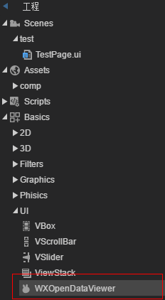

# 微信开放数据域展示组件

​	微信开放数据域使用一直是很麻烦的事情，需要特殊编码，并且会是性能瓶颈，还有经常发生鼠标事件对不上的问题

LayaAir2.0开始，Laya官方给出了微信开放域UI组件，一并解决上述问题，使其使用起来更简单，性能更高

开放数据域组件可以在工程树里面的 Basics > UI > WXOpenDataViewer 找到

## 如何使用

1.先设计一个开放数据域程序，比如大小为500*500

2.主域的IDE内，拉出一个WXOpenDataViewer组件到合适位置，设置大小为500*500

​	

3.在微信调试器里面查看，即可看到开放数据域内容，并且性能和鼠标事件都能达到最优化

总结：使用新的微信开放域数据组件，无需编码，即可展示开放域内容，并且性能和鼠标事件都能得到优化。