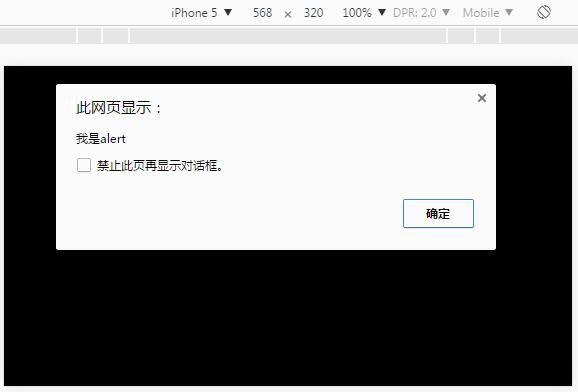

# AS3与JS混合编码

Interaction between AS3 and JS is a common requirement. Flash plug-in provides a simple interface function.`ExternalInterface.call`and`ExternalInterface.addCallback`Interact with JS. But by publishing HTML5, the flash interface will not work.

As an engine for writing HTML5 in AS3, LayaAir can use it`Browser.windows`and`__JS__`Methods interact with JS, and the AS compiler of LayaAir engine also supports specific macro compilation to help AS3 developers implement more complex AS3 and JS hybrid coding.

###1. Initial knowledge of AS3 and browser interaction

Suppose we create a startup class file named JSDemo.as to implement the native alert window effect of JS in AS3 code. The sample code is as follows:

**Method 1:**


```java

package 
{
	import laya.utils.Browser;
	public class JSDemo {
		
		public function JSDemo() 
		{
			//初始化引擎
			Laya.init(0, 0);
			//运行JS alert
			Browser.window.alert('我是alert');			
		}		
	}
}
```


**Mode two:**


```java

package 
{
	public class JSDemo
	{
		public function JSDemo()
		{
			//初始化引擎
			Laya.init(0, 0);
			//运行JS alert
			__JS__('alert("我是alert")');
		}
	}
}
```


The results of the above two modes are identical, as shown in Figure 1.

<br / >
(Fig. 1)

What's the difference between the two ways?

　　`Browser.window`This is a reference to the browser window. The global functions of the browser are all mounted on the`window`So you can use Browser. window. alert to call up the function of the pop-up window. All functions and attributes on all windows can be done in this way.

　　`__JS__`It is a macro compiler provided by the LayaCompiler compiler.`__JS__()`The code in the function will not be compiled and will be translated directly into JS code.


###2. AS3 Interactive Advancement with Browsers

The interaction between LayaAir engine and browser is much simpler than that of alert. Here's an example code to learn more about the interaction between AS and browser.

**Method 1:**


```java

package 
{
	import laya.utils.Browser;

	public class JSDemo
	{
		public function JSDemo()
		{
			//初始化引擎
			Laya.init(0, 0);
	
			var Height:int = Browser.window.innerHeight;
			var width:int = Browser.window.innerWidth;
			Browser.window.console.log("Console Log：浏览器高："+ Height + " 浏览器宽：" + width);
		}
	}
}
```


**Mode two:**


```java

package 
{

	public class JSDemo
	{
		public function JSDemo()
		{
			//初始化引擎
			Laya.init(0, 0);
			
			var BrowserInfo:String = __JS__('"Console Log：浏览器高：" + window.innerHeight + " 浏览器宽："+ window.innerWidth');
			trace(BrowserInfo);
		}
	}
}
```


The above two methods are completely consistent from the results of operation, as shown in Figure 2.

<br / >
(Fig. 2)

Relatively speaking, we recommend the above two approaches.`Browser.window`Mode interaction,`__JS__`Because JS code is written in the string, if you don't write the error carefully, and there is no error prompt, it will increase the cost of error checking.


###3. AS3 and JS hybrid coding

In the project, we will inevitably use third-party JS class libraries to assist development. So how do we deal with the AS project? Now let's take the most commonly used jquery. JS to explain.

First in jquery[官网下载](http://jquery.com/download/)Jquery.js version, for example, we use`jquery-3.2.0.min.js`。 On the index.html page of the project portal (usually located at“`bin\h5\`” Directory) Add`<script type="text/javascript" src="jquery-3.2.0.min.js"></script>`。

​*Tips: The introduction of third-party libraries must be added before the introduction of LayaAir engine libraries.*

After adding a reference to the library on the entry page, we write the following code in the AS3 entry library:


```java

package {
	import laya.utils.Browser;
	public class JSDemo {
		
		public function JSDemo() {
			//初始化引擎
			Laya.init(0, 0);
          	//Browser.window后的$(Browser.document)为第三方库jquery的方法。
			Browser.window.$(Browser.document).ready(function():void{
				
				Browser.window.alert("jquery调用成功");
			});
			
		}
		
	}
}
```


After compiling and running, we can see that the pop-up window is successful, indicating that the call has been successful. We successfully implemented hybrid coding in AS3 project.


###4. JS calls AS interface

Sometimes we have to cross-call the development project with the web developer, through the above method we can call the JS method of the web developer, then how can the web developer call the logic we write? In fact, developers can think further: we use AS3 to develop H5, in fact, through compiler directly compiled to generate js, so only need to expose the interface, let Web developers directly call our JS code. Here's a simple example code to illustrate the usage.

**The JSDemo.as code is as follows:**


```java

package {
	import laya.webgl.WebGL;

	public class JSDemo {
		
		public function JSDemo() {
			//初始化引擎
			Laya.init(0, 0);
			
		}
      //定义一个静态函数 对外暴露给web调用者。
		public static function getGameName():String
		{
			return "myGame";
		}
		
	}
}
```


Compile and run, then we open the browser console and enter`JSDemo.getGameName()`Find Output`"myGame"`As shown in Figure 3. It indicates that the call is successful, thus realizing the interaction with web developers.

<br / >
(Fig. 3)


The above example just defines a static method, and we can even open up all the methods and attributes inside.

The JSDemo.as code was modified as follows:


```java

package {
	import laya.utils.Browser;

	public class JSDemo {
		
		private var name:String = "Game";
		public function JSDemo() {
			//初始化引擎
			Laya.init(0, 0);
         	//定义一个命名空间的属性为app；
			Browser.window.app = this;
			
		}
		public static function getGameName():String
		{
			return "myGame";
		}
		public function getVersion():String
		{
			return "1.2.0";
		}
		
	}
}
```


Compile and run, open the browser console, and enter`app`,`app.name`,`app.getVersion()`You can see the effect as shown in Figure 4, which has achieved the effect of our call. From this we can see that the AS development of LayaAir engine and the interaction of web developers are seamless.

<br / >
(Fig. 4)


###5. Code Intelligent Tips

In the example above, we call the JS native method is simple, but the native JS method has no code hints in the AS3 project. Therefore, we use macro compilation to add function declarations manually to get code hints.

For example, let's create a window class（*`window.as`* To encapsulate functions commonly used by browsers.

The window.as code is as follows:


```java

/*[IF-FLASH]*/package
{
	public class window
	{
		public function window()
		{
		}
		public static function alert(msg:Object):void
		{			
		}
	}
}
```


`/*[IF-FLASH]*/`It's the compiler macro of LayaCompiler, and the subsequent classes will not be compiled into JS. If you don't know about this, please go ahead and learn about it.[宏编译教程文档](https://github.com/layabox/layaair-doc/blob/master/Chinese/LayaAir_AS3/LayaCompile_Macros.md)。


With this class, we can write windows methods directly, and have prompts (* premise is to use functions, must be encapsulated in advance *)

Now let's write one directly in the JS method`alert()`,

The JSDemo. as code is as follows.


```java

package {
	public class JSDemo {
		public function JSDemo() {
			//初始化引擎
			Laya.init(0, 0);
			window.alert("我是alert");
		}
	}
}
```


The compilation runs as shown in Figure 5, and alert is successfully executed. So, we can encapsulate the common Windows method developers. In the future, when mixed with JS coding, the code will have an intelligent prompt.

<br / >

(Fig. 5)


###6. AS Writes Nodejs

First, a new AS project is built, which is the original project of AS. LayaAir's class library can be ignored for the time being. The startup class of the project is set as Main.as; then, a new AS project is built.`require.as`。

Requ.as code is as follows:


```java

package
{
	/*[IF-FLASH-BEGIN]*/
	public class require
	{
		
		public function require(path:String)
		{
		}
		
	}
	/*[IF-FLASH-END]*/
}
```


​

The startup class Main.as code for the project is as follows:


```java

package
{
	public class Main
	{
		public var http:Object = require('http');
		public var net:Object = require('net');
		public var url:Object = require('url');
		public function Main()
		{
			var server:Object = this.http.createServer(clientHandler);
			server.listen(8989);
		}
		private function clientHandler(req:Object,respose:Object):void
		{
			trace("收到消息");
			respose.writeHead(200, {'Content-Type': 'text/plain'});
			respose.end('Hello Laya');
		}
	}
}
```


​*Tips: The API for creating a node server can be moved to[https://nodejs.org/](https://nodejs.org/)*


　　`Main.as`A dynamic server with port 8989 was created. The server received a request from the client and returned a Hello Laya.

　　`require.as`This class uses the macro compilation of the LayaCompiler compiler.`/*[IF-FLASH-BEGIN]*/`and`/*[IF-FLASH-END]*/`The code between the two tags is used for grammatical hints and does not participate in compilation (if you don't understand this, go ahead and learn about it first).[宏编译教程文档](https://github.com/layabox/layaair-doc/blob/master/Chinese/LayaAir_AS3/LayaCompile_Macros.md))

​**Compile this project:**

Start the compiled JS file of the project with node. Open command line input in the current directory`node Main.max.js`。 Then enter it in the browser[http://localhost:8989/](http://localhost:8989/)You can see it on the page: Hello LAYA.

So far, it shows that we have successfully written a dynamic server with AS code.