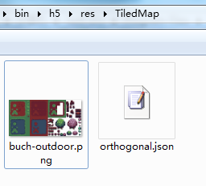

#Parsing Tiled Map Map Map with LayaAir Engine (Detailed)

> author:charley
>

Tiled Map Editor is a free map editor that can be used to edit 2D game maps. The LayaAir engine supports parsing maps exported from Tiled Map. This article describes how to use Tiled Map Editor-derived maps in LayaAir engine development.

> Note: This article is only for developers familiar with and using Tiled Map Map Map tools. This paper introduces how to use the map exported by tiled map editor in the project of layaair engine. For the content of tiled map editor tool, please find the third-party tutorial documents by yourself.
>
> Part of this document is new to LayaAir engine version 1.7.7. Please update the engine to version 1.7.7 or higher before reading this article.


##1. Tiled Map Map Map Supported by Export Engine

###1.1 Tiled Map Editor Download and Installation

Open the official home page（[http://www.mapeditor.org/](http://www.mapeditor.org/)) After that, click directly`DownLoad at itch.io`Button to enter download link（[https://thorbjorn.itch.io/tiled](https://thorbjorn.itch.io/tiled)) If the official website is redesigned, you can also download it directly from the download page.[http://www.mapeditor.org/download.html](http://www.mapeditor.org/download.html)Find the download link.

Find the corresponding system version link, download and install it. (* The version used in this document is Tiled 1.1.5*).

**Tips**:

*Open the download will pop up the payment page sponsoring the software. If you don't want to pay, you can click No thanks, just take me to the downloads, which will take you to a free download link.*

* If there is a problem with the version of the official website, GitHub`https://github.com/layabox/layaair-doc`There is a 64-bit version of Tiled 1.1.5*.


###1.2 Tiled Map Map Map Format Supported by Export Engine

The specific usage of tiled map tool is not covered in this article. You can search relevant tutorial documents in Baidu or Google by yourself. What matters a lot to the engine is the format. Developers need to pay special attention to the general problem is not noticed here.

####1.2.1 Requirements for Block Layer Format in Map Creation

Click on the new map, set the initial parameters such as map size and block size, click Save As, and the creation is completed when there is the location you specify.

However, the block layer format needs special attention because**The LayaAir engine does not support the Tiled Map map as a block layer format for Base64.**So in`创建`New map time**Must**by`CSV格式`As shown in Figure 1.

 


(Fig. 1)

**If it was created incorrectly**Or, in the Properties Panel, you can use the ____________`图块层格式`**Change to CSV or XML**As shown in Figure 2,**Base64 related formats are not supported.**

 


(Fig. 2)

####1.2.2 Export to JSON format

In this example, we directly open the example map of tiled map, orthogonal-outside.tmx (* located in the examples directory of tiled map installation directory *)

#####When exporting, we need to choose the JSON format.

In Tiled Tools`文件`In the menu, Click`另存为`To save the completed Tiled map as a JSON file type, this example is named orthogonal. JSON (file name developer is optional, then keep consistent). Click`保存`Save to**Project catalogue**(this example is`项目根目录\bin\h5\res\TiledMap\`As shown in Figure 3.

 


(Fig. 3)

###1.3 Modifying Atlas Path and Copying Tiled Resources

#####Just saving as a JSON file is not enough. We also need to change the image absolute path to a relative path.

We use IDE to open what we just saved.`orthogonal.json`Search for keywords`"image"`We will find that the default image path is in the Tiled installation directory. As shown in Figure 4.

 


(Fig. 4)

#####The path must not work in the Tiled installation directory.

So, we need to ** copy this picture (* buch-outdoor. png*) to the project directory first.**In contrast to what was previously preserved`orthogonal.json`At the same level,****

As shown in Figure 5.

 


#####(Fig. 5)
****
Then, in orthogonal. JSON`image`**Change path to relative path**`"image":"buch-outdoor.png",`

At the end of the preparation phase, the coding phase begins...


##2. LayaAir engine uses Tiled Map map

###2.1 Create Tiled Map Map Map

####2.1.1 createmap API description

The createMap method in the laya. map. TiledMap class can create a TiledMap map. The basic parameter description is shown in Figure 6.

 


(Fig. 6)

####2.1.2 Example of Creating Maps


```java

package
{
	import laya.map.TiledMap;
	import laya.maths.Rectangle;
	import laya.utils.Browser;
	import laya.webgl.WebGL;

	public class TiledMapDemo
	{

		private var tMap:TiledMap;
		public function TiledMapDemo()
		{
			//初始化舞台
			Laya.init(Browser.width, Browser.height, WebGL);
			//创建TiledMap实例
			tMap = new TiledMap();
			//创建Rectangle实例，视口区域
			var viewRect:Rectangle = new Rectangle(0, 0, Browser.width, Browser.height);
			//创建TiledMap地图
			tMap.createMap("res/TiledMap/orthogonal.json",viewRect);
		}
	}
}
```


Compile and run the code. The effect is shown in Figure 7, which shows that the map has been created successfully.

 


(Fig. 7)

###2.2 Control Map

The control map must first load the JSON of the map, and then control in the callback method. Below is an example of how to use it.

####2.2.1 map zooming

`laya.map.TiledMap`Class`scale`Attributes can control the scale of the map. Following the previous example, in the createMap method, we add callbacks, and then use`scale`Attributes zoom the map.

The sample code is as follows:


```typescript

package
{
	import laya.map.TiledMap;
	import laya.maths.Rectangle;
	import laya.utils.Browser;
	import laya.utils.Handler;
	import laya.webgl.WebGL;

	public class TiledMapDemo
	{
		private var tMap:TiledMap;
		public function TiledMapDemo()
		{
			//初始化舞台
			Laya.init(Browser.width, Browser.height, WebGL);
			
			//创建TiledMap实例
			tMap = new TiledMap();
			//创建Rectangle实例，视口区域
			var viewRect:Rectangle = new Rectangle(0, 0, Browser.width, Browser.height);
			
			//创建TiledMap地图，加载orthogonal.json后，执行回调方法onMapLoaded()
			tMap.createMap("res/TiledMap/orthogonal.json",viewRect, Handler.create(this,onMapLoaded));
		}
  
		private function onMapLoaded():void
		{
			//将原地图放大2倍
			tMap.scale = 2;
		}
	}
}
```


The operation effect is shown in Figure 8.

 


(Fig. 8)

####2.2.2 Setting the Center Point of Map Scaling

Obviously, the effect in Figure 8 is not what we want. After enlargement. Some of them did not show up. This is caused by the default zoom center in the central area of the viewport.

####Viewport area and default zoom center location

The viewport area is set in the second parameter of the creation map method (* createMap*).


```java

//创建Rectangle实例，视口区域
var viewRect:Rectangle = new Rectangle(0, 0, Browser.width, Browser.height);
//创建TiledMap地图，加载orthogonal.json后，执行回调方法onMapLoaded()
tMap.createMap("res/TiledMap/orthogonal.json",viewRect, Handler.create(this,onMapLoaded));
```


By looking at the code, we find that the viewport is set to the physical width and height of the browser（`Browser.width, Browser.heigh`) The default value of setViewPortPivotByScale, which controls scaling, is 0.5. Then the position of the center point is shown in Figure 9-1.

 


(Fig. 9-1)

When the map is doubled（`tMap.scale = 2;`）Because it is zoomed at the center points of the X and Y axes of the viewport area, the zoomed in result in the effect of figure 9-2.

 


(Fig. 9-2)

Next, we further understand the central point of scale attributes by moving Figure 9-3 from 0.1 to 2 times the original scale.

 


(Fig. 9-3)

####Setting the zoom center point with setViewPortPivotByScale method

The default zoom center effect is described in the previous article. How to set and change the zoom center? stay`laya.map.TiledMap`Class`setViewPortPivotByScale()`Method to set the center point of the viewport. The API basics are shown in Figure 10.

 


(FIG. 10)

`setViewPortPivotByScale()`The first parameter of the method, scaleX, is the scaled coordinate ratio in the direction of X axis, and scaleY is the scaled coordinate ratio in the direction of Y axis.

For example:


```java

tMap.setViewPortPivotByScale(0.1,0.5);
```


**Code description**:

Suppose the viewport size is 800*600

- scaleX value`0.1`The coordinate representing the x-axis scaling center point is 80 (800 * 0.1)

- scaleY value`0.5`The coordinates representing the center point of the y-axis zoom are 300 (600*0.5)

When the code runs, the center coordinates of X axis 80 and Y axis 300 are used to zoom and zoom.


####Set the zoom center to the upper left corner of the viewport

When setViewPortPivotByScale's zoom center is set to`0,0`The upper left corner of the viewport. Continue with the previous example, coded as follows:


```java

package
{
	import laya.map.TiledMap;
	import laya.maths.Rectangle;
	import laya.utils.Browser;
	import laya.utils.Handler;
	import laya.webgl.WebGL;
	
	public class TiledMapDemo
	{
		private var tMap:TiledMap;
		public function TiledMapDemo()
		{
			//初始化舞台
			Laya.init(Browser.width, Browser.height, WebGL);
			//创建TiledMap实例
			tMap = new TiledMap();
			//创建Rectangle实例，视口区域
			var viewRect:Rectangle = new Rectangle(0, 0, Browser.width, Browser.height);
			//创建TiledMap地图，加载orthogonal.json后，执行回调方法onMapLoaded()
			tMap.createMap("res/TiledMap/orthogonal.json",viewRect, Handler.create(this,onMapLoaded));
		}
		
		private function onMapLoaded():void
		{
			//设置缩放中心点为视口的左上角
			tMap.setViewPortPivotByScale(0,0);
			//将原地图放大2倍
			tMap.scale = 2;
		}
	}
}
```


When the zoom center is set in the upper left corner of the viewport and zoomed in twice, we can lay out the full screen on the iPhone 6 device without black edges. The effect is shown in Figure 11.

 


(FIG. 11)


###2.3 Drag Map

When the map is enlarged, it can not be displayed all. At this point, you need to drag the map to see all.

In addition to the methods described above, you need to use the`moveViewPort()`(Moving Viewport) Method and Method`changeViewPort()`(changing the size of the viewport) method. The basic descriptions of these two APIs are shown in Figures 12-1 and 12-2.

 


(Figure 12-1)


 


(Figure 12-2)

Let's look directly at the code to see how these two methods work.


```java

package
{
	import laya.events.Event;
	import laya.map.TiledMap;
	import laya.maths.Rectangle;
	import laya.utils.Browser;
	import laya.utils.Handler;
	import laya.webgl.WebGL;

	public class TiledMapDemo
	{

		private var tMap:TiledMap;
		private var scaleValue:Number = 0;
		private var MapX:Number = 0;
		private var MapY:Number = 0;
		private var mLastMouseX:Number;
		private var mLastMouseY:Number;
		public function TiledMapDemo()
		{
			//初始化舞台
			Laya.init(Browser.width, Browser.height, WebGL);
			//创建TiledMap实例
			tMap = new TiledMap();
			
			//创建Rectangle实例，视口区域
			var viewRect:Rectangle = new Rectangle(0, 0, Browser.width, Browser.height);
			//创建TiledMap地图，加载orthogonal.json后，执行回调方法onMapLoaded()
			tMap.createMap("res/TiledMap/orthogonal.json",viewRect, Handler.create(this,onMapLoaded));
		}


		private function onMapLoaded():void
		{
			//设置缩放中心点为视口的左上角
			tMap.setViewPortPivotByScale(0,0);
			//将原地图放大3倍          
			tMap.scale = 3;
			
			Laya.stage.on(Event.RESIZE,this, this.resize);
			Laya.stage.on(Event.MOUSE_DOWN, this, this.mouseDown);
			Laya.stage.on(Event.MOUSE_UP, this, this.mouseUp);
			resize();
		}
		
		/**
		 * 移动地图视口
		 */
		private function mouseMove():void
		{
			var moveX:Number = MapX - (Laya.stage.mouseX - mLastMouseX);
			var moveY:Number = MapY - (Laya.stage.mouseY - mLastMouseY)
			//移动地图视口
			tMap.moveViewPort(moveX, moveY);
		}
		
		
		private function mouseUp():void
		{
			MapX = MapX - (Laya.stage.mouseX - mLastMouseX);
			MapY = MapY - (Laya.stage.mouseY - mLastMouseY);
			Laya.stage.off(Event.MOUSE_MOVE, this, this.mouseMove);
		}
		
		private function mouseDown():void
		{
			mLastMouseX = Laya.stage.mouseX;
			mLastMouseY = Laya.stage.mouseY;
			Laya.stage.on(Event.MOUSE_MOVE, this, this.mouseMove);
		}		
		

		/**
		 *  改变视口大小
		 *  重设地图视口区域
		 */	
		private function resize():void
		{
			//改变视口大小
			tMap.changeViewPort(MapX, MapY, Browser.width, Browser.height);
		}
	}
}
```


The code runs as shown in Figure 13.

 


(FIG. 13)


##3. Tiled Map Usage Optimization

###3.1 Destruction of maps

When Tiled Map is no longer in use, destroy () is needed to recover the occupied memory.

For example:


```java

tMap.destroy();
```


###3.2 cache correlation

####3.2.1 Turn on and off automatic caching

When the LayaAir engine uses Tiled Map, it automatically caches non-animated blocks by default, and the caching type defaults to normal.


```java

//自动缓存没有动画的地块
tMap.autoCache = true;
//自动缓存的类型,地图较大时建议使用normal
tMap.autoCacheType = "normal";
//消除缩放导致的缝隙,也就是去黑边，1.7.7版本新增的优化属性
tMap.antiCrack = true;
```


The above code attributes are the default values of the engine. In most cases, the default values can be maintained without additional settings.

So why introduce it again?

Because sometimes, the cached Tiled map will have black edges (cracks). Although antiCrack attributes are added in version 1.7.7, most of the black edges caused by normal caching can be eliminated. But if the occasional black-edge problem has not yet been solved. The black edge (gap) problem can be solved by closing the automatic cache.

####3.2.2 Setting Buffer Block Size

####Recommendation of Buffer Block Settings

Tiledmap map is composed of unit blocks. If the original size is maintained while caching, the performance of small graph blocks will be affected in many cases. Therefore, it is suggested to turn on the buffer block setting and set the size of the buffer block to 512 pixels, which must keep the integer multiple of the original small block.

For example, the block size of a single graph in this example is`16*16`Then the cache block can be set to 32 times 16, that is`512*512`。

If the single graph is`15*15`Cacheable blocks can be set to`510*510`(34 times), and so on, as far as possible in the original block integer multiple premise, set at about 512. Recommend`为512*512`。

####Specific Setting Method of Buffer Block

The settings of cache blocks need to be set when creating Maps. Set the fourth parameter gridSize, as follows:


```javascript

//为第二个参数创建Rectangle实例，视口区域
var viewRect:Rectangle = new Rectangle(0, 0, Browser.width, Browser.height);

//为第四个参数gridSize创建一个512*512大小的Point对象实例
var gridSize:Point = new Point(512, 512);

//创建TiledMap地图
tMap.createMap("res/TiledMap/orthogonal.json",viewRect, Handler.create(this,onMapLoaded), null, gridSize)
```


###3.3 Merge Layers

####3.3.1 Open Merge Layer

When there are multiple layers in tiledmap, turn on the property enablemergelayer of the merged layer to merge the layers, which will improve the performance.

The way to open it is:


```java

//开启图层合并
tMap.enableMergeLayer = true;
```


**Tips**:

It's important to note that if you need to manipulate the layer before merging, you can't merge it directly. Because after merging, the layer before merging cannot be operated on.

####3.3.2 Layer Combination Grouping

If no layers are grouped in Tiled Map, all layers are merged together when the layers are merged. Therefore, it needs to be divided into several layers and operated separately. Layers can be grouped in Tiled Map.

####Tiledmap layer grouping method:

Open the Tiled Map Map Map Editor, select the layer to group, add a name in the layer's custom property bar`layer`Of`string`Type attributes. The operation is shown in Figure 14-1.

 


(Figure 14-1)

Click OK and when the addition is complete, add all the layers with the custom attribute layer. Set the group name.

For example, if we set the grouping name of block layer 2 and block layer 3 to layaair, the layer named layaair will be merged into the same layer after enabling mergelayer is turned on. The operation is shown in Figure 14-2.

 


(Fig. 14-2)

When merging layer is opened, layer attributes can be added to layer attributes. At run time, layers with the same layer attributes will be merged to improve performance.

####3.4 Remove the covered lattice

If the lower grid is blocked and the block is not transparent, then the blocked part is removed directly without being rendered, which can improve performance.

Removing the overwritten opening mode is as follows:


```java

//移除被非透明地块覆盖的部分
tMap.removeCoveredTile = true;
```


**Tips**:

It is impossible to operate on the removed part when it is turned on. So before you turn on this function, make sure that you don't operate on the removal part any more.

####Prerequisites for removeCovered Tile to open

If not in Tiled Map`图块`Set up`type`Property, then even if removeCoveredTile is turned on, it is invalid. Therefore, before opening, you need to add a custom attribute type to the block in the Tiled Map editor and set it to 1.

**How to Set Block Type in Tiled Map**

In the Block Panel, click Block Editing to open the Block Terrain Editing Panel. The operation is shown in Figure 15-1.

 


(Fig. 15-1)

In the block terrain editing panel, select the terrain, in the custom property bar, Click`+`Number icon, add`int`Type`type`Attribute. Then click OK to complete the addition. The operation is shown in Figure 15-2.


 


(Fig. 15-2)

After adding, set the type attribute value to 1. The operation is shown in Figure 15-3.

 


(Fig. 15-3)

As long as the custom attribute type is set to 1, when removeCovered Tile opens. When occluded and invisible, it can be removed to improve performance.


##This article appreciates

If you think this article is helpful to you, you are welcome to sweep the code and appreciate the author. Your motivation is our motivation to write more high quality documents.

