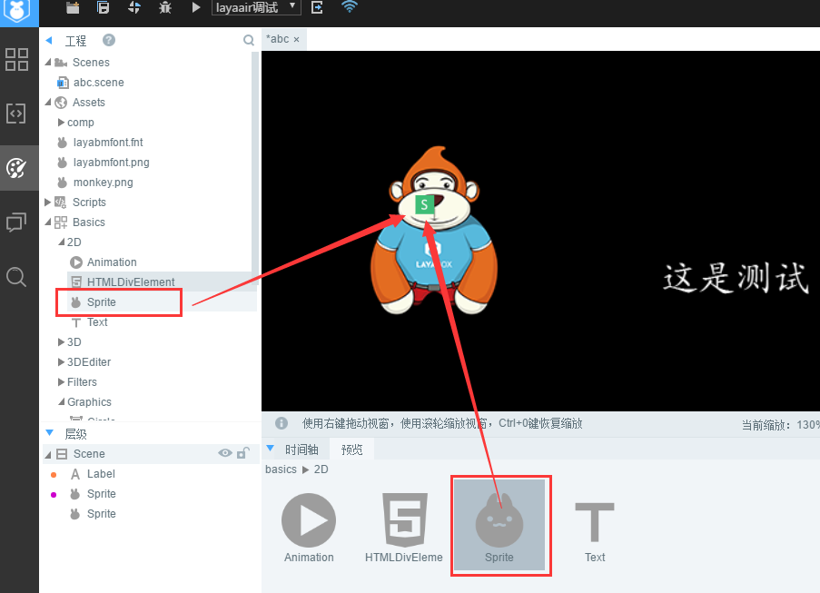

#Set Matte

> LayaAir's mask can set up an object (supporting bitmaps and vector maps), and then display the mask according to the shape of the object.
>


##Introduction of Mask API

Mask properties at[laya.display.Sprite](http://layaair.ldc.layabox.com/api/index.html?category=Core&class=laya.display.Sprite%3Ch1%3Emask)Within the API, the description of this property is shown in Figure 1.

<br/> (Fig. 1)


##2. Simple examples of masks

###2.1 Let's first display a bitmap with the LayaAir engine

Create a MaskDemo. as entry class and set it to the default application (Flash Builder is recommended). Write the following code:


```java

package
{
	import laya.display.Sprite;
	import laya.resource.Texture;
	import laya.utils.Handler;
	
	public class MaskDemo
	{
		private var Res:String;
		private var img:Sprite;
      
		public function MaskDemo()
		{
			Laya.init(1136,640);
			//设置舞台背景色
			Laya.stage.bgColor = "#ffffff"        
			//资源路径              
			Res = "res/img/monkey1.png";
			
			//先加载图片资源，在图片资源加载成功后，通过回调方法绘制图片并添加到舞台
			Laya.loader.load(Res,Handler.create(this,graphicsImg));          
		}
			
		private function graphicsImg():void
		{
			img = new Sprite();
			//获取图片资源，绘制到画布
			img.graphics.drawTexture(Laya.loader.getRes(Res),150,50);
			
			//添加到舞台
			Laya.stage.addChild(img);
		}	
	}
}
```


The compiler runs as shown in Figure 2.

<br />（图2）


###2.2 Create a circular mask area

Create a circular mask area with code. The masking effect can be achieved by mask attributes. Continuing with the code and comments, we changed the 2.1 sample code to the following code:


```java

package
{
	import laya.display.Sprite;
	import laya.resource.Texture;
	import laya.utils.Handler;
	
	public class MaskDemo
	{
		private var Res:String;
		private var img:Sprite;
		
		public function MaskDemo()
		{
			Laya.init(1136,640);
			//设置舞台背景色
			Laya.stage.bgColor = "#ffffff"      
			//资源路径
			Res = "res/img/monkey1.png";		
			
			//先加载图片资源，在图片资源加载成功后，通过回调方法绘制图片并添加到舞台
			Laya.loader.load(Res,Handler.create(this,graphicsImg));   
		}
		
		private function graphicsImg():void
		{
			img = new Sprite();
			//获取图片资源，绘制到画布
			img.graphics.drawTexture(Laya.loader.getRes(Res),150,50);
			
			//添加到舞台
			Laya.stage.addChild(img);
			
			
			//创建遮罩对象
			var cMask:Sprite = new Sprite();
			//画一个圆形的遮罩区域
			cMask.graphics.drawCircle(80,80,50,"#ff0000");
          	//圆形所在的位置坐标
			cMask.pos(120,50);
          
         	//实现img显示对象的遮罩效果
			img.mask = cMask;
			
		}
	}
}
```


The operation effect is shown in Figure 3.

<br/> (Figure 3)

By comparing the codes, we find that the implementation of masking is very simple. The masking effect of img display object is realized by assigning the created display object cMask to the mask attribute of img object as the masking object.


##3. Setting up masks in Laya AirIDE

> In addition to setting masks directly in the code, you can also easily set masks for objects through LayaAirIDE. Now let's follow the lead step by step.

Step 1: Create a UI page`maskDemo.ui`Import resources.*(If you are not familiar with this step, please go to the IDE section to see the documents related to UI creation and resource import.)*


Step 2: Drag in a resource panel`Sprite`Component to scene editing area, as shown in Figure 4

<br/> (Figure 4)


Step 3: Double-click Enter`Sprite`Inside the component, then drag one into the component panel`Sprite`Components, as shown in Figure 5.

<br/> (Fig. 5)


Step 4: Select`Sprite`Component, in the right attribute''Other''panel, will have common attributes`renderType`Set to`mask`As shown in Figure 6.

<br/> (Fig. 6)


Step 5: Double-click Enter`Sprite`Inside the component, then drag one into the component panel`Graphics`Round components, adjust the position and size. The hierarchical relationship is shown in Figure 7.

<br/> (Figure 7)


Step 6: Continuously double-click the blank area of the editing area to exit`Sprite`Inside the component, you can see the effect of the mask, as shown in Figure 8.

< br / > (Figure 8)


##4. Applying the masks set by LayaAirIDE in the project

###4.1 release UI

On the IDE interface, press`F12`Publish UI pages for masking effects, which will`src/ui`Generate UI classes under directories, and`bin/h5/res/atlas`The atlas file in the directory is shown in Figure 9.

<br/> (Figure 9)


###4.2 Use class and Atlas generated by IDE to achieve masking effect

Create an entry class`Main.as`The code is as follows:


```java

package
{
	import laya.net.Loader;
	import laya.utils.Handler;	
	import ui.maskDemoUI;
	
	public class Main
	{
		public function Main()
		{
			//初始化舞台
			Laya.init(1136,640);
			//设置舞台背景色
			Laya.stage.bgColor = "#ffffff"    
				
			//加载图集资源，加载成功后添加到舞台
			Laya.loader.load("res/atlas/ui.atlas",Handler.create(this,onLoaded));
			
		}
		
		private function onLoaded():void
		{
			var cMask:maskDemoUI = new maskDemoUI();
			Laya.stage.addChild(cMask);
		}
	}
}
```


The operation effect is shown in Figure 10. We quickly realized the effect of the mask.

 <br /> (图10)


