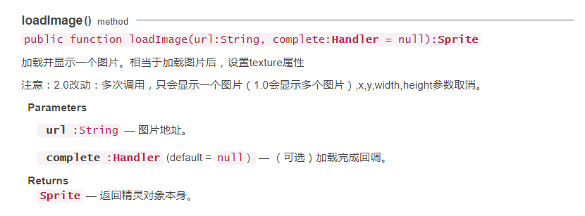
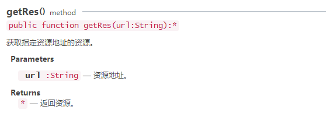

#Display and Switch Pictures

> Picture display is the basis of game development. This article introduces two methods of displaying pictures, Sprite. loadImage and Graphics. drawTexture, from API to examples.

##1. Displaying and Switching Pictures by Loading Image Method

###1.1 Overview of the loadImage API

Searching for laya. display. Sprite in the API document, you can find the loadImage () method. As shown in Figure 1, let's familiarize ourselves with the parameters of this method.

<br/> (Fig. 1)

###1.2 An example of loading images with loadImage

Create a Main.as entry class and set it to the default application (Flash Builder is recommended). Write the following code:


```java

package
{
	import laya.display.Sprite;
	
	public class Main
	{
		public function Main()
		{
			//初始化舞台
			Laya.init(1334,750);                
			
			//设置舞台背景色
			Laya.stage.bgColor  = "#ffffff"
			
			var img:Sprite = new Sprite();                  
			//加载显示图片，坐标位于100,50
			img.loadImage("res/img/monkey1.png"); 
			//添加到舞台
			Laya.stage.addChild(img);
		}
	}
}
```


In the sample code, "`100,50`” It is the display coordinate information of the picture. The example code runs as shown in Figure 2-1:

<br/> (Figure 2-1)

###1.3 Examples of switching pictures with loadImage

Switching pictures is based on displaying pictures, adding empty drawing, and then getting new picture resources through code logic to redraw. Specific code description can refer to code annotations and API, combined with the example running experience.

Next, we modify the code in the Main. as entry class as follows:


```java

package
{
	import laya.display.Sprite;
	
	public class Main
	{
        //需要切换的图片资源路径
		private var monkey1:String = "res/img/monkey1.png";
		private var monkey2:String = "res/img/monkey2.png";
      	//切换状态
		private var flag:Boolean = false;
      
		private var img:Sprite;
		
		public function Main()
		{
			//初始化舞台
			Laya.init(1334,750);                
			//设置舞台背景色
			Laya.stage.bgColor = "#ffffff"                        
			
			img = new Sprite();                        
			
			//显示绘制的图片
			switchImg();
			
			//侦听switchImg中图片区域的点击事件，触发后执行switchImg切换图片
			img.on("click",this,switchImg);
			
			//将图片添加到舞台
			Laya.stage.addChild(img);                        
		}
		
		
		private function switchImg(e:*=null):void
		{                        
			//清空图片
			img.graphics.clear();
			
			//获得要切换的图片资源路径
			var imgUrl:String = (flag = !flag)? monkey1:monkey2;
			
			//加载显示图片，坐标位于100,50
			img.loadImage(imgUrl);
			
		}
	}
}
```


The effect of running the code is shown in Figure 2-2.

<br/> (Motion 2-2)


##2. Display and Switch Pictures by DraTexture Method

###2.1 DraTexture API Overview

Searching for laya. display. Graphics in API documents can find the drawTexture () method. In addition, you need to understand the load () method and getRes () method in laya. net. Loader Manager, and the create () method in laya. utils. Handler. The parameters of each method are shown in Figures 3, 4, 5 and 6.

<br/> (Figure 3)

<br/> (Figure 4)

< br / > (Figure 5)

<br/> (Fig. 6)


###2.2 Examples of loading and displaying pictures with drawTexture

The loadImage () method can load external image resources in real time, or read image resources from the buffer. The drawTexture () method must first load the image, then draw it and add it to the stage, so it needs to be used in the sample code to load the image resources.（`Laya.loader.load()`) and callback（`Handler.create()`) Here we show a picture through simple sample code loading. Please see the comment section of the code and the related API instructions.

Create a Main.as entry class and set it to the default application (Flash Builder is recommended). Write the following code:


```java

package
{
	import laya.display.Sprite;
	import laya.utils.Handler;
	
	public class Main
	{
		private var monkey2:String = "res/img/monkey2.png";
		public function Main()
		{
			//初始化舞台
			Laya.init(1334,750);                
			//设置舞台背景色
			Laya.stage.bgColor = "#ffffff"                        
			
			//先加载图片资源，在图片资源加载成功后，通过回调方法绘制图片并添加到舞台
			Laya.loader.load(monkey2,Handler.create(this,graphicsImg));          
		}
		
		private function graphicsImg():void
		{
			var img:Sprite = new Sprite();
			//获取图片资源，绘制到画布
			img.graphics.drawTexture(Laya.loader.getRes(monkey2),100,50);
			
			//添加到舞台
			Laya.stage.addChild(img);
		}
		
	}
}
```


The code runs as shown in Figure 7-1.

< br / > (Figure 7-1)


###2.3 Examples of switching pictures with drawTexture

Switching pictures is based on displaying pictures, adding empty drawing, and then getting new picture resources through code logic to redraw. Specific code description can refer to code annotations and API, combined with the example running experience.

Next, we modify the code in the Main. as entry class as follows:


```java

package
{
	import laya.display.Sprite;
	import laya.resource.Texture;
	import laya.utils.Handler;
	
	public class Main
	{
		private var monkey1:String = "res/img/monkey1.png";
		private var monkey2:String = "res/img/monkey2.png";
		private var flag:Boolean = false;
		private var img:Sprite;
		
		public function Main()
		{
			//初始化舞台
			Laya.init(1334,750);            
			//设置舞台背景色
			Laya.stage.bgColor        = "#ffffff"                        
			
			//加载多张图片，在图片资源加载成功后，通过回调方法绘制图片并添加到舞台
			Laya.loader.load([monkey1,monkey2],Handler.create(this,graphicsImg));                
		}
			
		
		private function graphicsImg(e:*=null):void
		{
          	//创建一个实例
			img = new Sprite();      
          	//添加到舞台
			Laya.stage.addChild(img);                  
			
			//显示初始化绘制的图片
			switchImg();			
          
			//侦听switchImg中图片区域的点击事件，触发后执行switchImg切换纹理绘制
			img.on("click",this,switchImg);			

			//设置图片坐标
			img.pos(100,50);
			
		}
		
		private function switchImg(e:*=null):void
		{                        
			//清空绘制
			img.graphics.clear();
			
			//获得要切换的图片资源路径
			var imgUrl:String = (flag = !flag)? monkey2:monkey1;
			//获取图片资源
			var texture:Texture = Laya.loader.getRes(imgUrl);
			//绘制纹理
			img.graphics.drawTexture(texture);                        
			//设置纹理宽高
			img.size(texture.width, texture.height);        
			
		}
	}
}
```


The code runs as shown in Figure 7-2.


<br/> (Figure 7-2)


