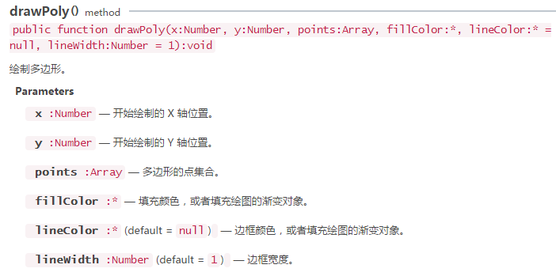
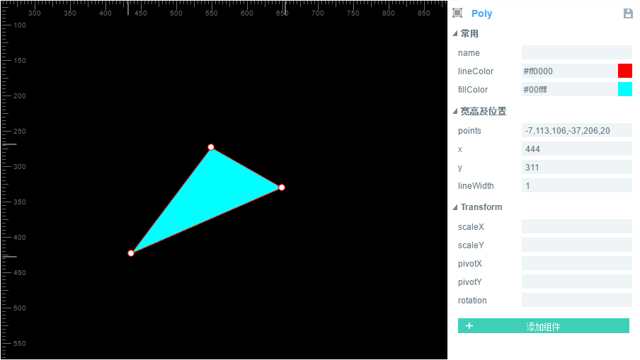

#Drawing triangles, polygons and patterns based on data


The method of "drawpoly();" of the class laya.display.graphics in the layaair engine can be used to draw triangles, polygons and patterns according to the specified path data. A detailed description of the method is shown in the following figure:

​<br/>
(Fig. 1)


###Drawing triangles

Let's start by drawing a triangle with the LayaAir engine. The sample code is as follows:


```java

package
{
    import laya.display.Sprite;
    import laya.display.Stage;
    import laya.webgl.WebGL;
      
    public class Sprite_DrawShapes
    {
        private var sp:Sprite;
          
        public function Sprite_DrawShapes()
        {
            Laya.init(500, 300, WebGL);
            drawSomething();
        }
  
        private function drawSomething():void
        {
            sp = new Sprite();
            Laya.stage.addChild(sp);
            //画三角形
            sp.graphics.drawPoly(30, 28, [0, 100, 50, 0, 100, 100], "#ffff00");
              
        }
    }
}
```


The code runs as shown in the following figure:

​<br/>
(Figure 2)

From the code, we can see that the "0,100" of the third parameter of drawPoly is the coordinate of point A. "50, 0" is the coordinate of point B. "100, 100" is the coordinate of C point. After connecting the three coordinate points, fill in the color value of the fourth parameter, that is to say, draw the yellow triangle of the picture above. But what we need to understand and pay attention to here is that all coordinates in the third parameter are relative coordinates, which will be affected by the first and second coordinate parameters "30,28". Once "30, 28" changes, the overall shape and position will be affected.


### **2. Draw polygon**

We continue to use the above code example to draw polygons by adding coordinates of the third parameter of drawPoly. The modified code is as follows:


```java

//画多边形
sp.graphics.drawPoly(30, 28, [0, 100, 50, 0, 100, 100, 75, 150, 25, 150], "#ffff00");
```


The code runs as shown in the following figure:

​<br/>
(Figure 3)

In the modified code, the coordinates of point D "75150" and point e "25150" are added. By connecting the coordinate points and filling the color, we can draw the polygon we want. To draw polygons with more edges, add coordinate points in the above way.


### **3. Drawing patterns according to specified path data**

Through the triangles and polygons above, we have mastered the drawing usage of drawPoly. Next, we will show you how to draw a Pentagon by specifying a path through an example. The sample code is as follows:


```java

package
{
    import laya.display.Sprite;
    import laya.display.Stage;
      
    public class Sprite_DrawShapes
    {
        private var sp:Sprite;
          
        public function Sprite_DrawShapes()
        {
            Laya.init(500, 300);
            drawSomething();
        }
  
        private function drawSomething():void
        {
             var canvas:Sprite = new Sprite();
         Laya.stage.addChild(canvas);
          
         var path:Array = []; 
         path.push(0, -130);//五角星A点坐标
         path.push(33, -33);//五角星B点坐标
         path.push(137, -30);//五角星C点坐标
         path.push(55, 32);//五角星D点坐标
         path.push(85, 130);//五角星E点坐标
         path.push(0, 73);//五角星F点坐标
         path.push(-85, 130);//五角星G点坐标
         path.push(-55, 32);//五角星H点坐标
         path.push(-137, -30);//五角星I点坐标
         path.push(-33, -33);//五角星J点坐标
          
         canvas.graphics.drawPoly(Laya.stage.width / 2, Laya.stage.height / 2, path, "#FF7F50");       
     }
    }
}
```


The code runs as shown in the following figure:

​<br/>
(Figure 4)

Through the above example code writing, do you feel that the readability of the code has been enhanced, you can also change the previous triangle or polygon into this way to experience, grasp these foundations, can derive a lot of flexible usage, such as data from the server.


###4. Use Laya air ide to draw irregular figures (including triangles and polygons) through controls


**Step one**Open our LayaAirIDE, click Design Patterns, and create a new View page

​<br/>
(Fig. 5)

**Step two**Drag the curve component from the component onto the View page and automatically generate the default polygon

​<br/>
(Fig. 6)

**Step three**Modify (add/reduce) the values in Poly component attributes, change the size, color, etc. of polygons.

​<br/>
(Figure 7)

​<br/>
(Figure 8) Triangle

​<br/>
(Figure 9) Irregular polygon


So far we have finished drawing polygons through the LayaAirIDE component.