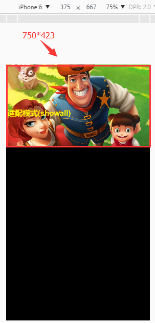

#Detailed Explanation of Scaling Mode for Screen Adaptation

Zoom mode is the key content of screen adaptation. In this paper, from the basic concept to parameter description, combined with code examples to help you understand the screen zoom mode of layaair engine. In the API document, we search laya. display. Stage. We can see that there are seven parameters for scaleMode, the method of scaleMode about scaling mode, to meet the scaling requirements of various screen adaptations. The parameters are illustrated in Figure 1.

<br/>
(Figure 1) Parametric description of the LayaAir engine for scaleMode


**To give a brief overview of the parameter descriptions, let's first understand some of the basic concepts involved in this article:**

**1. Design width and height:** 

In the project code, the width and height defined in the initialization stage Laya.init() is the design width and height.

**2. Stage width and height:**

The width and height of stage is the actual size of the game stage.

**3. Suitable width and height:**

In order to distinguish and understand the design width and height, we call the design width and height after the engine's adaptation mode is scaled to change the design width and height.

**4. Canvas width and height:**

Canvas width refers to the width and height of canvas nodes in HTML5. All visible content in the game is in the canvas area.

**5. Screen width and height:**

Screen width and height refer to the width and height of the screen of mobile browser, such as the screen width and height of the iPhone 6 vertical screen.`375*667`。 LayaAir engine can obtain screen width and height through laya.utils.Browser.clientWidth and laya.utils.Browser.clientHeight.

**6. Physical width and height:**

With regard to the physical width and height of the device screen, we need to understand the concept of pixel density first. On a PC, a physical pixel is usually located at a single pixel. Today, with the rapid development of mobile devices, the screen of mobile phones usually has two or three pixels in one pixel position. For example, the physical width and height of the iPhone 6 vertical screen are as follows`750*1334`。 The LayaAir engine can obtain the physical width and height of the device screen through laya. utils. Browser. width and laya. utils. Browser. height.


###The background image used in the sample code:

[loadingBg.jpg](http://ldc.layabox.com/uploadfile/file/20170223/1487816895380055.jpg)(click to open or save`1136×640`Pixel Background Map)


###Exctfit Model

The exactfit model is a direct, original proportion that does not take into account content**Fill the entire browser screen with unequal scaling**The pattern. In this mode, the canvas width and stage width are equal to the design width and height, and will not change. But when the physical width and design width are not equal, this non-equal scaling mode**It may cause obvious deformation of the original design.**。 The effect is shown in Figures 2 and 3.


​        <br/>
(Figure 2) Design width and height`1136*640`The physical width and height are`1334*750`The effect of exactfix mode

​<br/>
(Figure 3) Design width and height`1136*640`The physical width and height are`750*1334`Effectiveness of exactfit mode


**Exctfit pattern sample code:**


```javascript

package  {
    import laya.display.Stage;
    import laya.display.Text;
    import laya.ui.Image;
      
    public class SmartScale_T {
          
        //全局文本信息
        private var txt:Text;
          
        public function SmartScale_T() 
        {
        //初始化舞台大小
        Laya.init(1136, 640);
          
        //设置适配模式为"exactfit"
        Laya.stage.scaleMode = Stage.SCALE_EXACTFIT;
        //设置舞台背景色
        Laya.stage.bgColor  = "#ffff99";
  
  
        //实例一个背景
        var bg:Image = new Image();
        bg.skin = "res/img/loadingBg.jpg";
        Laya.stage.addChild(bg);
  
        //实例一个文本
        txt = new Text();
        txt.text = "适配模式("+Stage.SCALE_EXACTFIT+") ";
        txt.bold = true;
        txt.pos(10, 350);
        txt.fontSize = 60;
        txt.color   = "#fff000";
        Laya.stage.addChild(txt);
        }
      
    }
}
```


###II. Fixed height mode

In fixedheight mode, the height of canvas and stage remains unchanged, and the width of canvas and stage equals the width of adaptation (adaptation width = design height * screen width-height ratio). Finally, the full-screen zoom and adaptation is made according to the screen width and height. This mode is one of the mainstream adaptation modes.

For example, when the screen of the iPhone 6 is horizontal, the width and height of the screen are as follows`667*375`When the design height is 640, the fixedheight mode is adopted.`适配宽度=(667/375)*640`The width of the canvas is 1138 after the calculation result of the fit width is rectified. The example stretch fit full screen effect is shown in Figure 4.

​<br/>
(Fig. 4) The width and height of the canvas are`1067*640`The physical width and height are`1334*750`The effect of fixedheight mode

Similarly, when the iPhone 6 screen is upright`适配宽度=(375/667)*640`The width of the canvas is 360 after the fitting width is calculated. If we are designed according to the horizontal screen, we need to set the automatic horizontal screen when using this mode, otherwise the part outside the canvas will not be displayed. Figure 5 shows an example of the fixed height mode stretch fit full screen effect:

​<br/>
(Fig. 5) The width and height of the canvas are as follows`360*640`The physical width and height are`750*1334`The effect of fixedheight mode

**Fixed height pattern sample code:**


```javascript

package  {
    import laya.display.Stage;
    import laya.display.Text;
    import laya.ui.Image;
      
    public class SmartScale_T {
          
           
        //全局文本信息
        private var txt:Text;
          
        public function SmartScale_T() 
        {
        //初始化舞台大小
        Laya.init(0, 640);
          
        //设置适配模式为"fixedheight"
        Laya.stage.scaleMode = Stage.SCALE_FIXED_HEIGHT;
        //设置舞台背景色
        Laya.stage.bgColor  = "#ffff99";
  
  
        //实例一个背景
        var bg:Image = new Image();
        bg.skin = "res/img/loadingBg.jpg";
        Laya.stage.addChild(bg);
  
        //实例一个文本
        txt = new Text();
        txt.text = "适配模式("+Stage.SCALE_FIXED_HEIGHT+") ";
        txt.bold = true;
        txt.pos(10, 350);
        txt.fontSize = 60;
        txt.color   = "#fff000";
        Laya.stage.addChild(txt);
        }
      
    }
}
```


###3. Fixed width mode

In Fixedwidth mode, the width of canvas and stage remains the same as the design width, and the height of canvas and stage equals the height of adaptation.（`适配高度=设计宽度*屏幕高宽比`At last, the full-screen zoom-in mode is adapted according to the screen width and height, which is one of the mainstream adaptation modes.

For example, when the screen of the iPhone 6 is horizontal, the width and height of the screen are as follows`667*375`The design width is 1136, so after Fixedwidth mode is adopted,`适配高度=(375/667)*1136`The height of the canvas is 639 after the fitting height calculation is completed. The example stretch fit full screen effect is shown in Figure 6.

​<br/>
(Fig. 6) The width and height of the canvas are`1136*639`The physical width and height are`1334*750`The effect of Fixedwidth mode of

Similarly, the height of the adaptation is equal to (667/375)*1136 for the vertical screen of the iPhone 6, and 2021 is the height of the canvas after the calculation of the height of the adaptation. If we are designed according to the horizontal screen, we need to set the automatic horizontal screen when using this mode. Otherwise, the width and height of the adapter are higher than the width and height of the screen. When we zoom to the width and height of the screen for full screen display, it is usually not the desired effect. A sample of Fixedwidth mode is stretched to fit the full screen effect as shown in Figure 6:

​<br/>
(Figure 7) The width and height of the canvas are`1136*2021`The physical width and height are`1334*750`Running effect of Fixedwidth mode


**Fixed width pattern sample code:**


```javascript

package  {
    import laya.display.Stage;
    import laya.display.Text;
    import laya.ui.Image;
      
    public class SmartScale_T {
          
        //全局文本信息
        private var txt:Text;
          
        public function SmartScale_T() 
        {
        //初始化舞台大小
        Laya.init(1136, 0);
          
        //设置适配模式为"fixedwidth"
        Laya.stage.scaleMode = Stage.SCALE_FIXED_WIDTH;
        //设置舞台背景色
        Laya.stage.bgColor  = "#ffff99";
  
  
        //实例一个背景
        var bg:Image = new Image();
        bg.skin = "res/img/loadingBg.jpg";
        Laya.stage.addChild(bg);
  
        //实例一个文本
        txt = new Text();
        txt.text = "适配模式("+Stage.SCALE_FIXED_WIDTH+") ";
        txt.bold = true;
        txt.pos(10, 350);
        txt.fontSize = 60;
        txt.color   = "#fff000";
        Laya.stage.addChild(txt);
        }
      
    }
}
```


###4. Fixed auto mode

In fixedauto mode, the width of stage and canvas is higher than the height of adaptation after zooming, while the equal-ratio zooming displays the whole content in full screen, automatically calculates SCALE_FIXED_WIDTH and SCALE_FIXED_HEIGHT according to the length-width ratio of the screen, and chooses the mode that the width-height ratio of the screen is closer to the design width-height ratio.

For example, when the iPhone 6 screen is horizontal, the screen width and height are`667*375`After fixedauto mode is adopted, SCALE_FIXED_WIDTH mode will be selected automatically according to the aspect ratio.`适配高度=(375/667)*1136`, the height of the canvas is 639 after the rounding of the fitting height calculation result. The example stretch fit full screen effect is shown in Figure 8.

​<br/>
(Figure 8) the width and height of canvas are`1136*639`The physical width and height are`1334*750`Running effect of fixedauto mode

Similarly, the height of the vertical screen of the iPhone 6 equals (667/375)*1136, and 2021 is the height of the canvas after the calculation of the height. According to the aspect ratio, SCALE_FIXED_HEIGHT adaptation mode which is closer to the aspect ratio of screen is automatically selected.

If we are designed according to the horizontal screen, we need to set the automatic horizontal screen when using this mode, otherwise the width and height of the adapter are higher than the width and height of the screen, and then the horizontal cutting is based on the design height, which is usually not the desired effect. Fixed auto mode example stretches to fit the full screen effect as shown in Figure 9:

​<br/>
(Figure 9) The width and height of the canvas are as follows`1136*2021`The physical width and height are`1334*750`Running effect of fixedauto mode


**The fixedauto pattern example code is as follows:**


```javascript

package  {
    import laya.display.Stage;
    import laya.display.Text;
    import laya.ui.Image;
      
    public class SmartScale_T {

        //全局文本信息
        private var txt:Text;
          
        public function SmartScale_T() 
        {
        //初始化舞台大小
        Laya.init(1136, 640);
          
        //设置适配模式为"fixedauto"
        Laya.stage.scaleMode = Stage.SCALE_FIXED_AUTO;
        //设置舞台背景色
        Laya.stage.bgColor  = "#ffff99";
  
  
        //实例一个背景
        var bg:Image = new Image();
        bg.skin = "res/img/loadingBg.jpg";
        Laya.stage.addChild(bg);
  
        //实例一个文本
        txt = new Text();
        txt.text = "适配模式("+Stage.SCALE_FIXED_AUTO+") ";
        txt.bold = true;
        txt.pos(10, 350);
        txt.fontSize = 60;
        txt.color   = "#fff000";
        Laya.stage.addChild(txt);
        }
      
    }
}
```


###V. full mode

In full mode, the width and height of stage and canvas will ignore the design width and height, which is directly equal to the physical width and height, so this is also the mainstream zooming mode with the highest accuracy of game painting. In this mode, the design content will not be scaled, keeping the original proportion of 1:1, aligning the stage with the upper left corner of the browser screen, the original design content beyond the screen will be cut. The example effect is shown in Figures 10 and 11.
​
(Fig. 10) Design width and physical width are the same`1136*640`Full mode horizontal screen operation effect

​
(Fig. 11) Design width and height are as follows`1136*640`The physical width and height are`960*640`Full mode horizontal screen operation effect


**Full mode sample code:**


```javascript

package  {
    import laya.display.Stage;
    import laya.display.Text;
    import laya.ui.Image;
      
    public class SmartScale_T {

        //全局文本信息
        private var txt:Text;
          
        public function SmartScale_T() 
        {
        //初始化舞台大小
        Laya.init(0, 0);
          
        //设置适配模式为"full"
        Laya.stage.scaleMode = Stage.SCALE_FULL;
        //设置舞台背景色
        Laya.stage.bgColor  = "#ffff99";
  
  
        //实例一个背景
        var bg:Image = new Image();
        bg.skin = "res/img/loadingBg.jpg";
        Laya.stage.addChild(bg);
  
        //实例一个文本
        txt = new Text();
        txt.text = "适配模式("+Stage.SCALE_FULL+") ";
        txt.bold = true;
        txt.pos(10, 350);
        txt.fontSize = 60;
        txt.color   = "#fff000";
        Laya.stage.addChild(txt);
        }
      
    }
}
```


**Tips:**

1. Although this mode is a high-precision adaptation mode, the pressure on game performance is also higher than other modes. Whether to choose this mode or not should consider the overall situation of the game.

2. Since the width of the canvas and stage is directly derived from the physical width and height of the screen, the width and height of Laya.init() can be set to 0 directly.


###Vi. noscale mode

The noscale mode is non-scaling mode, and the width of canvas and stage is higher than the design width. The stage is aligned with the upper left corner of the browser screen on the basis of keeping the original design proportion of 1:1. When the screen width is smaller than the content, it will be cut. When the screen width is larger than the content, black edges will appear. The operation effect of this mode is shown in Figures 12 and 13.

​<br/>

(Figure 12) the effect when the screen width and height are greater than the design width and height

​<br/>
(Figure 13) the effect that the design content exceeds the screen width and the screen height is greater than the design height


**The noscale pattern sample code is as follows:**


```javascript

package  {
    import laya.display.Stage;
    import laya.display.Text;
    import laya.ui.Image;
      
    public class SmartScale_T {

        //全局文本信息
        private var txt:Text;
          
        public function SmartScale_T() 
        {
        //初始化舞台大小
        Laya.init(1136, 640);
          
        //设置适配模式为"noscale"
        Laya.stage.scaleMode = Stage.SCALE_NOSCALE;
        //设置舞台背景色
        Laya.stage.bgColor  = "#ffff99";
  
  
        //实例一个背景
        var bg:Image = new Image();
        bg.skin = "res/img/loadingBg.jpg";
        Laya.stage.addChild(bg);
  
        //实例一个文本
        txt = new Text();
        txt.text = "适配模式("+Stage.SCALE_NOSCALE+") ";
        txt.bold = true;
        txt.pos(10, 350);
        txt.fontSize = 60;
        txt.color   = "#fff000";
        Laya.stage.addChild(txt);
        }
      
    }
}
```


###Noorder Model

In noborder mode, canvas width is higher than design width. When zooming, zoom according to the maximum ratio of the screen width and height to the design width and height, for example, the design dimension is`1136*640`The physical width and height of the screen are`750*1334`。 Calculate the ratio of width`（750/1136）`0.66, high rate`（1334/640）`It is 2.08. Then, when zooming in noborder mode, the adaptation height is stretched to 1334 of physical height and the adaptation width is equal to that of stretching according to the maximum ratio (high).（`1334/640*1136`) 2368. Of course, more than the width of the screen will be cut off. The effect is shown in Figure 14.

​<br/>
(Fig. 12) Canvas width and height to maintain design dimensions`1136*640`When the adapter width reaches the maximum ratio, one side stretches to the full screen.


**The noborder pattern sample code is as follows:**


```javascript

package  {
    import laya.display.Stage;
    import laya.display.Text;
    import laya.ui.Image;
      
    public class SmartScale_T {

        //全局文本信息
        private var txt:Text;
          
        public function SmartScale_T() 
        {
        //初始化舞台大小
        Laya.init(1136, 640);
          
        //设置适配模式为"noborder"
        Laya.stage.scaleMode = Stage.SCALE_NOBORDER;
        //设置舞台背景色
        Laya.stage.bgColor  = "#ffff99";
  
  
        //实例一个背景
        var bg:Image = new Image();
        bg.skin = "res/img/loadingBg.jpg";
        Laya.stage.addChild(bg);
  
        //实例一个文本
        txt = new Text();
        txt.text = "适配模式("+Stage.SCALE_NOBORDER+") ";
        txt.bold = true;
        txt.pos(10, 350);
        txt.fontSize = 60;
        txt.color   = "#fff000";
        Laya.stage.addChild(txt);
        }
      
    }
}
```


###VIII. Showall mode

In showall mode, the width of stage and canvas is higher than that of the scaled canvas, and the scaling is done in the same ratio according to the minimum ratio of screen width to design width.

For example, the design size is`1136*640`The physical width and height of the screen are`750*1334`。 Calculate the Wide Ratio（`750/1136`) 0.66, high ratio（`1334/640`) 2.08. When zooming in showall mode, the canvas width will be zoomed to 750 physical width of the screen at the smallest ratio (width), and the height of the canvas will be zoomed to equal ratio.（`750/1136*640`423. At this time, because 423 is far less than the screen physical height of 1334, there will be a large number of black blank screen. The effect is shown in Figure 15.

​<br/>
(Fig. 15) The width and height of the canvas are scaled to`750*423`, in physical width and height`750*423`A large number of black blank screens appeared on the screen.


**The showall pattern sample code is as follows:**


```javascript

package  {
    import laya.display.Stage;
    import laya.display.Text;
    import laya.ui.Image;
      
    public class SmartScale_T {

        //全局文本信息
        private var txt:Text;
          
        public function SmartScale_T() 
        {
        //初始化舞台大小
        Laya.init(1136, 640);
          
        //设置适配模式为"showall"
        Laya.stage.scaleMode = Stage.SCALE_SHOWALL;
        //设置舞台背景色
        Laya.stage.bgColor  = "#ffff99";
  
  
        //实例一个背景
        var bg:Image = new Image();
        bg.skin = "res/img/loadingBg.jpg";
        Laya.stage.addChild(bg);
  
        //实例一个文本
        txt = new Text();
        txt.text = "适配模式("+Stage.SCALE_SHOWALL+") ";
        txt.bold = true;
        txt.pos(10, 350);
        txt.fontSize = 60;
        txt.color   = "#fff000";
        Laya.stage.addChild(txt);
        }
      
    }
}
```


**Concluding summary:**

Full mode renders completely according to physical pixels. It is a common adaptation mode with high image quality. However, in different sizes of screens, the size of display content will be different, and the performance pressure for HTML5 games is higher than other adaptation modes.

Showall and noborder are isometric scaling modes that keep the picture intact. Showall scales at the smallest ratio of screen width to design height to ensure that the screen is fully displayed, but it will result in blank screen with black edges. On the contrary, no border zooms at the maximum ratio of the screen to the design width and height. No blank black edge will appear, but part of the width or height will not be displayed.

Fixed width and fixed height are more like the variants of showall and noborder. They are also equivalent scaling modes, but they specify one side to be fixed and the other side to be scaled. They are the main adapting modes commonly used in HTML5 games. Fixedauto automatically switches between Fixedwidth and fixedheight modes according to the scale. These modes are also our recommended full-screen adaptation modes.

In this paper, we focus on the different parameters of scaling mode. Without other screen adaptation settings such as screen autorotation, developers can view related technical documents.

The core of the adaptation mode is to zoom the canvas, stage or change the canvas size directly. The following compares the different scaling modes for which scaling has been done, which is convenient for you to understand intuitively.

|| noscale | exactifit | showall | noborder | full | fixed_width | fixed_height | fixed_auto|
| ------------------------------------------------------------------------------------------------------------------------------------------------------------------------------------------------------------------------------------|
| Zoom Canvas | | Yes | | Yes | Yes | | Yes | Yes | Yes | Yes | Yes|
| Scale Stage | | | Yes||||||
|Change canvas size | yes | yes | yes | yes | yes|

**Be careful:**If the physical pixel resolution mode is used, that is`useRetinalCanvas=true`When the size of the canvas is constant to the physical resolution, the original scaling of the canvas is all changed to the scaling of the Stage.


Finally, a detailed comparative illustration of each adaptation mode is attached. You can right-click in the new page to open the full screen original view.

 


