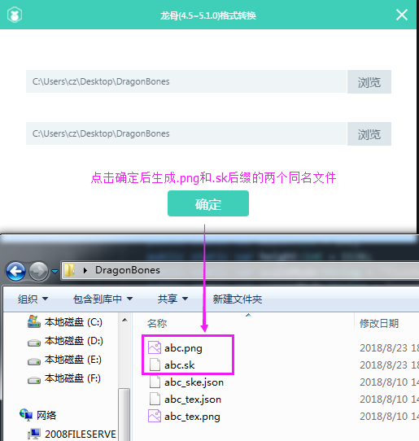

# LayaAir引擎播放DragonBones动画

> This article uses screenshots of LayaAirIDE version 2.0.0 to illustrate. If there are any differences, please download the latest stable version of LayaAirIDE, whichever version is the latest.

DragonBones (DragonBones) skeleton animation is one of the most frequently used skeleton animation in games. DragonBones skeleton animation format can be transformed into the skeleton animation format supported by LayaAir engine through the conversion tool provided by LayaAirIDE.


###1. Introduction of Dragon Bones Skeletal Animation

####1.1 Texture settings for export must be texture sets

Laya AirIDE's DragonBones conversion tool only supports DragonBones skeleton animation conversion in atlas mode, so when using DragonBones skeleton animation editing tool to export, you must`纹理设置`Of`纹理类型`Choose from Options`纹理集`As shown in Figure 1.

 


(Fig. 1)

####1.2 Exported version of Dragon Bones

Not all dragonbones versions of Laya air ide support transformations. The supported version number is in LayaAirIDE`龙骨转换工具`The panel is displayed, as shown in Figure 2.

 


(Fig. 2)

As of this document, dragonbones started from version 4.5 and has been supported to version 5.1. Subsequent Laya AirIDE updates DragonBones version support from time to time, and developers can focus on changes in version number support status on the transformation tool panel.


###2. Converting DragonBones Animation to LayaAir Engine Recognition Format

####2.1 Open the Conversion Tool Panel

At Laya air IDE`设计模式`In turn, click on the menu bar`工具`>`龙骨动画转换`Open as shown in Figure 3`DragonBones格式转换`Tools.

 


(Fig. 3)


####2.2 Generate skeleton animation file with.Sk suffix

open`龙骨格式转换`After the toolbar, export the DragonBones resource directory`拖入`Go to the conversion panel, or click`浏览`Button to select the resource directory exported by DragonBones. Then click`确定`It can be generated under the original resource directory`.png`and`.sk`Two files of the same name with suffixes. As shown in Figure 4.

 


(Fig. 4)


###3. Loading and Displaying DragonBones Animation

####3.1 Copy the converted DragonBones animation resources to the corresponding directory of the project.

We generated the same name for the keel conversion tool`.sk`And`.png`Files with suffixes are copied into the project directory, as shown in Figure 5. (* the original file exported by keel tool does not need to be processed, and is only used by conversion tool. *)

 


(Fig. 5)

####3.2 DragonBones Animation Play Example

The following example will be used`laya.ani.bone.Skeleton`Class. The specific API description can be viewed directly through the link:[https://layaair.ldc.layabox.com/api/?category=Bone&class=laya.ani.bone.Skeleton](https://layaair.ldc.layabox.com/api/?category=Bone&class=laya.ani.bone.Skeleton)

Create the document class dragonbonesdemo.as, and write the code as follows:


```java

package
{
	import laya.ani.bone.Skeleton;

	public class DragonBonesDemo
	{
		public function DragonBonesDemo()
		{
			//初始化舞台
			Laya.init(1334, 750);
			
			//创建一个Skeleton对象
			var skeleton:Skeleton = new Skeleton();
			 //添加到舞台
			Laya.stage.addChild(skeleton);
			
			skeleton.pos(600,350);
			
			//通过加载直接创建动画
			skeleton.load("res/DragonBones/rooster/Rooster_Ani.sk");
		}
	}
}
```

The operation effect is shown in Figure 6.

 


(Fig. 6)