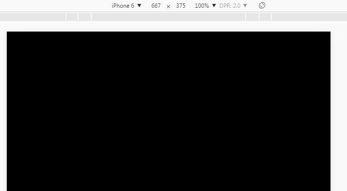

#Slow motion animation

###1. Overview of Slow-motion Animation

Slow motion animation is very common in game development. It is one of the important factors to enhance game UI experience. For example, dialog box pop-up and close, button action appears and disappears, props fly into knapsack, etc. We can use Tween Slow motion class and Ease class provided by LayaAir engine to realize it quickly.

`Tween`Slow class is used to achieve the target object attributes, such as the target value settings such as the X or Y axis of the target object, as well as the slow start, stop, clean-up settings. More Tween APIs

`Ease`Class defines a large number of retardation functions for implementation`Tween`The specific slowing effect of animation. The tween class of layaair engine is used in combination with the ease class, which can basically meet the demand of slow motion effect in game development. Click on the link to view the API directly:[https://layaair.ldc.layabox.com/api/?category=Core&class=laya.utils.Tween](https://layaair.ldc.layabox.com/api/?category=Core&class=laya.utils.Tween)

`Ease`Class API gives a basic introduction to the slowdown function. Click on the link to view the API directly:[https://layaair.ldc.layabox.com/api/?category=Core&class=laya.utils.Ease](https://layaair.ldc.layabox.com/api/?category=Core&class=laya.utils.Ease)

`Ease`The effect of each slowdown function in the API of the class can be seen in the demo DEMO, link:[https://layaair.ldc.layabox.com/demo/?Tween_EaseFunctionsDemo](https://layaair.ldc.layabox.com/demo/?Tween_EaseFunctionsDemo)


###2. Introduction to common API of slow motion

####2.1 Common methods of Tween slow-moving classes from () and to ()

Slow-moving Tweens provide a lot of methods, but we often use two kinds of methods, one is the slow-moving Tween, the other is the slow-moving Tween, and the other is the slow-moving Tween.`from()`And`to()`The parameters of the two methods are exactly the same, but the effect is different. From the slow moving target point to the initial position (* from the slow moving target position *), to is from the initial position to the slow moving target position.（`到缓动目标位置去`Later, it will be explained in detail with examples. Developers can first understand the basic instructions of these two methods, as shown in Figure 1.

 


(Fig. 1)

####2.2 Description of common parameters

`to()`and`from()`Both methods support static methods, so we don't need to instantiate the Tween class to use them.

By looking at the API description in Figure 1,`to()`and`from()`Their parameters are easy to understand. Here we emphasize the props, duration, ease, complete and delay parameters.

#####Props

Props is an attribute that the target object needs to be changed to produce a slow motion effect. Common attributes of objects can be set, such as the most commonly used x, y location attributes, and alpha transparency attributes, as well as other attributes such as rotation, axis, size.

#####Duration

Duration is the time spent to perform the slowing effect in Haushi seconds. The more time, the slower the slowing effect.

#####Ease

Ease is a slowdown type, it can use various functions defined under the Ease class to change the process of animation change, LayaAir engine provides a lot of slowdown methods for developers to choose to use. Developers can view the API or switch the jog function in the engine example on the official website and observe the jog effect. Link address:[https://layaair.ldc.layabox.com/demo/?Tween_EaseFunctionsDemo](https://layaair.ldc.layabox.com/demo/?Tween_EaseFunctionsDemo)

#####Complete

Complete is the method of callback after slow completion. For example, the button appears slowly, in the process of slowing, we can not let the user click, then we can use the slowing to complete the callback, and add the button to the callback function to listen.

#####Delay

Delay is the time of delayed execution. Later, we will make the fluctuation effect of text slow motion through the delayed execution in the instance.


###3. Slow motion examples

####3.1 Examples of Tween. from ()

In the following code, we first use the Tween. from () method to realize the text slow animation of the "LayaBox" character.

Create a TweenDemo. as document class with the following code:


```java

package 
{
	import laya.display.Text;
	import laya.utils.Tween;
	import laya.utils.Ease;
	import laya.webgl.WebGL;
	
	public class TweenDemo
	{
		
		public function TweenDemo() 
		{
			// 初始化舞台
			Laya.init(1334,750, WebGL);

			//背景颜色
			Laya.stage.bgColor = "#1b2436";
			
			//创建缓动文本
			createTween();
		}
		
		//创建缓动文本
		private function createTween():void 
		{	
			
			//"LayaBox"字符串总宽度
			var w:int = 800;
			
			//文本创建时的起始x位置(>>在此使用右移运算符，相当于/2 用>>效率更高)
			var offsetX:int = Laya.stage.width - w >> 1;

			//显示的字符串
			var demoString:String = "LayaBox";
			
			var letterText:Text;
			
			//根据"LayaBox"字符串长度创建单个字符，并对每个单独字符使用缓动动画
			for (var i:int = 0, len:int = demoString.length; i < len; ++i)
			{
				//从"LayaBox"字符串中逐个提出单个字符创建文本
				letterText = createLetter(demoString.charAt(i));
				letterText.x = w / len * i + offsetX;
				
				//文本的初始y属性
				letterText.y = 300;

				//对象letterText属性y从缓动目标的100向初始的y属性300运动，每次执行缓动效果需要3000毫秒，缓类型采用elasticOut函数方式，延迟间隔i*1000毫秒执行。
				Tween.from(letterText, { y : 100 }, 3000, Ease.elasticOut, null, i * 1000);
			}
		}
		
		
		//创建单个字符文本，并加载到舞台
		private function createLetter(char:String):Text
		{
			var letter:Text = new Text();
			letter.text = char;
			letter.color = "#FFFFFF";
			letter.font = "Impact";
			letter.fontSize = 180;
			Laya.stage.addChild(letter);			
			return letter;
		}
	}
}
```


The operation effect is shown in Figure 2.

<br/> (Motion 2)

Combined with the example code, and through the motion effect of Figure 2, we can see that the text "Layabox" disappears instantly after the initial position (* Y axis 300*) appears, and then from the target set by the slowdown method Tween. from.`{ y : 100 }`(* Y axis 100*) moves to the initial position (top-down slowing effect).

Because this method first displays in the initial position, then disappears instantaneously from the slow moving target position to the initial position. It produces a poor vision and feels more like a rebound effect. So we continue to understand the effect of Tween. to, and developers can choose which slowdown method to use according to their needs.

####3.2 example of Tween. To()

We can continue with the example above, just change Tween. From to Tween. To see the effect first.


```java

//文本的初始y属性
letterText.y = 300;
//Tween.from(letterText, { y : 100 }, 3000, Ease.elasticOut, null, i * 1000);//注释本行改为将Tween.from改变为Tween.to
Tween.to(letterText, { y : 100 }, 3000, Ease.elasticOut, null, i * 1000);
```


The operation effect is shown in Figure 3.

<br/> (Motion 3)

Combined with the code, let's look at the effect of moving Figure 3. Tween. to () will be more intuitive. The initial attribute y is 300, and the attribute y of the jog method is 100.（`{ y : 100 }`So moving Figure 3 produces a slowing motion effect from the bottom up (that is to say, to be frank, the slowing effect of the bounce).

####3.3 Understanding Props parameters

Whether Tween. from or Tween. to, the second parameter, Props (property), can affect the motion trajectory of the slowing effect, etc.

Because Tween. front and Tween. to have opposite slowing effects, Tween. front has a sense of falling, while Tween. to in Figure 3 has a sense of bouncing up.

If we compare the initial y attribute value with the Y attribute value of the slow moving target, let's see how the drop effect achieved by tween.to is different from that achieved by tween.from.

Continue with the previous example and modify the code as follows.


```java

//文本的初始y属性
letterText.y = 100;
//Tween.from(letterText, { y : 100 }, 3000, Ease.elasticOut, null, i * 1000);//注释本行改为将Tween.from改变为Tween.to
Tween.to(letterText, { y : 300 }, 3000, Ease.elasticOut, null, i * 1000);
```


The operation effect is shown in Figure 4.

<br/> (Motion 4)

Since the initial y attribute is 100 in Motion 4, the effect of Tween. to is to move from the initial attribute to the attributes of the slow moving target. So when the Y attribute of the slow moving target is 300, it will produce the effect of moving from the initial Y axis 100 to the Y axis 300, that is, falling. The drop effect will be significantly different from that of Tween. From. So developers should pay attention to the effect difference between the two.

####3.4 Understand Slow Duration (* duration *) and Delay Execution (* delay *) parameters

Continuing with the previous example, we modify the third parameter duration to 1000 milliseconds and the sixth parameter delay to 100 milliseconds, as shown in Figure 5. Whether the speed of slow motion or the speed of the fall interval will have a more obvious change. Therefore, we can see that different animation effects can be achieved by adjusting the duration or delay time. This is no longer in-depth. Developers can adjust the experience themselves.

<br/> (Fig. 5)

Move Fig. 5 to modify the code as follows:


```java

//文本的初始y属性
letterText.y = 100;
//Tween.from(letterText, { y : 100 }, 3000, Ease.elasticOut, null, i * 1000);//注释本行改为将Tween.from改变为Tween.to
Tween.to(letterText, { y : 300 }, 1000, Ease.elasticOut, null, i * 100);
```


####3.5 Understanding ease parameters

Ease correspondence of the fourth parameter`laya.utils.Ease`Each method of class, in the engine example of official website, has demonstration effect for these methods. Developers can click on links（[https://layaair.ldc.layabox.com/demo/?Tween_EaseFunctionsDemo](https://layaair.ldc.layabox.com/demo/?Tween_EaseFunctionsDemo)) You can view them one by one and then experience them instead of the effects in this example.

In this section, we change it to`Ease.bounceIn`The effect is shown in Figure 6.

< br / >

Modified code for Moving 6 effect is as follows:


```java

//文本的初始y属性
letterText.y = 100;
//Tween.from(letterText, { y : 100 }, 3000, Ease.elasticOut, null, i * 1000);//注释本行改为将Tween.from改变为Tween.to
Tween.to(letterText, { y : 300 }, 1000, Ease.bounceIn, null, i * 100);
```


####3.6 Understanding the completion callback (* complete*) parameter

The fifth parameter complete is used to perform the callback after the slowdown effect is completed. Let's continue with the previous example and add a callback method to redden the font color after the slowdown.

Use examples:


```java

Tween.to(letterText, { y : 300 }, 1000, Ease.bounceIn, Handler.create(this,changeColor,[letterText]), i * 100);
```


Due to the need to add new references, all the sample codes are posted this time.

TweenDemo.as:


```java

package 
{
	import laya.display.Text;
	import laya.utils.Ease;
	import laya.utils.Handler;
	import laya.utils.Tween;
	import laya.webgl.WebGL;
	
	public class TweenDemo
	{
		
		public function TweenDemo() 
		{
			// 初始化舞台
			Laya.init(1334,750, WebGL);

			//背景颜色
			Laya.stage.bgColor = "#1b2436";
			
			//创建缓动文本
			createTween();
		}
		
		/**
		 * 创建缓动文本
		 */	
		private function createTween():void 
		{	
			
			//"LayaBox"字符串总宽度
			var w:int = 800;
			
			//文本创建时的起始x位置(>>在此使用右移运算符，相当于/2 用>>效率更高)
			var offsetX:int = Laya.stage.width - w >> 1;

			//显示的字符串
			var demoString:String = "LayaBox";
			
			var letterText:Text;
			
			//根据"LayaBox"字符串长度创建单个字符，并对每个单独字符使用缓动动画
			for (var i:int = 0, len:int = demoString.length; i < len; ++i)
			{
				//从"LayaBox"字符串中逐个提出单个字符创建文本
				letterText = createLetter(demoString.charAt(i));
				letterText.x = w / len * i + offsetX;
				
				//文本的初始y属性
				letterText.y = 100;

				/**
				* 对象letterText属性y从100缓动到300的位置
				* 用1000毫秒完成缓动效果
				* 缓动类型采用bounceIn
				* 单个字符的缓动效果结束后，使用changeColor回调函数将字符改变为红色
				* 延迟间隔i*100毫秒执行
				*/
				Tween.to(letterText, { y : 300 }, 1000, Ease.bounceIn, Handler.create(this,changeColor,[letterText]), i * 100);
			}
		}
				
		/**
		 * 缓动完成后的回调方法
		 * @param txt  缓动对象
		 */		
		private function changeColor(txt:Text):void
		{
			//将文本字体改变成红色
			txt.color="#FF0000";			
		}		
		
		/**
		 * 创建单个字符文本，并加载到舞台
		 */		
		private function createLetter(char:String):Text
		{
			var letter:Text = new Text();
			letter.text = char;
			letter.color = "#FFFFFF";
			letter.font = "Impact";
			letter.fontSize = 180;
			Laya.stage.addChild(letter);			
			return letter;
		}
	}
}
```


The code runs as shown in Figure 7.

 


####3.7 Process callback through Props parameters

The complete (* complete callback *) parameter can be implemented not only in the fifth parameter, but also in the second parameter, Props. However, in order to make the code clearer and easier to read, we do not recommend that the completion callback be implemented in Props.

Here we will only introduce the implementation of update callback in props. That is to say, if we want to execute the callback method in the slowdown process, it is impossible to implement the fifth parameter, because the fifth parameter must be executed after the slowdown. So let's continue with the previous example by adding an update callback for font color in the Props parameter.

Use examples:


```java


/**
* 对象letterText属性y从100缓动到300的位置，每一帧都通过回调方法更新颜色
* 用1000毫秒完成缓动效果
* 缓动类型采用bounceIn
* 单个字符的缓动效果结束后，使用changeColor回调函数将字符改变为红色
* 延迟间隔i*100毫秒执行
*/

Tween.to(letterText, { y : 300, update: new Handler(this, updateColor,[letterText])}, 1000, Ease.bounceIn, Handler.create(this,changeColor,[letterText]), i * 100);
```


All the sample code, TweenDemo.as:


```java

package 
{
	import laya.d3.math.Rand;
	import laya.display.Text;
	import laya.utils.Ease;
	import laya.utils.Handler;
	import laya.utils.Tween;
	import laya.webgl.WebGL;
	
	public class TweenDemo
	{
		public function TweenDemo() 
		{
			// 初始化舞台
			Laya.init(1334,750, WebGL);

			//背景颜色
			Laya.stage.bgColor = "#1b2436";
			
			//创建缓动文本
			createTween();
		}
		
		/**
		 * 创建缓动文本
		 */	
		private function createTween():void 
		{	
			
			//"LayaBox"字符串总宽度
			var w:int = 800;
			
			//文本创建时的起始x位置(>>在此使用右移运算符，相当于/2 用>>效率更高)
			var offsetX:int = Laya.stage.width - w >> 1;

			//显示的字符串
			var demoString:String = "LayaBox";
			
			var letterText:Text;
			
			//根据"LayaBox"字符串长度创建单个字符，并对每个单独字符使用缓动动画
			for (var i:int = 0, len:int = demoString.length; i < len; ++i)
			{
				//从"LayaBox"字符串中逐个提出单个字符创建文本
				letterText = createLetter(demoString.charAt(i));
				letterText.x = w / len * i + offsetX;
				
				//文本的初始y属性
				letterText.y = 100;

				/**
				 * 对象letterText属性y从100缓动到300的位置，每一帧都通过回调方法更新颜色
				 * 用1000毫秒完成缓动效果
				 * 缓动类型采用bounceIn
				 * 单个字符的缓动效果结束后，使用changeColor回调函数将字符改变为红色
				 * 延迟间隔i*100毫秒执行
				 */
			
				Tween.to(letterText, { y : 300, update: new Handler(this, updateColor,[letterText])}, 1000, Ease.bounceIn, Handler.create(this,changeColor,[letterText]), i * 100);
			}
		}
		
		/**
		 * 缓动进行时的回调更新方法
		 * @param txt  缓动对象
		 */			
		private function updateColor(txt:Text):void
		{
			
			var c:int = parseInt(Math.random()*3);
			switch(c)
			{
				case 0:
				{
					txt.color="#EEE000";
					break;
				}
				case 1:	
				{
					txt.color="#FFFFFF";
					break;
				}
				case 2:	
				{
					txt.color="#FF0000";
					break;
				}
				default:
				{					
					txt.color="#EEE000";
					break;
				}
			}
		}		
		
		/**
		 * 缓动完成后的回调方法
		 * @param txt  缓动对象
		 */		
		private function changeColor(txt:Text):void
		{
			//将文本字体改变成红色
			txt.color="#FF0000";
		}		
		
		/**
		 * 创建单个字符文本，并加载到舞台
		 */		
		private function createLetter(char:String):Text
		{
			var letter:Text = new Text();
			letter.text = char;
			letter.color = "#FFFFFF";
			letter.font = "Impact";
			letter.fontSize = 180;
			Laya.stage.addChild(letter);			
			return letter;
		}
	}
}
```


When the code runs, because the update callback is executed in every frame, there is a flash word effect in the process of slowing down. As shown in Figure 8.

 


(Motion 8)


LayaAirIDE's timeline animation editing can also set the slowdown effect for object properties. If you want to know the settings of slowing effect in IDE, you can read the introduction of slowing in Time Axis Animation Editor Details.