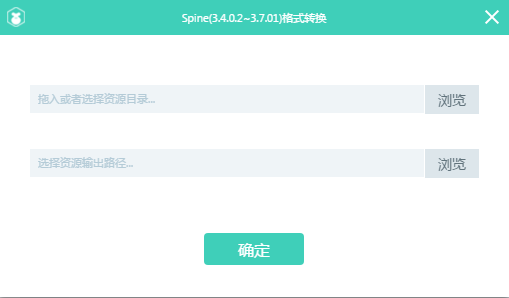

# LayaAir引擎播放Spine骨骼动画

> This article uses screenshots of LayaAirIDE version 2.0.0 to illustrate. If there are any differences, please download the latest stable version of LayaAirIDE, whichever version is the latest.

Spine bone animation is one of the bone animations often used in the game. Through the conversion tool of layaairide, the spine bone animation format can be converted to the bone animation format supported by the layaair engine.


###1. Notices in Exporting Spine Skeletal Animation

The original spine skeleton animation in the export, there are several things to pay attention to, otherwise it can not complete the conversion.

####1.1 supports only transformations exported to JSON format

Spine skeleton animation supports JSON and binary data export. It should be noted that LayaAirIDE's Spine conversion tool only supports JSON format conversion. Please select JSON format when exporting.

####1.2 atlas must be created when exporting

LayaAirIDE's Spine conversion tool only supports spine skeleton animation conversion in atlas mode. Therefore, when using spine skeleton animation editing tool to export, check`创建图集`As shown in Figure 1.

 


(Figure 1) Export Interface of Spine Skeleton Animation Editor Tool

####1.3 In the settings of Atlas Packaging, the Rotation option cannot be checked

On the right side of the Creation Atlas of the Spine Skeleton Animation Editor Tool, Click`设置`Button to enter the Pack Settings interface. To confirm in the area settings`旋转`Options are unchecked. Checklist`旋转`After the option, LayaAirIDE converts the Spine tool, which cannot be converted successfully.

 


(Figure 2) Setting Interface of Atlas Packaging Exported by Spine Skeletal Animation

####1.4 Pay attention to the exported version of Spine

Not all Spine versions of LayaAirIDE support conversion. The supported version number is displayed in the Spine Conversion Tool Panel. As of this document, Spine has been supported to 3.6.16 since version 3.4.0.2. Later, Laya air ide will update the spin version support from time to time. Developers can pay attention to the change of version number support status on the conversion tool panel.

####1.5 converting the entire exported directory

Export generated file is`atlas,json,png`The format of the file is shown in Figure 3. It is important to note that when using the conversion tool, do not drag the file directly to convert, but drag the entire parent directory (* spine directory in Figure 3 *) into the conversion panel.

 


(Fig. 3)


###2. Converting Spine Animation to LayaAir Engine Recognition Format

####2.1 Open the Conversion Tool Panel

At Laya AirIDE`设计模式`In turn, click on the menu bar`工具`>`Spine动画转换`As shown in Figure 4, you can open it`Spine格式转换`Tools.

 


(Fig. 4)


Open`Spine格式转换`In the toolbar, the spine version number supporting conversion is in parentheses after the top spine. As shown in Figure 5, spine 3.4.0.2 and 3.6.16 versions and spine skeleton animation between the two versions are currently supported for conversion to the format supported by the LayaAir engine.

 


(Fig. 5)


####2.2 Generate skeleton animation file with.Sk suffix

open`Spine格式转换`After the tool panel, drag the resource directory exported by spine into the transformation panel, or click the Browse button to select the resource directory exported by spine. Then click`确定`, a new bone animation file with. SK suffix can be generated in the original resource directory. As shown in Figure 6.

 


(Fig. 6)


###3. Loading display of spine animation

####3.1 Copy the converted spine animation resources to the corresponding directory of the project.

In addition to the. SK format file generated by the transformation, the. png suffix's atlas resources also need to be copied to the project directory, as shown in Figure 7. (* Other exported files are not managed and are only used by conversion tools. *)

 


(Fig. 7)

####3.2 Spine Animation Play Example

The following example will be used`laya.ani.bone.Skeleton`Class, specific API instructions can be directly opened to see the link:[https://layaair.ldc.layabox.com/api/?category=Bone&class=laya.ani.bone.Skeleton](https://layaair.ldc.layabox.com/api/?category=Bone&class=laya.ani.bone.Skeleton)

Create the document class SpineDemo.as, and write the following code:


```java

package
{
	import laya.ani.bone.Skeleton;

	public class SpineDemo
	{
		public function SpineDemo()
		{
			//初始化舞台
			Laya.init(1334, 750);
			
			//创建一个Skeleton对象
			var skeleton:Skeleton = new Skeleton();
			//添加到舞台
			Laya.stage.addChild(skeleton);
			
			skeleton.pos(600,700);
			
			//通过加载直接创建动画
			skeleton.load("res/spine/spineboy/spineboy.sk");
		}
	}
}
```

The operation effect is shown in Figure 8.

 


(Fig. 8)

