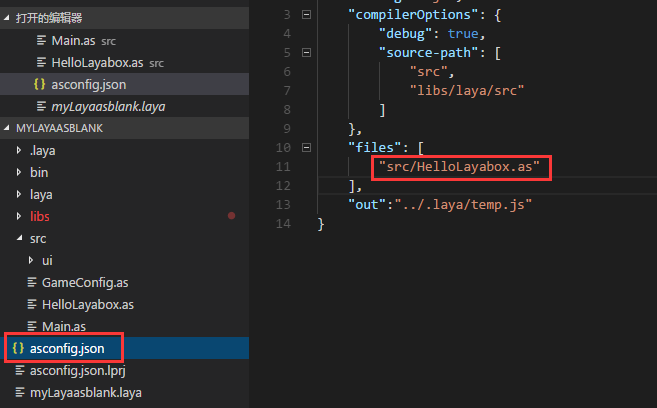

#Novice FAQ: click Run error reporting and black screen after configuring the environment


###I. Error Reporting Caused by Native Reference to AS3

**Phenomenon:**

Configure the compilation environment of FB after the new project is built in FB. Click Application-Run Error Report after the environment is configured, as shown in Figure 1.

​<br/>
(Fig. 1)

**Reason:**

Error reporting is due to the introduction of native Flash AS3 API in the code and Sprite inheriting native AS3. The LayaAir engine supports the basic grammar of Flash AS3 language, but does not support the reference and inheritance of native AS3 API.

​<br/>
(Figure 2)

**Recommendation:**

1. Right-click on the project - > Attribute - > Construction Path - > Delete the original flash sdk. Verify that Laya's SWC file has been introduced in the library path and Laya's engine library file in the source path. Figure 3, Figure 4, Figure 5.

2. We need to be familiar with the LayaAir engine API and develop it with the API of the LayaAir engine.

​<br/>
(Figure 3) Delete the original SDK

​<br/>
(Figure 4) Introduce playerglobal. SWC in the LayaAir engine library compression package. The path in the graph is for reference only.

​<br/>
(Fig. 5) Introduce the engine library. The path in the diagram is for reference only.


###2. Compilation error caused by document class (default program) not set

**Phenomenon:**

​<br/>
(Figure 6) Project compilation error

**Reason:**

When the error in Figure 6 occurs during compilation, it is certain that it is caused by the absence of a document class (default program).

**Solution:**

​<br/>
(Figure 7) in Flash Builder, you need to set the entry program as the default application

​<br/>
(Figure 8) In Flash Development, you need to set the entry program as a document class

​<br/>
(Figure 9) in Laya air IDE, modify it in the asconfig.json project file.


###3. Compilation errors caused by redundant characters

**Phenomenon:**

​<br/>
(Figure 10)

After the error in Figure 10 occurs, click OK and the error is reported in the browser console as shown in Figure 11.

​<br/>
(Fig. 11)

**Reason:**

Most of these errors are caused by grammatical illegalities such as redundant characters.

**Recommendation:**

Flash Builder is recommended to develop an AS3 version of the Laaya Air Engine project. The automatic grammar checking function in Flash Builder is mature, which can avoid errors caused by careless mistakes.


###Compilation Errors Caused by Unselected Program Files

**Phenomenon:**

An error in Figure 12 occurs when you click or use shortcut keys to compile.

​<br/>
(Fig. 12)

**Reason:**

Because there is no mouse and no program file is selected, running compilation directly will result in the error report in Figure 12.

**Solution:**

Select a valid program file or folder and recompile it.


###V. black screen caused by cross domain

**Phenomenon:**

After running the project, the browser displays a black screen and the console displays as shown in Figure 13.

​<br/>
(Figure 13)


 


**Reason:**
By default, browsers do not allow files to be read across files, which involves cross-domain issues.

**Solution:**

1. Local debugging solution:

In Chrome browser shortcut - > right click to open properties - > shortcut bar - > add at the end of target`--allow-file-access-frome-files`

2. Server web server solution:

It is necessary to modify the web server (most of the web servers are apache, nginx, tomcat, etc.) and add cross-domain identifiers under the specific domain name requested. Take nginx as an example:


```nginx

http {

  ......

  add_header Access-Control-Allow-Origin *;

  add_header Access-Control-Allow-Headers X-Requested-With;

  add_header Access-Control-Allow-Methods GET,POST,OPTIONS;

  ......

}

```


This enables cross domain request support for get, post, and options

It's fine too`add_header Access-Control-Allow-Origin http://www.layabox.com;`- specify the allowable url;

3. If the data request is cross-domain, it needs the backend language to cooperate with the modification, and add the header identifier to the request. Here, take PHP language as an example:

`header("Access-Control-Allow-Origin: *");`Not necessarily used`*`,`*`It allows all hosts to access across domains. You can also write hosts under the specified domain name to access.
