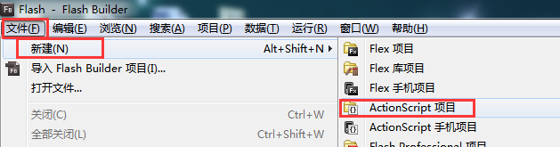
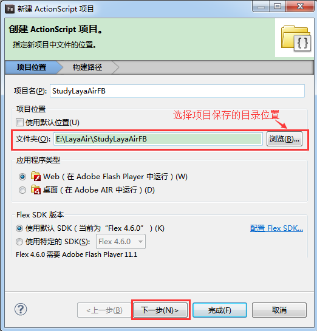

#The first program "Hello Layabox" in FlashBuiler

>**This article uses AS3 language to display text Hello Layabox in Flash Builder environment. After learning this article, it is the first program to complete the LayaAir engine. Make sure you read this article first: Configuration of Flash Builder development environment**
>
> If you have read "Creating AS3 Project with LayaAirIDE and Explaining the Directory Structure" and have already established the project, you can skip the first step. We recommend that you use LayaAirIDE to build the project.
>


##The first step is to build a new project

**Step one**:

Open Flash Builder, click "File" in the menu bar, then select "New" and click "ActionScript Project" to enter the window to create the project. As shown in Figure 1

<br / >
(Fig. 1)


**Step two**:

Enter the project name in the "Project Name" input field, and then enter the project storage directory in the "Folder" input field or click "Browse" to select the storage directory. Then click Next to enter the Build Path window for Engine Compilation and Engine Library Configuration. As shown in Figure 2

<br / >
(Fig. 2)


**Step three**:

In the build path configuration "library path" window, first delete the built-in compilation SDK of the system (in order to avoid wrong package import).

Then click "Add SWC" and add "player global. swc" in the engine package.

If the project needs to release Flash version, add "LayaAirFlash. swc" in LayaAirFlash. As shown in Figure 3

 <br /> (动图3)


***Tips**Under the Engine Pack Directory`LayaAirFlash/flash`In folder`glsl2agal.swc`It's also for Flash releases, but the reference`glsl2agal.swc`Then you need to refer to the library that publishes Flash at the source path of the project. Layaairflash.swc integrates libraries, so there is no need to refer to them repeatedly. Notice that`LayaAirFlash.swc`and`glsl2agal.swc`Only one of the files can be imported.


**Step four**:

After introducing swc, it is recommended that the output folder be defaulted`bin-debug`Set to`bin`As shown in Figure 4. Because the default release directory of LayaAirIDE is the bin directory after the project is created, since LayaAirIDE is usually used in game design such as UI, animation, etc., it is recommended that the uniform settings be set to the bin directory when creating the project.`bin`。

<br/> (Figure 4)


**Step five**:

In the build path configuration“`源路径`” Click in the window“`添加文件夹`"Enter the directory where the engine library is located" or click "Browse" to select "the directory where the engine library is located" (Note: the directory where the engine library is located is the SRC file under the LIBS folder), and then click OK to complete the import of the engine library. As shown in Figure 5

<br/> (Fig. 5)

If we need to publish Flash, and the previous library path refers to`glsl2agal.swc`When referring to the source path, you also need to add the source libraries needed to publish flash (* refer to LayaAirFlash. SWC without adding *). The flash source libraries are located in“`引擎库目录\as\LayaAirFlash\flash\src`” In the directory, as shown in Figure 5-2.

<br/> (Fig. 5-2)


**Finally, click the "Finish" button at the bottom to end the boot of the new project.**

　　


##The second step shows the text "Hello Layabox"

**Step one**:

In the menu bar File, select New, click ActionScript Class, and open the window for the new class file. As shown in Figure 6

<br/> (Fig. 6)


*Tips: A new ActionScript project will have an ActionScript class with the same name as the project name. If you need to use this class, you need to delete the Sprite package inside, because it's Flash's native package. If you don't delete it, you will get an error.*


**Step two**:

Enter Hello Layabox in the name bar and click Finish to create a new ActionScript class. As shown in Figure 6-1

<br / >
(Fig. 6-1)


**Step three**:

Set HelloLayabox. as as the default application. As shown in Figure 7

<br / >
(Fig. 7)


**Step four**:

Double-click to open Hello Layabox. as and start coding. Add a text of "Hello layabox" to the stage. The code is as follows:


```typescript

package
{
	import laya.display.Text;
	public class HelloLayabox
	{
		public function HelloLayabox()
		{
			//初始化引擎
			Laya.init(600, 300);
			var txt:Text = new Text();
			//设置文本内容
			txt.text = "Hello Layabox";
			//设置文本颜色为白色，默认颜色为黑色
			txt.color = '#ffffff';
			//将文本内容添加到舞台 
			Laya.stage.addChild(txt);
		}
	}
}
```


**Step five**:

After the code is written, use the compiler configured in the previous article and click the button to start compiling. After compiling, the chrome running code will start automatically. As shown in Figure 8

<br / >

(Fig. 8)


The results of the operation are shown in Figure 9.

<br / >
(Fig. 9)


**Step six**:

"Hello Layabox" has been shown, but it's too simple. Now let's make "Hello Layabox" look better. The code is as follows:


```typescript

package
{
	import laya.display.Text;
	public class HelloLayabox
	{
		public function HelloLayabox()
		{
			//初始化引擎
			Laya.init(600, 300);
			var txt:Text = new Text();
			txt.text = "Hello Layabox";
			//设置文本颜色   
			txt.color = '#FF0000';
			//设置文本字体大小，单位是像素   
			txt.fontSize = 66;
			//设置字体描边   
			txt.stroke = 5;
			//描边为5像素   
			txt.strokeColor = '#FFFFFF';
			//设置为粗体   
			txt.bold = true;
			//设置文本的显示起点位置X,Y   
			txt.pos(60, 100);
			//设置舞台背景色   
			Laya.stage.bgColor = '#23238E';
			//将文本内容添加到舞台   
			Laya.stage.addChild(txt);
		}
	}
}
```


The results are shown in Figure 10.

<br / >
(FIG. 10)


So far, if you can follow this introductory tutorial to complete the display above, congratulations on your success in introducing, we have completed the first HTML5 program developed in AS3 language, which also shows that LayaAir's development environment configuration is correct. For more information on how to use the API for LayaAir engine development, please visit the Layabox Developer Center on the official website to view the online API and online DEMO.