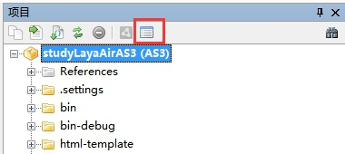
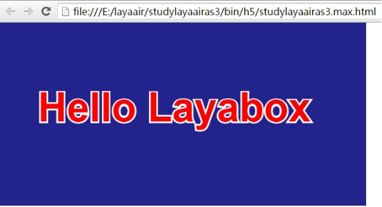

#The first program in flash development "Hello layabox"

>###This article uses AS3 language to display text Hello Layabox in Flash Development environment
> This is the first program to complete the LayaAir engine. Make sure you finish reading before you study this article.**Configuration of Flash Develop Development Environment**
>
> If you have read "Creating AS3 Project with LayaAirIDE and Explaining the Directory Structure" and have already established the project, you can skip the first step. We recommend that you use LayaAirIDE to build the project.
>


##The first step is to build a new project through Flash Development

​**Step one**: open flash development, find "project" in the menu bar and click "new project".

​<br/>
Figure (1)

​**Step two**Select "AS3 Project" type, enter project name, select project storage location, click "OK" to complete the operation of the new project.

​<br/>
Figure (2)


  


##Step 2 Configuration Project

###2.1 Reference Engine Library

**Step one**: click "project properties" in the project panel to open the project property configuration window.

​<br/>
Figure (3)

​**Step two**Click "Add Class Path" to select the directory where the LayaAir engine is located, and then click "OK" to complete the reference of the LayaAir engine library.

<br/>
Figure (4)


 


###2.2 Adding SWC to the library

When downloading the engine, after decompressing the engine package, we can see three SWC files, namely "player global. swc" in the root directory, "LayaAirFlash. swc" in the LayaAirFlash directory and "glsl2agal. swc" in the subdirectory. Player global. SWC is used to use LayaAir engine API prompts during development. The other two SWC files are used to publish Flash versions. LayaAirFlash. SWC and glsl2agal. SWC may not be added to the library without considering the release of Flash.

​**Step one**Add a LIBS folder under the new studyLaya AirAS3 project.

​<br/>
Figure (5)

​**Step two**: drag "playerglobal. SWC" under the root directory of the downloaded and unzipped layaair engine to the newly created LIBS folder by clicking and dragging. Or copy and paste it into the LIBS folder. Then right-click the SWC file and left-click "Add to Library" to add to the library.

​<br/>
Figure (6)


 


##The third step is to display the text "Hello Layabox"

###3.1 create a new class file hellolayabox

​**Step one**Right-click "src directory" to add a new class. (Tip: The added class files must be in the SRC directory or referenced by "Add Class Path", otherwise they cannot be compiled)

​<br/>
Figure (7)

​**Step two**Set the class name to HelloLayabox

​<br/>
Figure (8)

###3.2 Display "Hello Layabox" on the H5 page

​**Step one**: set hellolayabox.as as the document class.

​<br/>
Figure (9)

​**Step two**Add a "Hello Layabox" text to the stage, code as follows:


```java

package {
 import laya.display.Text;
  
 /** @author Charley */
  
 public class HelloLayabox {
  public function HelloLayabox() {
   //创建舞台，默认背景色是黑色的
   Laya.init(600, 300);
   var txt:Text = new Text();
    
   //设置文本内容
   txt.text = "Hello Layabox";
    
   //设置文本颜色为白色，默认颜色为黑色
   txt.color = '#ffffff';
    
   //将文本内容添加到舞台 
   Laya.stage.addChild(txt);
  }
 }
}
```


​**Step three**After the code is written, the AS3 code is compiled into HTML5 using the compiler shortcut key (Alt + F5) defined earlier.

​<br/>
Figure (10)

After compiling, the compiler automatically starts chrome to view the results.

​<br/>
Figure (11)

​**Step four**As shown in the figure above, "Hello Layabox" has been shown, but it's relatively simple. Now let's make "Hello Layabox" look better. The code is as follows:


```java

package {
 import laya.display.Text;
  
 /**
  * @author Charley
  */
 public class HelloLayabox {
  public function HelloLayabox() {
   //创建舞台
   Laya.init(600, 300);//舞台默认背景色是黑色的
   var txt:Text = new Text();
   txt.text = "Hello Layabox";
    
   //设置文本颜色
   txt.color = '#FF0000';
   //设置文本字体大小，单位是像素
   txt.fontSize = 66;
    
   //设置字体描边
   txt.stroke = 5;  //描边为5像素
   txt.strokeColor = '#FFFFFF';
    
   //设置为粗体
   txt.bold = true;
    
   //设置文本的显示起点位置X,Y
   txt.pos(60, 100);
    
   //设置舞台背景色
   Laya.stage.bgColor = '#23238E';
    
   //将文本内容添加到舞台
   Laya.stage.addChild(txt);
   
  }
 }
}
```


The results of the operation are as follows:

​<br/>
Fig. (12)


**At this point, if you can follow this introductory tutorial and complete the above figure, congratulations on your success. We have completed the first HTML5 program developed in AS3 language, which also shows that the development environment of layaair is configured correctly. For more API usage methods developed by layaair engine, please go to the layabox Developer Center on the official website to view online API and online demo.**
