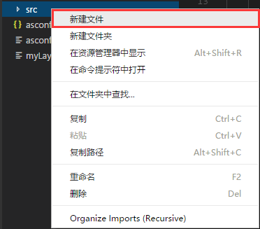

#The first program "Hello Layabox" in LayaAirIDE

>This article uses AS3 language to display the text Hello layabox in Laya air ide environment
>
> This is the first program to complete the LayaAir engine. Make sure you finish reading before you study this article.**"Creating AS3 Project with LayaAirIDE and Detailing Directory Structure"**
>

​


 **Step one**Open the AS3 project of LayaAirIDE, under the SRC directory, click "New File", as shown in Figure 1.


​    <br/>
Figure (1)


​**Step two**: enter the class name hellolayabox.as and press enter to generate an AS3 class file of hellelayabox.as, as shown in Figure 2.

​<br/>
Figure (2)


​**Step three**HelleLayabox. as is a document class. Click to open the Flash Development project file`“项目名.as3proj”`(here is`myLaya.as3proj`) modify`<compiletargets></compiletargets>`The compilation path of the document class in the label, as shown in Figure 3, is modified to the path of the new class file HelleLayabox. as in this example. The specific operation is shown in the following figure:

​<br/>
Figure (3)


​**Step four**: one`“Hello Layabox”`The text of is added to the stage. Click on HelleLayabox. as to add the code as follows:
​<br/>
Figure (4)


**HelleLayabox.as code:**


```javascript

package 
{
    /**
     * ...
     * @author laya_Aaron(小明)
     */
    import laya.display.Text;
    public class HelloLayabox
    {
        public function HelloLayabox()
        {
            //创建舞台，默认背景色是黑色的
            Laya.init(600, 300);
            var txt:Text = new Text();
             
            //设置文本内容
            txt.text = "Hello Layabox";
             
            //设置文本颜色为白色，默认颜色为黑色
            txt.color = '#ffffff';
             
            //将文本内容添加到舞台 
            Laya.stage.addChild(txt);       
        }
    }
 
}

```


​

**Step five**After coding, compile and run the code with F5 shortcut key as shown in the following figure:

​<br/>
Figure (5)


​**Step six**As shown in the figure above,`“Hello Layabox”`It's already shown, but it's a bit crude. Let's make it look like this.`“Hello Layabox”`To make it better, continue to modify the code as follows:

​<br/>
Figure (6)

**Hellelayabox.as Code:**


```javascript

package 
{
    /**
     * ...
     * @author laya_Aaron(小明)
     */
    import laya.display.Text;
    public class HelloLayabox
    {
        public function HelloLayabox()
        {
            //创建舞台
            Laya.init(600, 300);//舞台默认背景色是黑色的
            var txt:Text = new Text();
            txt.text = "Hello Layabox";
             
            //设置文本颜色
            txt.color = '#FF0000';
            //设置文本字体大小，单位是像素
            txt.fontSize = 66;
             
            //设置字体描边
            txt.stroke = 5;  //描边为5像素
            txt.strokeColor = '#FFFFFF';
             
            //设置为粗体
            txt.bold = true;
             
            //设置文本的显示起点位置X,Y
            txt.pos(60, 100);
             
            //设置舞台背景色
            Laya.stage.bgColor = '#23238E';
             
            //将文本内容添加到舞台
            Laya.stage.addChild(txt);
        }
    }
 
}
```


​

The results of the operation are as follows:

​<br/>
Fig. (7)


So far, if you can follow this introductory tutorial, complete the display above, congratulations on your successful introduction, we have completed the first HTML5 program developed in AS3 language in LayaAirIDE, which also shows that the development environment configuration of LayaAir is correct. For more information on how to use the API for LayaAir engine development, please visit the Layabox Developer Center on the official website to view the online API and online DEMO.

