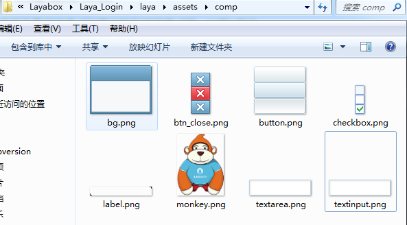
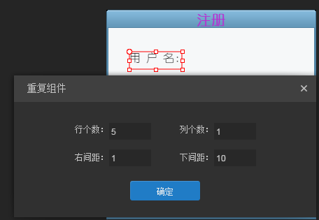

#Use LayaAir IDE to create the login and registration interface of the game

As long as the game developers believe that you are familiar with the login and registration pages of the game. How to use LayaAirIDE to create a login registration page? Please read this tutorial patiently.

**Let's first look at the final results. As shown in Figure 1, figure 2, figure 3 and Figure 4**


(Figure 1) after the interface is spelled in the IDE, instantiate the login page in the code and add it to the stage. Click the registration button to pop up the registration panel (Figure 2).


(Figure 2) Click the submit registration prompt registration success page (Figure 3) and click the close button in the upper right corner to close the registration page.


(Figure 3) Click on the OK or Close button in the upper right corner to close the registration success prompt page.


(Figure 4) Click the login button on the login panel to pop up the login success page.

##1. New projects

Open the installed LayaAirIDE and create an empty project (this article is version AS). Name the project, select the path, select the project class, and finally click Create. As shown in Figure 5


(Figure 5) the created project structure will not be explained in detail here, please switch to the relevant document page to view

##2. Create landing pages and complete UI splicing of landing pages

###2.1 add resources

If the current ide page is not in editing mode, you need to switch to editing mode. As shown in Figure 6


(Fig. 6)

The project created with LayaAirIDE will have a resource file named comp in the edit mode - resource directory, which stores some common UI component resources. You can't use so many resources in this document, so delete some resources and add a new one. The resources retained in the final resource file are shown in Figure 7.


(Figure 7) Resource operation steps: Right-click in the resource panel - open the directory where the resource is located - delete the redundant resource, add a resource - return to the IDE resource panel to refresh the resource. As shown in Figure 8


(Fig. 8)

###2.2 Create landing pages

In the edit mode project module, right-click - New - page to create a landing page (as shown in Figure 9), and then pop up the creation page panel (as shown in Figure 10).


(Fig. 9)


(FIG. 10)

**Page type:**

There are two kinds, View and Dialog. The difference between the two is that Dialog inherits from View, and some functions of View are available in Dialog. Unlike View, Dialog component is a pop-up dialog box, which implements pop-up, drag and mode window functions of dialog box. View can be used as a fixed display panel in a real project, while Dialog can be used as a pop-up box in a real project.

**Page Name:**

Name of this page

**Reference View:**

In the actual project, there may be a lot of resources on the interface. In this case, you need to follow the schematic diagram given by the art to locate these locations. If there is no reference, it will take a long time just to look at the sketch to operate. The purpose of the reference view is to add art to the sketch and follow it. (The reference view will not eventually be used in the actual project.)

**Page width, page height:**

The width and height of the page, you can see a "Reference Only" check box at the back. If this check box is checked, the width and height filled in the front is invalid in the actual project. The width and height of the elements on the current page will be calculated automatically, and the width and height of the whole page will be obtained (this operation will consume performance, please use it with caution). If this option box is not checked, the width set at the front is the width of the actual page (if the resource exceeds the width set, then the excess will not be rendered and no events can be added).

**Background:**

The color of the background when editing the page (for reference only, the actual project will not take effect)

Finally, by clicking the OK button, you will find a visual area in the middle of the IDE.

###2.3 Edit landing page

**A common landing page is the game's logo, title, user name, password, remember password option box, automatic login option box, registration button, login button and other elements. Then we will make a landing page like this (Note: the properties of all components can be found in the API, if you do not understand, please find the corresponding API by yourself).**

**2.3.1. Add Background**:

Select the background resources and drag them onto the page. Find the sizeGrid property in the right property bar (set the nine panes to 35, 20, 20, 20). The purpose of setting the nine panes is to avoid blurring when stretching the picture, and then set the width and height of the background image to the width of the page. As shown in Figure 11


(FIG. 11)

**2.3.2. Add logo resource:**

Add the logo monkey of layabox to the page and place it on the left side (I will not take a screenshot here to see the effect, as shown in Figure 12)

**2.3.3. Add a title:**


将资源面板中的Label组件拖拽到页面中。在右侧属性面板—常用属性中设置text属性为“欢迎来到LayaAir世界”，设置color颜色为红色“#Ff0400 ", set bold to"true"and font font font to"young circle"(note that the font must be the font already in the computer.**All the words in this project will be set to Youyuan and will not be mentioned later.**Set fontSize text font size to "35" and align align horizontally to center alignment. As shown in Figure 11


(Fig. 12)

**2.3.4. Add user name and password:**

Drag from the resource list to place the two labels on the page in the appropriate position, then set the text to "user name:" and "password:" in the right property panel, set the font to "small circle" and the font size to "20".

Drag the two input boxes "TextInput" from the list of resources to the page and place them in the corresponding position of the user name and password. In the right property bar, declare the variable "userName" to the VaR of the user name input box (the difference between VaR and name: VaR is the only variable in the world, through which all attributes under this component can be modified directly. Name can obtain the object through the parent node. Getchildbyname ("name") to modify its properties). Set the prompt prompt of the user name to "please enter the user name", and the font is also "small circle". The password input box is the same as the username input box. Set the VaR variable to "userPassword" and the prompt to "Please enter your password". As shown in Figure 13 and Figure 14


(FIG. 13)


(FIG. 14)

**2.3.5. Add check box:**

Add the Memory Password and Automatic Logon check box to record status

Drag two check box components from the resource directory, set the label to "remember password" and "auto login" in the right property panel, and then set whether the labelbold is bold to "true" and labelfont to "small circle" in other options. As shown in Figures 15 and 16


(FIG. 15)


(FIG. 16)

**2.3.6. Add registration and login buttons:**

Registration button: After clicking, the registration page pops up; The landing button: Click the landing prompt.

The button property settings are shown in Figures 17 and 18.


(FIG. 17)


(Fig. 18)

**The login interface has been completed here. Next, continue to spell the registration window and the prompt window. After the UI interface is completed, the corresponding functions can be realized by code.**

##3. Create registration page and complete UI splicing of registration page

**3.1 Create a Registration Page**

The steps are consistent with the 2.2 landing page. The difference is that the registration page is of Dialog type (the difference between Dialog and View has been discussed in detail when creating the login interface in 2.2 above, but not in detail here). Click the OK button to complete the creation of the page. As shown in Figure 19


(Fig. 19)

**3.2 Add Page Background**

Refer to Step 2.3.1, drag the background resources into the page, set the nine palaces and the size of the picture.

**3.3 add title**

Refer to step 2.3.3, drag the Label component into the page, place it in the title position, and set the corresponding properties. As shown in Figure 20


(FIG. 20)

**3.4 Add user name, user name input box, password and other components**

Drag a Label component from the resource panel and set the font to Young Circle, font Size font size to 16, alignment algin to left, and display text. Select Label and press Ctrl + R to copy five identical components. As shown in Figure 21


(Figure 21) after clicking OK, you can see that there are five identical labels on the page. Adjust the lower position appropriately and modify the text content of each label. As shown in Figure 22


(Fig. 22)

The display text is identical except the text text content. The content in the red box name can be created automatically when the component is copied by shortcut keys without affecting any content. With the front text display content, there must be a corresponding input box at the back. Drag a text input box from the resource panel and put it behind the username. Then use the shortcut key Ctrl+R to copy five identical text input boxes, fine-tune the position, prompt the content of the prompt at the input prompt, and set font to "baby circle". As shown in Figure 23


(Fig. 23)

**3.5 Add submit registration button and close page button**

Drag a button component from the resource panel and put it directly below. The label display text is set to "submit registration". The VaR variable is named "BTN? Submit" (close the registration page when clicking the button). Then drag a closing button from the resource panel and place it in the upper right corner. Name the closing button as "close" (you can name the component name on the page as close in the Dialog page. Clicking on the component will close the Dialog page), and delete the label text displayed by the closing button by default. As shown in Figures 24 and 25


(Fig. 24)


(Fig. 25)

##4. Create the prompt page and complete the UI splicing of the prompt page

**4.1 Create Pages**

Step 3.1: Change the page name to NormalDig and click OK

**4.2 Adding Display Components**

Drag a Label component from the resource panel, define the VaR variable as "txtContent", and set common properties as shown in Figure 26.


(Fig. 26)

**4.3 Add confirm button and close page button**

Consistent with step 3.5, define the VaR variable for the confirmation button as "btn_sure". As shown in Figures 27 and 28


(Fig. 27)


(Fig. 28)

##5. Realize the effect of Figure 1, 2, 3 and 4 with code

Before writing the code, export the resources in edit mode F12, and then go to the bin/h5/res/atlas directory in code mode to see if the corresponding atlas files are generated. If not, go back to edit mode and clean up and export the resources by pressing the shortcut key Ctrl+F12. (The AS project suggests that developers use FB or FD to write, and this article takes FB as an example.)

**5.1 Importing Projects with FB**

Import project step: Open FB - File - Import Flash Builder project (pop-up import project selection box) - Select project folder to copy project directory in - Complete. (Refer to the Basic Documents if you don't understand)

**5.2 Preload resources and display landing pages**

The purpose of preloading resources is to avoid overloading when using resources (button resources must be preloaded!). After preloading the resource, the landing page is instantiated in the callback after loading the resource. The code is as follows:


```typescript

package {
	import laya.net.Loader;
	import laya.utils.Handler;
	
	import ui.LoginUI;

	public class LayaSample {
		public function LayaSample() {
			//初始化引擎
			Laya.init(1136, 640);
			//预加载资源
			Laya.loader.load("res/atlas/comp.json",Handler.create(this,onLoaded),null,Loader.ATLAS);
		}		
		//资源加载完成回调
		private function onLoaded():void
		{
			//实例化登陆页面
			var login_ui:LoginUI = new LoginUI();
			//把登陆页面添加到舞台上
			Laya.stage.addChild(login_ui);
		}
	}
}
```


The compilation effect is shown in Figure 29.


(Fig. 29)

In practical projects, if there are many operations on the elements on the UI page, it is not recommended to instantiate the UI page directly in the entry class. It is suggested to create a UI logic class to inherit the UI page and then operate on the elements inside. So modify the code here, create a landing page to inherit the corresponding UI page, instantiate the landing page in the entry class

The new login logic class is shown in Figure 30.


(Fig. 30)

Then change the code of the entry class to the following code


```typescript

package {
	import laya.net.Loader;
	import laya.utils.Handler;
	
	import ui.LoginUI;

	public class LayaSample {
		public function LayaSample() {
			//初始化引擎
			Laya.init(1136, 640);
			//预加载资源
			Laya.loader.load("res/atlas/comp.json",Handler.create(this,onLoaded),null,Loader.ATLAS);
		}		
		//资源加载完成回调
		private function onLoaded():void
		{
          	/////修改此处/////
			//实例化登陆页面
			var login_view:LoginView = new LoginView();
			//把登陆页面添加到舞台上
			Laya.stage.addChild(login_view);
		}
	}
}
```


**5.3 Open the corresponding page by adding events to the login and registration buttons**

Before adding click events to the login and registration buttons, create a logistic class of the login page and a logistic class of the registration page to inherit their respective UI pages, so as to operate the corresponding UI interface. As shown in Figures 31 and 32


(Fig. 31)


(Fig. 32)

Open the LoginView class, add a click event to the registration button, and click the registration button to pop up the registration page. The code is as follows:


```typescript

package
{
	import laya.events.Event;
	import ui.LoginUI;

	public class LoginView extends LoginUI
	{
		public function LoginView()
		{
			//给注册按钮添加点击事件
			this.btn_reg.on(Event.CLICK,this,onReg);
		}
		private function onReg(e:Event):void{
			//实例化并弹出注册页面
			var reg:RegDlg = new RegDlg();
			//弹出注册页面
			reg.popup();
		}
	}
}
```


The effect of the above code implementation is shown in Figure 33 (the effect is the same as Figure 2).


(Figure 33) Click the Close button to close the registration page (because the name of the Close button is named "close" in the UI page).

Add a click event to the submit registration button and pop up the prompt panel after clicking. However, the prompt content in the prompt panel needs to be assigned a value at the same time of pop-up, so first switch to the normal dig class of the prompt page, add a public method to assign a value to the text and add a click event to the OK button, and click to close the prompt page. The code is as follows:


```typescript

package
{
	import laya.events.Event;
	
	import ui.NormalDigUI;

	/**
	 * 提示页面
	 * @author Laya
	 * 
	 */
	public class NormalDig extends NormalDigUI
	{
		public function NormalDig()
		{
			//给确定按钮侦听点击事件，点击后关闭面板
			this.btn_sure.on(Event.CLICK,this,onClick);
		}
		private function onClick(e:Event):void{
			//关闭页面
			this.close();
		}
		public function popupContent(msg:String):void{
			//给文本赋值
			this.txtContent.text = msg;
			//弹出页面
			this.popup();
		}
	}
}
```


Open the registration page RegDlg class, and pass in the text "Register Successfully!" to the prompt panel. The code is as follows:


```typescript

package
{
	import laya.events.Event;
	import ui.RegDlgUI;
	/**
	 * 注册页面
	 * @author Laya
	 * 
	 */
	public class RegDlg extends RegDlgUI
	{
		public function RegDlg()
		{
			//给提交注册按钮侦听点击事件
			this.btn_submit.on(Event.CLICK,this,onClick);
		}
		private function onClick():void
		{
			//实例化提示页面（目的是为了给提示面板中的文本赋值）
			var dlg:NormalDig = new NormalDig();
			dlg.popupContent("注册成功！");
		}
	}
}
```


The operation effect of the above code is shown in Figure 34 (consistent with figure 3)


(Fig. 34)

**The relevant code of the registration page has been completed here. Next, the logistic code of the landing page is completed.**

Open the login LoginView class, register the click event for the login button, click the pop-up prompt page and display the successful login. The code is as follows:


```typescript

package
{
	import laya.events.Event;
	import ui.LoginUI;
	public class LoginView extends LoginUI
	{
		private var dlg:NormalDig;
		public function LoginView()
		{
			//实例化提示面板（目的是为了在点击登陆按钮时给提示页面中的文本赋值）
			dlg = new NormalDig();
			//给注册按钮添加点击事件
			this.btn_reg.on(Event.CLICK,this,onReg);
			//给登陆按钮添加点击事件
			this.btn_login.on(Event.CLICK,this,onLogin);
		}
		private function onReg(e:Event):void{
			//实例化并弹出注册页面
			var reg:RegDlg = new RegDlg();
			//弹出注册页面
			reg.popup();
		}
		private function onLogin(e:Event):void 
		{
			//给提示面板赋值
			dlg.popupContent("登陆成功！");
		}
	}
}
```


The operation effect of the above code is shown in Figure 35 (consistent with figure 4)


(Fig. 35)

Up to now, the sample documents of login and registration have been completed, and developers can realize more complete login and registration functions on this basis. If you have any questions, please submit them to the forum.[http://ask.layabox.com/](http://ask.layabox.com/)