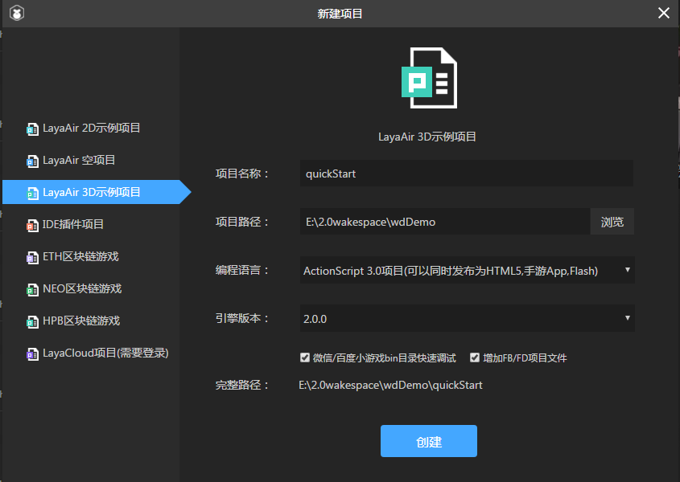

#Quickly start a LayaAir3D project

Below we will use the LayaAir engine to quickly start a 3D project, and use AS language as a tutorial, a simple demonstration using engine code to achieve a basic 3D application.

##IDE Creates 3D Sample Projects

Download Laya air IDE, start the new project and select 3D project as shown in the figure.

(Fig. 1)

Here we choose**JavaScript**Language. After creation, we found that ide created a 3D template for us. Developers can refer to 2D novice tutorials for project structure introduction. I'm not going to repeat it here.

##Quick display of 3D scene

If we go directly to F6 (mac system users may want CMD + F6) or click the run button, we can see the 3D scene of the sample project running.

(Fig. 2)

In the runtime class of gameui.as, a 3D world is built for us, and several elements (scene, camera, light, model, material) necessary for a simple 3D world are added. The following code excerpt is from GameUI. as.


```typescript

//添加3D场景
var scene:Scene3D = Laya.stage.addChild(new Scene3D()) as Scene3D;

//添加照相机
var camera:Camera = (scene.addChild(new Camera(0, 0.1, 100))) as Camera;
camera.transform.translate(new Vector3(0, 3, 3));
camera.transform.rotate(new Vector3(-30, 0, 0), true, false);

//添加方向光
var directionLight:DirectionLight = scene.addChild(new DirectionLight()) as DirectionLight;
directionLight.color = new Vector3(0.6, 0.6, 0.6);
directionLight.transform.worldMatrix.setForward(new Vector3(1, -1, 0));

//添加自定义模型
var box:MeshSprite3D = scene.addChild(new MeshSprite3D(PrimitiveMesh.createBox(1, 1, 1))) as MeshSprite3D;
box.transform.rotate(new Vector3(0, 45, 0), false, false);
var material:BlinnPhongMaterial = new BlinnPhongMaterial();
Texture2D.load("res/layabox.png", Handler.create(null, function(tex:Texture2D):void {
    material.albedoTexture = tex;
}));
box.meshRenderer.material = material;
```


##### 	