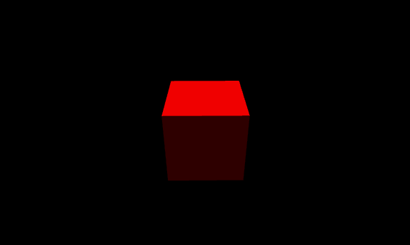

##LayaAir3D script component


###Component 3D, a parent component

In LayaAir 3D engine, Component 3D, a powerful component class, is provided to facilitate display object control and code maintenance. Our animation control components, colliders, scripts, skeleton hangpoints and so on are extensions based on component functions and belong to its subclasses. In addition, the LayaAir 3D engine also supports adding multiple components to a 3D object to make component control more flexible.

In the previous technical documentation, we introduced the basic functions of the animation control component and the collider component, and we will not talk more about them here. In this chapter,**We'll focus on the script component as an example.**Because it inherits from component classes, but hardly has its own extension function. It mainly uses the parent class Component 3D attributes and methods. The script function will be updated in the future. Please look forward to it!


###Main attributes and methods of components

**Owner**: the sprite3d object to which the bound component belongs.

**Enable:**When a component is loaded, it is enabled by default. If it is changed to false, the enabled change event will be sent first, and then the update method _update() of the component will stop executing.

**OnAwake ():**Components are created and executed only once, with no code by default. It can be overridden in inheritance classes and will need to be initialized with logical code.

**OnStart ():**After the 3D object instantiation of the loading component is completed, the first update is executed, and there is no code by default. It can be overridden in inheritance classes, and the logical code after loading 3D objects will be put into it.

Another example is to clone a 3D object with script. If there are more sub-objects in the 3D object, script cloning will be completed first. If the logic in the script is not put into onStart () method, empty object bugs will occur when the sub-objects are retrieved.

**OnUpdate ():**Component update method is equivalent to frame loop. It can be overridden in inheritance classes, putting the logical code that needs to be updated per frame into this method.


###Component-related events

** COMPONENT_ADDED:**The component is loaded to complete the event, sent by the component owner sprite3d, and the component is sent as a parameter.****
****
**The event after the COMPONENT_REMOVED:** component is removed is sent by Sprite3D, the component owner, and the component is sent as a parameter.


###Script Component Script3D

The script inherits from the component, so you can add the script to the 3D display object using the addComponent () method of the display object.

Camera MoveScript is used in many examples of cameras in official website's 3D engine example. After adding this script, cameras can control its rotation and keyboard to control its movement around and around. After developers download the example from the Internet, they can find it for research and modification. Add the script component method code as follows:


```java

//添加摄像机脚本组件
camera.addComponent(CameraMoveScript);
```


Of course, scripts can also be deleted from objects when some logic requires them. The removeComponentByType () method for displaying objects in 3D can be used to remove scripts.


```java

//根据类型移除脚本组件
camera.removeComponentByType(CameraMoveScript);
//移除所有组件(包括动画、脚本、碰撞器等，注意，此方法不能移除子对象节点上的组件)
camera.removeAllComponent();
```


###Create your own script component

Developers can refer to camera scripts and create their own script components to control objects in the scene.

In the development of LayaAir 3D game, we basically create scenes, characters, animations in unit, export scenes and load them in code, then we can add corresponding control script components to different objects in the scene.

For example, the protagonist control script, NPC control script, scene object control script, etc., a game level was born. When the game loads the next level scene, the script can be reused, the project maintenance is convenient and fast, and the control and display are separated.

In the following example, we modify the "Quick Open 3D Travel" code in the technical document, create a control script to add to the box, and remove the script component in four seconds.

First, create a custom script, BoxControlScript, to modify the material of the object box to which the script belongs and rotate around.


```java

package {
	import laya.components.Script3D;
	import laya.d3.core.MeshSprite3D;
	import laya.d3.core.Sprite3D;
	import laya.d3.core.material.RenderState;
	import laya.d3.core.material.PBRStandardMaterial;
	import laya.d3.math.Vector4;
	import laya.d3.math.Vector3;
	import laya.d3.core.material.PBRSpecularMaterial;

	public class BoxControlScript extends Script3D{
		//**************** wq *****************************************
        private var box:MeshSprite3D;
		public function BoxControlScript() {

        }
        /**
		 * 覆写3D对象组件被激活后执行，此时所有节点和组件均已创建完毕，此方法只执行一次
		 */
        override public function onAwake():void{
            //得到3D对象
            box  = this.owner as MeshSprite3D;
        }
        override public function onStart():void{
            //得到3D对象的材质
            var material:PBRSpecularMaterial = box.meshRenderer.material as PBRSpecularMaterial;
            //更改3D对象的材质反射率 （偏红）
            material.albedoColor = new Vector4(1,0,0,1);
        }
        /**
		 * 覆写组件更新方法（相当于帧循环）
		 */	
        override public function onUpdate():void{
            //所属脚本对象旋转更新
            box .transform.rotate(new Vector3(0,0.5,0),false,false)
        }
    }
}
```


Then in the "Quick Open 3D Trip" code, add the script type mentioned above to the box and remove the script after 4 seconds.


```java

package {
	import laya.d3.core.Camera;
	import laya.d3.core.MeshSprite3D;
	import laya.d3.core.Sprite3D;
	import laya.d3.core.light.DirectionLight;
	import laya.d3.math.Vector3;
	import laya.d3.math.Vector4;
	import laya.d3.resource.models.BoxMesh;
	import laya.display.Stage;
	import laya.utils.Stat;
	import laya.d3.core.scene.Scene3D;
	import laya.d3.core.material.BlinnPhongMaterial;
	import laya.webgl.resource.Texture2D;
	import laya.utils.Handler;
	import laya.d3.core.material.PBRSpecularMaterial;
	public class LayaAir3D {
		//**************** wq *****************************************
		public function LayaAir3D() {

			//初始化引擎
			Laya3D.init(0, 0);

			//适配模式
			Laya.stage.scaleMode = Stage.SCALE_FULL;
			Laya.stage.screenMode = Stage.SCREEN_NONE;

			//开启统计信息
			Stat.show();

			//添加3D场景
			var scene:Scene3D = Laya.stage.addChild(new Scene3D()) as Scene3D;

			//添加照相机
			var camera:Camera = (scene.addChild(new Camera( 0, 0.1, 100))) as Camera;
			//移动摄影机位置
			camera.transform.translate(new Vector3(0, 3, 3));
			//旋转摄影机方向
			camera.transform.rotate(new Vector3( -30, 0, 0), true, false);
			//设置背景颜色
			camera.clearColor = null;

			//添加方向光
			var directionLight:DirectionLight = scene.addChild(new DirectionLight()) as DirectionLight;
			//设置灯光漫反射颜色
			directionLight.color = new Vector3(0.6, 0.6, 0.6);
			//设置灯光的方向（弧度）
			directionLight.transform.worldMatrix.setForward(new Vector3(1, -1, 0));

			//添加自定义模型
			var box:MeshSprite3D = scene.addChild(new MeshSprite3D(new BoxMesh(1,1,1),"MOs")) as MeshSprite3D;
			//设置模型的旋转
			box.transform.rotate(new Vector3(0,45,0),false,false);
			//创建材质
			var material:PBRSpecularMaterial = new PBRSpecularMaterial();
			//加载模型的材质贴图
			Texture2D.load("h5/res/layabox.png",Handler.create(this,function(text:Texture2D):void{
				material.albedoTexture = text;
				//给模型添加材质
				box.meshRenderer.material = material;

				//给box添加自定义脚本组件
				box.addComponent(BoxControlScript);
			}))
			//4秒后删除自定义组件
			Laya.timer.once(4000,this,onLoop,[box]);
		}
		private function onLoop(box:MeshSprite3D):void{
			trace("移除组件")
			// 获取到组件
			var boxContro:BoxControlScript = box.getComponent(BoxControlScript);
			// 移除组件
			boxContro.destroy();
			//如不想移除组件，可设置为不启用能达到同样效果（组件_update方法将不会被更新）
			boxContro.enabled = false;
		}	
	}
}
```


In the above code, if the developer does not want to remove the component after 4 seconds, just stop using the script, the script enablement property can be set to false.


By compiling and running the above code, the following results can be achieved (Figure 1). After removing the components, the model stops rotating.

<br> (Fig. 1)