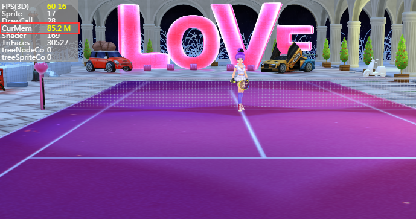

## LayaAir3D之资源释放

###### 修改时间:2019-4-24,version:2.0.1

###Why should resources be released?

In the development of LayaAir 3D games, resource release is very important. 3D resources include model, texture, material, animation, etc. In order to achieve good picture effect, the file will be much larger than 2D, and the basic resources of 3D engine will be put into GPU for computing and rendering, so it occupies a lot of memory. When the game level is constantly loaded, the game continues to deepen, and more and more resources are put into the display memory. If the resources are not released, the game will eventually collapse.

Unlike memory, there is a garbage collection mechanism in memory. Unlike memory, it must be released manually, so the resource release of memory must be paid attention to!

Observe the display size in the statistical tools in Figures 1 and 2

Figure 1 shows the first scene loaded after the game starts. The area is 30527, occupying 85.2M of display memory.

<br> (Fig. 1)

Figure 2 shows the second scenario of game loading, with only 7455 faces, but 118.91M of display memory resources after loading. What is the reason for this? Small area, small scene, mapping is actually much less than the scene in Figure 1, light mapping is much smaller, but the display and memory resources are much larger!

This is because the first shutdown scenario has not been released, its resources are still in the memory, so the memory occupancy becomes larger. If not manually cleared, the game continues to switch other scenes, when a certain amount of mobile phone display memory will be consumed, game card death, flashback, fever and other phenomena will occur frequently.

<br> (Figure 2)


###Handling Principles When Loading Resources

Through the example above, we can see that the layaair3d engine processes the relationship between resources and video memory. In order to achieve the goal of game performance optimization, some principles should also be paid attention to when loading resources.

1. When loading resources, do not load all resources at one time, only the required resources (subsection loading mode). After loading 3D resources, 3D display objects will be created directly according to the suffix names of resources. For example, Scene will be created by. ls and Sprite3D objects will be created by. lh. Even if the created object resources are not put on the stage, they will be directly put into the display memory. Therefore, too much resources will occupy a large amount of display memory.

2. Reasonable management of memory, resources that are often reused need not be released in memory, but resources that are not reused need to be released immediately after use to save performance overhead. For example, protagonist resources, 3D props resources, players often use, can always be stored in the display memory, extraction speed; and some large-scale scenes, when switching, can release resources, scene level mapping, model resources are large, after release can save tens of hundreds of megabytes of display memory overhead.


###Method of Releasing Display Storage Resources

There are two ways to release the explicit memory resources. One is to release the explicit memory resources through the objects, but traversing the resource objects is too troublesome. It is not recommended here. The other is to release the explicit memory resources through the address of the resources. From the perspective of resource management, the method of resource address is more flexible and JSON data table can be configured to manage.

####Transitional interface for switching scenarios and releasing resources

When loading resources and switching scenarios, we create a progress display interface in IDE for transition, as shown in Figure 3

<br> (Figure 3)

After the issuance of IDE, write a control class, the logical code reference is as follows:


```java

package view {
  import ui.ProgressBarUI;

  public class loading extends ProgressBarUI {

    public function loading() {

    }
    public function setValue(num:Number):void{
      this.pro.value = num;
    }
    public function init():void{
      this.pro.value = 0;
      //进度增加帧循环
      Laya.timer.loop(20,this,loop);
    }		
    //资源加载进度模拟*（假进度）
    private function loop():void{
      //进度增加
      this.pro.value +=0.01;
      //最高进度度100%
      if(this.pro.value>=1)
      {
        this.pro.value = 100;
        Laya.timer.clearAll(this);
        this.removeSelf();
      }
    }
  }
}
```


####Release explicit memory resources through resource address table

In the main class, we switch scenarios by double-clicking the stage with the mouse, release the display resources by using the resource address, and load new scenarios.

The method of resource path list is flexible, and it is convenient to add and delete resources in the table by configuring the table. For example, when art exports scenarios, create a new JSON table, put all the resource paths that are not needed after switching in this scenario into the J table. If the useful resources do not enter the table, the resources will not be released, such as some common NPC, props, special effects and other game element resources.

Tips: Resources include: scene light map, material. lmat, model. lm, various types of mapping. png or. jpg, animation. lani, skeleton. LAV and other resources.

Let's introduce the resource table method. First, create a JSON file in the exported resource file directory and edit the path resources to be released to form a JSON array with the same name as the. LS file to make the logical call. In this case, lovescene.json. Figures 5 and 6.

<br>（图5）


<br> (Fig. 6)

After the Json edit is completed, you can use the checking tool to check whether the format is correct. Then create the main class code as follows:


```java

package {
  import laya.d3.core.Camera;
  import laya.d3.core.MeshSprite3D;
  import laya.d3.core.Sprite3D;
  import laya.d3.core.light.DirectionLight;
  import laya.d3.math.Vector3;
  import laya.d3.math.Vector4;
  import laya.d3.resource.models.BoxMesh;
  import laya.display.Stage;
  import laya.utils.Stat;
  import laya.d3.core.scene.Scene3D;
  import laya.d3.core.material.BlinnPhongMaterial;
  import laya.webgl.resource.Texture2D;
  import laya.utils.Handler;
  import view.loading;
  import laya.events.Event;
  import laya.resource.Resource;
  public class LayaAir3D {
    public var load:loading;
    private var scene:Scene3D;
    public function LayaAir3D() {

      //初始化引擎
      Laya3D.init(0, 0);

      //适配模式
      Laya.stage.scaleMode = Stage.SCALE_FULL;
      Laya.stage.screenMode = Stage.SCREEN_NONE;

      //开启统计信息
      Stat.show();
      //加载2D资源文件
      Laya.loader.load("h5/res/atlas/comp.atlas",Handler.create(this,Complete2D));
    }
    public function Complete2D():void{
      //实例化加载进度界面
      load = new loading();
      Laya.stage.addChild(load);
      load.init();
      //加载场景3D资源(不能全部加载，否则太占显存)
      Laya.loader.create(["h5/LayaScene_test/test.ls","h5/LayaScene_twonScene/twonScene.ls"],Handler.create(this,Complete3D))

    }	
    //加载3D资源完成的回调
    public function	Complete3D():void{
      //添加场景
      scene = Laya.stage.addChild(Laya.loader.getRes("h5/LayaScene_test/test.ls"))as Scene3D;
      Laya.stage.setChildIndex(scene,0);
      //点击游戏画面切换场景
      Laya.stage.on(Event.MOUSE_DOWN,this,ChangeScene);
    }
    //加载第二关场景资源，切换场景
    private function ChangeScene():void{
      //去除场景的点击切换事件
      Laya.stage.off(Event.MOUSE_DOWN,this,ChangeScene);
      //移出之前的场景
      scene.removeSelf();
      load.init();
      Laya.stage.addChild(load);
      scene.destroy();

      //加载第二关场景资源到游戏中
      scene = Laya.loader.getRes("h5/LayaScene_twonScene/twonScene.ls");
      Laya.stage.addChild(scene);
      //设置游戏场景层级
      Laya.stage.setChildIndex(scene,0);

      //列表释放显存资源的方法（利用资源表方式，每个场景配置资源路径表）
      assetsDispose();
    }
    private function assetsDispose():void{
      //加载释放的资源配置表
      Laya.loader.load("loveScene.json",Handler.create(this,this.onAssetOK));
    }
    //加载资源释放表完成后
    private function onAssetOK():void{
      //获取加载的数据（Json数据转换成数组）
      var arr:Array = Laya.loader.getRes("loveScene.json");
      for(var i:Number = arr.length-1;i>-1;i--)
      {
        //根据资源路径获取资源
        var resource:Resource = Laya.loader.getRes(arr[i].url)as Resource;
        //非空
        if(resource)
        {
          //销毁资源
          resource.destroy();
        }
        else
        {
          console.log(arr[i].url);
        }
      }
    }
  }
}
```


Observe the code assetsDispose (assetsUrl: String) method mentioned above. After loading the configuration table, we get the object generated by the resource directly by Laya. loader. getRes (arr [i]. url) method (when created, different types of objects are generated according to the suffix name of the url, which can be read directly by getRes method). LayaAir 2.0 has been unified to call the resource. destroy () method to release resources.

After releasing the resources, you can also view the resources in the existing cache through the Loader. loadeMap attribute.

When compiling and running the above code, we can see the effect of Figure 4. When the new scene is released and loaded, the memory consumption is much smaller than before. Previous unreleased resources were 118.91M, and only 56.11M of apparent storage was released.

<br> (Figure 4)

###Automatic release of resources

LayaAir2.0 adds a more convenient way for developers to release 3D resources.

After the scene (or wizard) is destroyed (destory notes here that ontology is destroyed rather than its clone destroyed), call`Resource.destroyUnusedResources()`Unused resources are automatically released.


```typescript

//自动释放没有被使用的资源
Resource.destroyUnusedResources();
```


