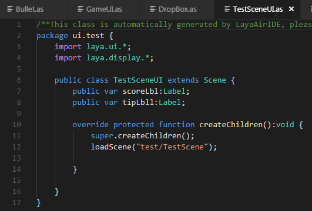

#Overview of Code Pattern Layout

 

###I. Code Compiling Environment

Code editing environment consists of multiple panels, which can be freely hidden/displayed to meet the needs of different projects and developers. In this chapter, we will take the default editing environment layout as an example to quickly browse the panels and their functions.

 
Figure (1) LayaAirIDE Home Page

###II. Project Manager

The Project Manager window shows all the code and resource structures in the project folder in a tree structure. Folder automatically synchronizes changes to folder contents in the operating system. At the same time, it can also carry out new construction, renaming, deletion and other common operation functions.

 

Figure (2) Method of creating files

 

###Code Editor

The Code Editing Window is used to display and edit selected documents in the Project Manager by clicking on them.

 

Figure (3) Code Editing Page

###IV. Toolbar

A toolbar is a collection of tools used to quickly manipulate projects and code documents. In the introduction section of the Code Patterns toolbar, we will give a detailed description of the specific use.

  
Figure (4) Toolbar Panel

 

###V. menu bar

The menu bar contains a set of operations and functions needed in editing. In the Introduction to the Code Mode Menu Bar section, we will give a detailed introduction to the Menu Bar.

 

Figure (5) Menu Bar Panel

 

###Mode Switch Button

The mode switching button can quickly switch between design mode, code mode and question-and-answer community.

 
Figure (6) Mode Panel