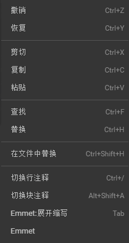
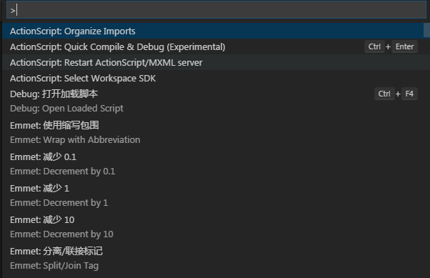

# 菜单栏详解

 

​  代码模式菜单栏包含了一系列常用的功能及选项集合。在本章节中，我们会对代码模式菜单栏做详细的介绍。
  
​        （图1）菜单栏面板

 

## 一、文件

​         
​        （图2）文件列表

​        **新建项目**：弹出新建项目窗口以供用户选择新建项目名称、位置、项目类型，目前项目类型支持AS、JS、TS三种项目类型。

​        **新建文件**：新建文件会在编辑视图窗口中新建一个代码文档，文档位置您可以在 资源视图窗口中的工作文件 栏目中找到，新建的代码文档只有进行保存操作时才会真正生成。

​        **新建窗口**：新建窗口会弹出一个新的代码编辑窗口以供您进行新项目创建或打开其他项目进行编辑。

​        **打开项目**：打开项目会弹出一个WINDOWS资源管理器 样式的浏览窗口进行项目所在位置选择。确认后IDE会切换成您打开的新的项目。

​        **打开文件夹**：打开文件夹会弹出一个 WINDOWS资源管理器 样式的浏览窗口进行文件夹所在位置选择，确认后资源视图窗口中自动添加您打开的文件夹。

​        **保存**：对当前操作的文件进行保存。

​        **另存**：将当前操作的文件另存为新文件。

​        **保存所有**：对全部文件执行一次保存操作。

​        **刷新编辑器**：刷新编辑器的实时状态。

  

## 二、编辑

​         
​        （图3）编辑列表

 

​        **撤销**：对当前操作进行一次撤销。 

​        **重做**：对已经撤销的操作进行一次恢复。 

​        **剪切**：将选中的段落或文件进行剪切。 

​        **粘贴**：将已复制或已剪切的段落或文件进行粘贴操作。 

​        **复制**：对选中的段落或文件进行复制。 

​        **全选**：对当前文件内容进行全选操作。 

​        **查找**：在编辑视图窗口右上方弹出查找功能窗口，进行关键字查找。

​         
​        （图4）查找面板

​        **替换**：在编辑视图窗口右上方弹出替换功能窗口，进行关键字替换。

​        **全局搜索**：将资源视图窗口转换成全局搜索窗口，对关键字进行全项目搜索，列出所有包含该关键字的文件路径以及关键字所在行、关键字数量。并且在代码编辑窗口中对该关键字进行高亮显示。

 

## 三、查看(视图)

​         
​        （图5）视图列表

​        **文件**：如果资源管理视图被屏蔽，此选项会重现资源管理器窗口。 

​        **搜索**：如果全局搜索窗口被屏蔽，此选项会重现全局搜索窗口。 

​        **GIT**：如果GIT窗口被屏蔽，此选项会重现GIT窗口。 

​        **调试**：如果调试窗口被屏蔽，此选项会重现调试窗口。 

​        **命令面板**：此选项会在编辑视图窗口上方显示命令窗口。 

​         
​        （图6）命令面板

​        **错误和警告**：此选项会在编辑视图窗口上方显示错误和警告窗口。 

​        **输出面板**：此选项会在编辑视图窗口下方显示输出窗口。 

​        **终端**：此选项目会启动系统命令行终端。

​        **调试面板**：此选项会在编辑视图窗口下方显示调试控制台窗口。

​        **全屏**：将IDE全屏最大化显示。 

​        **拆分编辑器**：将编辑视图窗口进行多份分屏拆分。

​        **切换侧边栏**：将侧边栏 显示/隐藏。 

​        **移动侧边栏**：将侧边栏移动到 最左侧/最右侧。 

​        **放大**：将LayaAirIDE的显示比例 整体放大。 

​        **缩小**：将LayaAirIDE的显示比例整体缩小。

​        **重置缩放**：将LayaAirIDE的显示比例重置为默认。

## 四、工具

​         
​        （图7）工具面板     

- **SWF转换**：打开SWF资源转化工具窗口，以供用户进行SWF转换操作。
- **JS压缩工具**：打开JS压缩工具窗口，以供用户将JS文件进行压缩和混淆。
- **龙骨动画转换**：打开龙骨动画转换窗口，以供用户将DragonBones骨骼动画转换为LayaAir识别的格式。
- **Spine动画转换**：打开Spine动画转换窗口，以供用户将Spine骨骼动画转换为LayaAir识别的格式。
- **Psd2UI**：将pad文件直接转为UI页面，资源命名规则可参考[这里](https://ask.layabox.com/question/7365)
- **图集打包**：打开图集打包窗口，以供用户进行图集打包操作。
- **运行器下载**：打开运行器下载的二维码窗口，以供用户扫码下载LayaNative的运行器。
- **打包APP**：APP打包的环境配置与操作窗口，以供用户将LayaAir项目打包为安卓的APP（apk文件）
- **app构建**：打开构建功能窗口，以供用户将LayaAir引擎项目构建为Android-eclipse、Android-studio、XCode(IOS)三种移动端的APP项目工程。
- **3D转换工具**：打开3D转换工具的URL链接，压缩包内提供了3DMax与Unity3D编辑器的资源转换工具，让3DMax与Unity3D的资源成为LayaAir引擎支持的资源。

## 五、项目

​         
​        （图8）项目面板

​        **类库管理**：用于设置当前项目使用的类库版本。

## 六、帮助

​         
​        （图9）帮助面板
- **开发人员工具**：用于打开编辑器的调试页面。
- **官网**： 打开Layabox官网链接。
- **官网示例**：打开官网的LayaAir引擎示例链接。
- **开发者中心**：打开Layabox开发者中心链接。
- **打开编辑器本地缓存目录**：打开编辑器的本地缓存文件所在目录。
- **检查更新**：打开LayaAirIDE的版本下载列表链接。
- **更新日志**：打开gitHub中的引擎与IDE版本更新日志链接。
- **当前版本号**：显示LayaAirIDE当前的版本号。