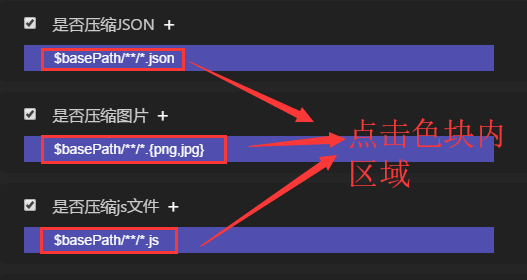
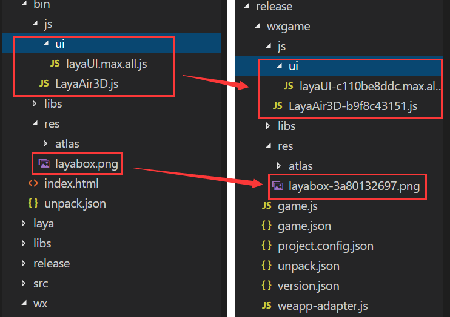
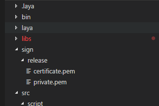

#Project Release Details (New Edition)

>*Author: Charley version: LayaAir IDE 2.1.1 update: 2019-06-25*

[TOC]

LayaAir IDE has been continuously optimizing the functionality of project release, and has undergone several upgrade iterations of large and small versions. In the new version, it not only strengthens the customization of publishing process, makes publishing screening more flexible, but also promotes a more convenient user experience for one-click publishing as a small game project.

 


(Fig. 1-1)

Following is a detailed description of each function:

###I. Publishing Platform Options

By the time this article was written, IDE version 2.1.1, there are currently six options in the release platform: VIVO games, OPPO games, millet fast games, Baidu games, Web, Wechat games. As shown in Figure 1-2.

 


(Fig. 1-2)

Choosing different platform types will adapt different platforms at the time of publication.

`Web`It refers to the HTML5 version, which runs in the browser environment, webView, LayaNative APP environment.

`微信小游戏`It refers to the project published as an adapted Wechat game, which can run in the Wechat developer tool (related documents about the Wechat game can be read).

`百度小游戏`It refers to the project that has been released as an adaptation of Baidu mini-games, and the released project can run in Baidu developer tools (about Baidu mini-games can read relevant documents).

`小米快游戏`It refers to the project published as an adapted millet fast game, which can run in the millet developer's tool (about millet fast game can read the relevant documents).

`OPPO小游戏`The term "OPPO" refers to a project that has been released as an OPPO game, and the released project can run in the OPPO developer's tool (the relevant documents about OPPO games can be read).

`VIVO小游戏`It refers to the project published as an adapted VIVO game, which can run in the VIVO developer's tool (about the VIVO game can read the relevant documents).

###Application of Node-glob Module in Compression and Version Management

Confusion compression and version management are commonly used functions in publishing. But how to manage and control more flexibly which directories and files are to be compressed, which are to start version management, and which are not needed? LayaAirIDE has also been optimized and revamped many times. Since the release of the new version, node-glob module has been built in the release function, which can make the matching between directories and files more flexible.

LayaAirIDE's publishing function integrates common exclusion and inclusion functions by default, and allows developers to customize file filtering matching rules. The following will be described one by one in conjunction with the functions in the Publishing Panel.

####1. Compression function (JSON, JS, pictures)

After checking whether to compress JSON, whether to compress pictures, whether to compress JS files and other functions, these corresponding compression functions will be activated. The default file filter matching rules are displayed in the color block area. If you want to modify the default file matching rules, you can click on the color block area. As shown in Figure 2-1.

 


(Fig. 2-1)

After clicking on the area in the color block, we can enter the rule editing interface corresponding to the block. For example, if we click on whether to compress the color block area of the picture, we will open the rule editing interface of the compressed picture, as shown in Figure 2-2.

 


(Fig. 2-2)

`文件夹`By default, folders are bin directories, which can be compressed to their subdirectories or lower level directories, but not to jump out of bin directories.

`后缀列表`The default values of suffix lists after different compression types are different, such as JSON for compressed JSON, PNG for compressed images and JPG for compressed images. The default value for compressed JS files is js.

Although changes or additions are allowed in the suffix list, developers should not add unrelated suffixes randomly because the processing mechanism of each classification call is different, otherwise they may cause errors. For example, to compress the suffix rules in JSON, even if other suffix names are added, the file still needs JSON format. Another example is the JS suffix, which can detect and confuse grammar while compressing. This is also different from the compression mechanism of JSON format. Not to mention the function of compressing pictures, the same thing.

`排除这些文件`This option is an auxiliary filtering function based on suffix list filtering. When this function option is checked, the current matched file is not compressed, but excluded from the current matched file. This mechanism is usually used to combine multiple matching rules. For example, we default to compress all PNG and JPG files in the bin directory. But I want to ignore uncompressed res directory in bin directory. Then, we can click on the plus sign on the right side of the compressed image to create a new exclusion rule, as shown in Figure 2-3.

 


(Fig. 2-3)

After adding this exclusion rule, click OK, and the combined matching rule is shown in Figure 2-4.

(Fig. 2-4)

`包含子文件夹`This option is also an auxiliary filtering function based on suffix list filtering. Unchecked is limited to matching`文件夹`The current directory file set in the option is checked and all subfolder directories under it are included in the matching rules.

`筛选器结果`In the result bar of the filter, not only will the filter function currently set be displayed, but also more complex filter conditions can be edited directly in the column. It should be noted that after editing the filter conditions directly, click first.`确定`Save, otherwise when other filter parameters are set, the settings here will be automatically replaced.

As for the rules in the filter, which are similar to Glob matching rules of regular expressions, when parsing the path model, the contents separated by commas in brackets will be expanded, and the parts in brackets can also contain "/", such as a {b/c, bcd} will be expanded into a/b/c and abcd. Here we briefly introduce the commonly used matching rules:

| matcher | description|
| ----------------------------------------------------------------------------------------------------------------------------------------------------------------------------------|
A kind of`*`| Matches 0 or more characters in the file path, but does not match the path separator unless the path separator appears at the end|
A kind of`**`| The 0 or more directories and their subdirectories in the matching path need to appear separately, that is, it can't have anything else left or right. If it appears at the end, the file can also be matched. A kind of
A kind of`?`| Matches a character in the file path (does not match the path separator)|
A kind of`[...]`| Match any character that appears in square brackets. When the first character in square brackets is ^ or!, it means that any of the other characters that appear in square brackets does not match. Note that it can't be combined, it can only be one of the characters. For example, [x y z].Js can only match x.js, y.js, z.js, but not xy.js, xyz.js, etc.|
A kind of`!(pattern｜pattern｜pattern)`Match any match that does not match any given pattern in parentheses.
A kind of`?(pattern｜pattern｜pattern)`Match any pattern given in parentheses 0 or 1 times, similar to those in JS regularization.`(pattern｜pattern｜pattern)?`A kind of
A kind of`+(pattern｜pattern｜pattern)`Match any pattern given in parentheses at least 1 times, similar to those in JS regularization.`(pattern｜pattern｜pattern)+`A kind of
A kind of`*(pattern｜pattern｜pattern)`Match any pattern given in parentheses 0 times or more, similar to those in JS regularization.`(pattern｜pattern｜pattern)*`A kind of
A kind of`@(pattern｜pattern｜pattern)`Match 1 patterns of any given pattern in parentheses, similar to those in JS regularization.`(pattern｜pattern｜pattern)`A kind of

If developers want to know more about the rules of glob writing, they can find the documents related to node-glob in search engines such as Baidu. This is not detailed here.

`说明`The instructions can be filled in the memorandum information of some rules, which can be used to prompt for the rules, so as to avoid forgetting the role of the rules after long-term use. For example, in Figure 2-3, this rule is written out to "exclude image compression in bin res directory".

####Compressed Use Reminder

Enabling compression will result in slower release time. The more files to be compressed, the longer compression time to be consumed, if not final online or necessary testing. In debugging stage, try not to check, especially after JS compression, it will confuse the code, make the code readability very poor, affecting debugging.

####2. Enabling Version Management

As for version management, the first way is to add random numbers after links, but in the environment of Wechat, the caching problem is very serious. Random numbers can not effectively solve the caching problem, or there will be page chaos caused by the updated version. Therefore, when LayaAirIDE was released, it added a radical solution to the caching problem, that is, directly rename the file name, the file name is different, and the caching problem naturally does not exist.

#####Version management mechanism

When a developer has version management enabled, the file name with hash strings will be automatically generated at publication time, and a version. JSON file name mapping file will be generated at the same time. Automatically associate the actual file name in the code with the renamed version management controlled file through the version management class ResourceVersion. As long as the file with version management is changed, the hash string in the changed file name will be updated automatically when it is released. This is equivalent to calling a new file in the running environment, so there will be no caching problem.

In the process of development, developers do not need to pay attention to what the final file name generated by version management is. Even since LayaAirIDE 2.0 automatically integrates version management class ResourceVersion into the code when creating a project, developers don't even need to pay attention to how to use the ResourceVersion class. They just need to check whether to enable version management in the project release interface when they plan to enable version management.

#####Effectiveness of enabling version management

In the project release interface, after checking whether version management is enabled or not, the filtering rules are the same as compression. Glob rules are used to control which files participate in version management and which files do not participate in version management. The default HTML page is not involved in management, and this developer should not remove it, because HTML changes are prone to problems. Other files can be controlled by developers if they have specific requirements.

It should be noted that, if the release of Weixin games and other specific small game channels, the project files and default file names of these small games are automatically ignored, and will not be added to version management, such as game. JS and game. json.

 


(Fig. 3)

As shown in Figure 3, the bin directory in the development environment is on the left, and the release directory after version management is enabled on the right. We can see that the files that must exist in game. JS and game. JSON are automatically ignored, while the JS files in the JS directory and the PNG image file names in the res directory are all added with hash strings.


###3. Extracting Local Packages

Weixin, Baidu and other small game platforms are hot. However, because these platforms all have the concept of local package and restrict the package body, it is very important to extract the function and ease of use of local package. The current version is also the most friendly version after many times of optimization, which optimizes the previous inconveniences and can fully meet the needs of developers to release one-click local package for small game projects. Specific local package related introductions and documents directly view the corresponding documents, here focuses on how to extract.

####1. Selecting Files

click`选择文件`The input box on the right will pop up the bin directory structure tree as shown in Figure 4. The developer checks the code or resources to be used in the local package. click**Determine**After that, the selected directories and files are automatically saved to facilitate the publishing tool to filter and copy and extract the specified local package content.

 


(Fig. 4)

####2. Target Catalogue

When the default is not selected, the local package directory creates a wxgame_pack directory under the release directory to store the contents of the local package. Of course, developers are free to specify a directory to store local package content for small game projects.

Specific operation: click Figure 5`目标目录`Select the corresponding directory in the input box on the right.


(Fig. 5)

The extract file of the game is as follows`选择文件`and`目标目录`These two core functions, not to mention the simple operation, are very practical functions.

The earliest version can not extract local packages, and the extraction of full package replication is more troublesome. Or if you omit the game project files when copying, it needs to be manually copied again. All these problems have been solved in this version. Not only can the local package directory be filtered by user. After choosing the corresponding small game platform, the corresponding project files of the platform will automatically extract the past even if they are not checked in the local package file list, thus ensuring the integrity of the small game project.


###IV. Other Functions

 


(Fig. 6)

####1. Open Domain Projects

The default entry files of small game open domain projects such as Weixin and Baidu are different from those of the main domain, so check`是否为微信/百度开放数据域项目`After that, the problem of entry will be handled automatically, without the need for developers to handle it manually after each release. Greatly increased the developer's ease of release of small games.

> Tips: For platforms that do not support open domains, the function checks are automatically blocked after choosing different platforms.

####2. Copy only the class libraries referenced in index.js

The default is to check the status, which only copies the class libraries referenced in index. JS (usually in editing mode, we use F9 class library configuration to control the reference of class libraries). Otherwise, all unused parts of LIBS will be copied, which will increase the volume of the whole inclusion body. Unless there is a special use, it is recommended not to move and keep checking.

####3. Pre-release recompilation

Check if the developer is worried that the released code is not the latest code because he forgot to compile it.`是否重新编译项目`After checking, the project is compiled before the release process is executed at each release. Errors can be avoided after project release due to forgetting compilation.


###5. Experience optimization of publishing process

Because it is inevitable to compress images, js, JSON and so on in the final release. The longer the project is, the longer the release and compilation time will be. This is difficult to avoid, especially JS compression needs to analyze the grammar and confuse it.

Previously, many developers did not understand that the release time of feedback was too long, which depended on the compressed content and project size checked, so we can only advise developers not to confuse and compress in debugging phase when they were not final release.

When optimizing version 3.0, considering the needs of developers, in addition to allowing developers to freely choose and control compressible files, real-time printing and display of publishing and compiling process is also added. Let developers have a general understanding of the current product compilation and release progress, reduce the urgency in an unknown state.

> LayaAir engine officials pay more attention to developer experience feedback and continue to optimize.

 


(Fig. 7)

###6. Special Configuration of Millet, OPPO and VIVO

Because there are no visual development and debugging tools in Millet Fast Game, OPPO Game and VIVO Game, the relevant parameters can only be configured in LayaAirIDE, as shown in Figure 8-1 and Figure 4. Then a key is issued directly in the LayaAirIDE (generating an RPK package). As for the debugging method, it is through installing an APK debugging environment in the millet mobile phone, selecting to open the RPK file in the apk, and then connecting the mobile phone with the data line on the PC through Chrome for debugging.

   


(Figure 8-1) On the left is the release interface of Millet Fast Game and VIVO Game, and on the right is the release interface of OPPO Game.


Now let's introduce how to fill in these function parameters.

####1. Game Name

Generally, Chinese characters are filled in, and English is also acceptable. Used at game entrance of application store, desktop icon, pop-up window, etc. A good name is an important element of the game's ability to absorb. Here we should pay attention to millet and VIVO requirements must be less than 6 Chinese characters, OPPO is less than 10 Chinese characters can be. Our suggestion is not to exceed 6 Chinese characters. It's no good to have a long name.

####2. Game Package Name

The format of the game package name is`com.company.module`The first com should not change, the second is the company name, and the third is the project name. Write in English, for example:`com.layabox.demoGame`。

####3. Game icons

Game icon is also an important entry sign of the game. Like the name of the game, it is a very important absorptive element. If the game icon is well designed, the name of the game will rise well. The same location will get more clicks than other games. Game icons need to be provided`192 * 192`Square size.

####4. Name of Game Version

The name of the game version is the real version, which is generally used to distinguish functional versions. For example, I have a big revision. It turned out to be 1.0, which could be changed to 2.0. If only Bug was changed, 1.0 could be changed to 1.1. By analogy, we recommend floating-point naming. For example, "0.1", "1.3", "5.0"...

####5. Game Version

The game version is different from the version name. Here is the channel platform for distinguishing version updates. Every trial should be at least recursive + 1, so it doesn't matter if you test it yourself. However, the value here must be at least + 1 more than the value of the last review, and + n can also be used. It cannot be equal to or less than the value of the previous version. It is recommended that the version number of the review be recursively + 1. It's important to note that the game version must be a positive integer.

####6. Minimum Platform Number

Minimum platform number, millet and OPPO can only be set to 1050 at present (based on the version on the actual test app). If there are future changes or other updates, please pay attention to this document in time.

Vivo is different. vivo is currently debugging fast applications downloaded on the official website. The built-in version number is 1034. We recommend version 1041 or higher. If the version number shown on the debugger is less than 1041, you should go to the vivo website to update the APK installation package of the game engine. Open URL[[https://minigame.vivo.com.cn/documents/](https://minigame.vivo.com.cn/documents/#/download/engine)#[/download/engine](https://minigame.vivo.com.cn/documents/#/download/engine)] Select the new version, click download, and then install, you can upgrade the engine version of the small game platform. After installation, the minimum platform number in IDE can be filled in according to the platform version number displayed on the debugger.

####7. Screen Direction

Here, just like the horizontal and vertical screen settings of Wechat games, we should pay attention to the unity with the actual game and the horizontal and vertical screen settings of the engine.

####8. Start mobile debugging after packaging

This option is used to start real-time debugging.

Millet release does not need, LayaAirIDE release millet fast game will generate a two-dimensional code after success, developers can start debugging by scanning the two-dimensional code generated by IDE on the mobile phone.

When oppo needs real machine debugging, it must be checked when it is released, and ADB must be installed in the PC environment.[ ADB官网下载:  [http://adbshell.com/downloads](http://adbshell.com/downloads)] At the same time, we should also ensure that the mobile phone and PC are connected, and open the USB debugging authority.

####9. Whether to Use Official Signature

If you're just debugging the test version, you don't need to check here. Before officially launching, you must check out the version to the platform.

If checked, the official signature will be enabled. With regard to release signatures:

For a company, a company usually only uses one signature. If the company has already signed, it is recommended to use the company's signature. If not, publishing in IDE integrates this feature to facilitate signature generation by developers.

(2) For individual developers, one formal signature can be used for multiple projects. It only needs to be generated once.

If you have released your signature, place the signature file in the Laya project sign/release folder, as shown in Figure 8-2.

 


(Fig. 8-2)

####10. Generating release signatures

This function is to generate the official version of the signature, do not check the previous function or have a release signature, do not configure here. After checking, the configuration parameters are as follows (note the need to generate release signatures)`OpenSSL`Environment):

 


(Fig. 8-3)

The signature content is suggested to be written in English, which can be translated and illustrated as follows:


```

//国家简称，例如中国CN
Country Name (2 letter code) [AU]:
CN 

//省或直辖市名字，例如北京市BeiJing
State or Province Name (full name) [Some-State]:
BeiJing 

//区或市县的名称，例如海淀区HaiDian
Locality Name (eg, city) []:
HaiDian 

//公司或组织名,例如Layabox
Organization Name (eg, company) [Internet Widgits Pty Ltd]:
Layabox 

//单位或者是部门名称，例如游戏部门Game
Organizational Unit Name (eg, section) []:
Game 

//Email地址,例如：游戏对接合作 bd@layabox.com
Email Address []:
bd@layabox.com 
```


###Special reminder

####1. Attention should be paid to publish.js if the old version is changed.

LayaAir 2.0.2 beta version began, the publish.js has been modified (to increase millet fast game support), if the developers changed the old version of publish.js, please move the modified content to the new version. As shown in Figure 9. The 2.1.0 beta version of OPPO will have similar hints.

 


(Fig. 9)

####2. New projects will be released for a long time.

After clicking on publish, it will compile and publish. As shown in Figure 10.

 


(FIG. 10)

Since the RPK publishing environment (used to generate RPK packages) is checked before publication, and if there is no publishing environment, downloads will begin. So it will take about 10 minutes for the first release of a new project. The specific time varies depending on the speed of the network. However, under normal network speed, it will certainly not exceed 30 minutes. If it exceeds 30 minutes, it needs to close the publishing interface directly and re-publish. If the re-publishing is still unsuccessful, you can contact the Layabox official for feedback (QQ group administrator).

> Here's how to optimize future versions. The current release, every new project, will check the release environment, the project does not need to re-download the release environment. Multiple projects are checked and updated for each new project, resulting in a slower initial release of each new project. OPPO games do not have this problem, the mechanism of OPPO is slow for the first time, then it will not slow down.
>
> In future versions, millet games will be downloaded only when the project is first released, or when the release environment needs to be updated. Otherwise, the new project will be replicated using the environment that the previous project has downloaded. This reduces the release time of the download environment.

####3. What is the reason why there is no two-dimensional code after the successful release of Millet Express Game?

Before publishing, other publishing interfaces need to be closed, otherwise two-dimensional codes can not appear (due to port occupancy).

After the normal release of the millet fast game, as shown in Figure 11. Otherwise, please check if there is any other interface that is not closed and redistribute it after closing.

 


(FIG. 11)

> Note: OPPO games do not have two-dimensional codes. Only millet games and vivo games.


###7. Command Line Publishing

For some developers who need to make automatic packaging tools, project publishing also provides`layaair2-cmd`Command line publishing mode. Developers can use`layaair2-cmd`Compression, version management, engine adaptation, compilation and publishing of layaair 2.0 project without opening IDE. It can avoid the tedious switching process of publishing between multiple projects.

####1. layaair 2-cmd installation mode


```

npm install layaair2-cmd -g
```


> If there are developers who will not use NPM installation, please face the wall and skip the command line to publish the document, honestly publish it with the LayaAirIDE interface.

####2. What commands do layaair2-cmd support?

We use input`layaair2-cmd -h`After returning, you can see the help information of layaair2-cmd.

The output after return is as follows:


```

Usage: layaair2-cmd [command] [args]

Options:
  -v, --version  output the version number
  -h, --help     output usage information

Commands:
  compile        compile project.
  publish        publish project.
  help [cmd]     display help for [cmd]
```


####Help note for layaair2-cmd:

First of all, an example of command usage is given in the help.


```

Usage: layaair2-cmd [command] [args]
```


Description: layaair2-cmd is followed by the specific corresponding command, and then the parameters of the command.


```

Options:
  -v, --version  output the version number
  -h, --help     output usage information
```


Note: When no command is entered`-h`The printed output is the layaair2-cmd help note just seen.`-v`The print output is the layaair2-cmd version number. Of course, if you enter specific commands, then - H and - V are the help instructions and version numbers for the corresponding commands.


```

Commands:
  compile        compile project.
  publish        publish project.
  help [cmd]     display help for [cmd]
```


Explanation: What commands do layaair2-cmd support? Three commands, compile, publish and help, are also given directly in the help description of-h.

`compile`It is a project compilation command that generates compiled JavaScript files, equivalent to F8 compilation in the IDE. Note here that if the release panel is checked`是否重新编译项目`Developers should stop calling this command in their own command-line publishing process, otherwise the project will be compiled twice and the publishing time will be wasted.

`publish`It's project publishing, which is equivalent to clicking the publishing button in the publishing panel. This one is more important. I will introduce it separately later.

`help`It's a layaair 2-cmd help note, and`layaair2-cmd -h`The display effect is the same.

####3. Use of project issuance orders and matters needing attention

Let's pass first.`layaair2-cmd publish -h`Check out the help for issuing commands.

Enter the following after return:


```

    Usage: layaair2-cmd publish [options]

    Options:
    -v, --version              output the version number
    -c, --config <configPlatform>  Set the publishing platform name[web|wxgame|qqw
    anyiwan|bdgame]
    -h, --help                     output usage information
```


We can see from the help that the most critical parameters are`-c`At present, it supports four parameters: web, wxgame, qqwanyiwan and bdgame.

`web`It's a web version of HTML5.

`wxgame`It is a platform for releasing Weixin games.

`qqwanyiwan`Is the release of QQ light game platform (also known as QQ play).

`bdgame`Baidu is the release of small game platform.

#####The following examples are used:


```

layaair2-cmd publish -c wxgame
```


####Issue Notes

1. The compile and publish commands of layaair2-cmd must be executed in the root directory of the project.
2. Before calling the project publishing command line, check if there is a JSON corresponding to the publishing platform, such as publishing web version, project folder.`.laya`Under the directory, there should be web.json. Wxgame.json is required for the release of Wechat games. Similarly, QQ light games should have qqwanyiwan. json, and Baidu small games should have bdgame. json.
If not, then use LayaAirIDE's Release 3.0 tool to select the corresponding platform to publish manually once (special reminder, be sure to use 3.0 release tool), the release tool will automatically generate the corresponding json. JSON saves publishing filter rules and publishing configuration information in publishing tools.


This is the end of the article.

If you have any questions, please come to the community and ask:[https://ask.layabox.com](https://ask.layabox.com/)


##This article appreciates

If you think this article is helpful to you, you are welcome to sweep the code and appreciate the author. Your motivation is our motivation to write more high quality documents.

