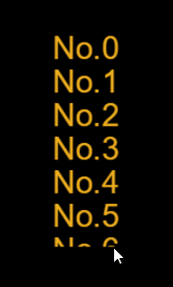

#List Component Reference


##1. Creating List Components through LayaAirIDE

The List component displays a list of items. The default is a vertical list. You can customize the list through the UI editor. Each list in a List list is usually the same, or you can customize different types of list content items using an editor.
Lists usually consist of two parts: list rendering items (cells) and scrollbars.
Refer to the script interface for List components[List API](http://layaair.ldc.layabox.com/api/index.html?category=Core&class=laya.ui.List)。


 


###1.1 Create List Components

####1. Edit list items.

List items can be Box objects or Views (pages) or other custom page objects. Take the Box object as an example.
​**A.**Select and drag a Label component from the resource panel to the interface of the editing area. Set the value of the Label attribute name to m_label. In addition, set Label's display-related properties to make it look better.
​**B.**Select the Label object, use the shortcut key Ctrl + B or select**Menu Bar - > Edit - > Convert to Container**Options, open the Conversion to Container Settings panel, select the container type as Box, and click the OK button to complete the addition of Box containers.

​<br/>
(Fig. 1)


 ####2. Convert to a List container.

Select the list rendering item object, use the shortcut key Ctrl + B or select**Menu bar - > Edit - > Convert to container**Options, open the Conversion to Container Settings panel, select the Container Type as List, and click the OK button to complete the addition of Container List.
​<br/>
(Figure 2)
####3. Specify a list render entry for the list.
Method 1: Double-click the List object and enter the List. Set the value of the attribute name of the List rendering item to render.**Note: The value of the list render item attribute name here must be render.**

Method 2: Double-click the List object and enter the List. Set the renderType value of the renderType attribute of the List rendering item to render.


​<br/>
(Figure 3)

####4. Add a scrollbar component to the List.
Method 1: Select and drag a VScrollBar component from the resource panel to the inside of the List component, and set the value of the attribute name of the VScrollBar component object to scrollBar.***Note: The value of the property name of the scrollbar here must be scrollBar.***

Method 2: Select list component, vScrollBarrSkin will appear in the right attribute panel. Selecting and dragging a VScrollBarr component from the resource panel into the skin attribute will immediately generate a scrollbar.


​        <br/>
(Figure 4)

####5. Drag to set the width of the List
Set the value of repeatX to 1 and repeatY to 6. Set the global reference name of the List object, that is, set the value of the property VaR to m_list.
​<br/>
(Fig. 5)

####6. Apply values to List objects in the code.


```javascript

 var data:Array =[];

   for(var m:int =0;m<20;m++){

        data.push({m_label:"No."+m});
}
m_list.array = data;
```


####7. Run the program to see the effect.
​<br/>
(Fig. 6)

####8. Add scripts to the code, hide scrollbars, and set drag-and-drop rubber band effects.

```javascript

 m_list.scrollBar.hide = true;//隐藏列表的滚动条。
 m_list.scrollBar.elasticBackTime = 200;//设置橡皮筋回弹时间。单位为毫秒。
 m_list.scrollBar.elasticDistance = 50;//设置橡皮筋极限距离。
```


####9. Run the program to see the effect.
​<br/>
(Figure 7)


###1.2 Common attributes of List components

​<br/>
(Figure 8)

A kind of**Function description**A kind of**attribute**A kind of
| ----------------------------------------------------------------------------------------------------------------------------------------------------|
| The number of cells displayed horizontally. | repeatX|
| The number of cells displayed vertically. | repeatY|
| Spacing (in pixels) between cells displayed horizontally. | SpaceX|
| Spacing between cells displayed vertically (in pixels). | spaceY|
| Vertical scroll bar skin. | vScrollBarSkin|
| Horizontal scroll bar skin. | hScrollBarSkin|


  


###1.3 Tips:

1. There are two ways to add a scrollbar to a List: one is to drag and drop a scrollbar directly inside the List and set the name of the scrollbar to scrollBar, the other is to set the value of the attribute vScrollBarSkin and hScrollBarSkin to the resource address of the scrollbar.

2. List's list rendering item can be either a Box object or a page object.

​


##2. Creating List Components through Code

When we write code, we inevitably control UI through code, create UI_List class, and import it into code.`laya.ui.List`Set List-related properties through code.

**Run the example effect:**
​<br/>
(Figure 9) Create a List from code

Other attributes of List can also be set by code. The following sample code demonstrates how to create lists with different skin (styles) through code. Interested readers can set lists themselves by code to create lists that meet their needs.

**Sample code:**


```javascript

package
{
	import laya.display.Stage;
	import laya.ui.Box;
	import laya.ui.Image;
	import laya.ui.List;
	import laya.utils.Handler;
	import laya.webgl.WebGL;
	
	public class UI_List
	{
		//列表对应图片的路径
		private var data:Array = [  "../../../../res/ui/listskins/1.jpg",
									"../../../../res/ui/listskins/2.jpg",
									"../../../../res/ui/listskins/3.jpg",
									"../../../../res/ui/listskins/4.jpg",
									"../../../../res/ui/listskins/5.jpg",
									"../../../../res/ui/listskins/1.jpg",
									"../../../../res/ui/listskins/2.jpg",
									"../../../../res/ui/listskins/3.jpg",
									"../../../../res/ui/listskins/4.jpg",
									"../../../../res/ui/listskins/5.jpg",
									"../../../../res/ui/listskins/1.jpg",
									"../../../../res/ui/listskins/2.jpg",
									"../../../../res/ui/listskins/3.jpg",
									"../../../../res/ui/listskins/4.jpg",
									"../../../../res/ui/listskins/5.jpg"];
		
		public function UI_List()
		{
			// 不支持WebGL时自动切换至Canvas
			Laya.init(800, 600, WebGL);
			//画布垂直居中对齐
			Laya.stage.alignV = Stage.ALIGN_MIDDLE;
			//画布水平居中对齐
			Laya.stage.alignH = Stage.ALIGN_CENTER;
			//等比缩放
			Laya.stage.scaleMode = Stage.SCALE_SHOWALL;
			//背景颜色
			Laya.stage.bgColor = "#232628";

			//创建列表
			createList();			
		}
		
		/***创建list列表**/
		private function createList():void
		{
			//实例化列表
			var list:List = new List();
			//设置列表渲染单元格为Item类（注：必须是类，不能是实例化对象，Item需类继承于Box）
			list.itemRender =Item;
			//列表显示区单元格的列数
			list.repeatX = 1;
			//列表显示区单元格的行数
			list.repeatY = 4;
			//设置列表位置
			list.x = (Laya.stage.width - Item.WID) / 2;
			list.y = (Laya.stage.height - Item.HEI * list.repeatY) / 2;
			
			// 使用但隐藏垂直滚动条
			list.vScrollBarSkin = "";
			//滚动在头或底回弹时间
			list.scrollBar.elasticBackTime = 500;
			//滚动在头或底最大距离
			list.scrollBar.elasticDistance = 200;
			
			//设置为可以选择
			list.selectEnable = true;
			//选择单元格时回调方法
			list.selectHandler = new Handler(this, onSelect);
			//渲染单元格时的回调方法
			list.renderHandler = new Handler(this, updateItem);
			//为列表赋值
			list.array = data;
			//加载到舞台
			Laya.stage.addChild(list);
		}
		
		/***渲染单元格时的回调方法***/
		private function updateItem(cell:Item, index:int):void 
		{
			//用获得的数据给图片更换皮肤
			cell.img.skin=cell.dataSource;
		}
		
		/***选择单元格回调***/
		private function onSelect(index:int):void
		{
			trace("当前选择的索引：" + index);
		}
	}
}


//单元格类，继承于Box
import laya.ui.Box;
import laya.ui.Image;

class Item extends Box
{
	/***单元格宽***/
	public static var WID:int = 375;
	/***单元格高***/
	public static var HEI:int = 85;
	/***单元格中图片***/
	public var img:Image;
	
	public function Item()
	{
		//设置大小宽高
		size(WID, HEI);
		//实例化图片
		img = new Image();
		//加载到单元格中
		addChild(img);
	}
}

```


