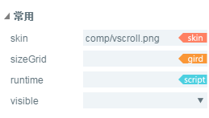

#VScrollBar Component Reference


##1. Creating VScrollBar Components through LayaAirIDE

###1.1 Create VScrollBar

The VScrollBar component is a vertical scrollbar component.
When there is too much data to accommodate the display area, the end user can use the VScrollBar component to control the data portion displayed.
The scrollbar consists of four parts: a track map, a slider button and two arrow buttons.
Click on the VScrollBar component in the Resource Panel and drag it into the page editing area to add the VScrollBar component to the page.
Refer to the script interface for the VScrollBar component[VScrollBar API](http://layaair.ldc.layabox.com/api/index.html?category=Core&class=laya.ui.VScrollBar)。
Examples of image resources for VScrollBar components:

​<br/>
(Fig. 1)

​<br/>
(Figure 2)
​<br/>
(Figure 3)

​<br/>
(Figure 4)

Drag and drop VScrollBar into the editor area to display the effect:

​<br/>
(Fig. 5)

After setting the value of attribute max of VScrollBar to 10, the value of attribute min to 0, and the value of attribute value to 3, the display effect is as follows:

​<br/>
(Fig. 6)

When running the program, you can drag the slider or click the arrow button to control the value of the progress bar:

​<br/>
(Figure 7)

Set the value of showButtons of VScrollBar to false:

​<br/>
(Figure 8)

The effect of running a program:

​<br/>
(Figure 9)

###1.2 Common attributes of VScrollBar components

​<br/>
(Figure 10)

A kind of**attribute**A kind of**Function description**A kind of
| -----------------------------------------------------------------------------------------------------------------------------------------------|
| Skin | scrollbar image resource address. A kind of
| SizeGrid | Scroll Bar Track Map Resource Scales Grid Data Effectively (Nine-Palace Data). A kind of
| runtime||
| visible||


 

 


##2. Creating VScrollBar Components by Code

When we write code, we inevitably control the UI through code and create it.`UI_ScrollBar`Class, imported in code`laya.ui.VScrollBar `The package of VScrollBar and the related attributes of VScrollBar are set by code.

**Run the example effect:**
​<br/>
(Figure 11) Create VScrollBar from code

Other attributes of VScrollBar can also be set by code. The following sample code demonstrates how to create VScrollBar by code. Interested readers can set VScrollBar by code and create scrollbars that meet their needs.

**Sample code:**


```javascript

package
{
	import laya.display.Stage;
	import laya.display.Text;
	import laya.ui.HScrollBar;
	import laya.ui.ScrollBar;
	import laya.ui.VScrollBar;
	import laya.utils.Handler;
	import laya.webgl.WebGL;

	public class UI_ScrollBar
	{
		/***垂直滚动条资源**/
		private var skins:Array=["../../../../res/ui/vscroll.png", 
								"../../../../res/ui/vscroll$bar.png", 
								"../../../../res/ui/vscroll$down.png",
								"../../../../res/ui/vscroll$up.png"];
		/***提示信息文本框**/
		private var promptText:Text;		
		/****垂直滚动条****/
		private var vScrollBar:VScrollBar;
		
		
		public function UI_ScrollBar()
		{
			// 不支持WebGL时自动切换至Canvas
			Laya.init(800, 600, WebGL);
			//画布垂直居中对齐
			Laya.stage.alignV = Stage.ALIGN_MIDDLE;
			//画布水平居中对齐
			Laya.stage.alignH = Stage.ALIGN_CENTER;
			//等比缩放
			Laya.stage.scaleMode = Stage.SCALE_SHOWALL;
			//背景颜色
			Laya.stage.bgColor = "#232628";
			
			//加载资源
			Laya.loader.load(skins, Handler.create(this, onSkinLoadComplete));
		}

		/***加载资源完成***/
		private function onSkinLoadComplete(e:*=null):void
		{
			//创建垂直滚动条
			createVScroller();
		}
		
		/***创建垂直滚动条***/
		private function createVScroller():void 
		{
			//实例化水平滚动条
			vScrollBar= new VScrollBar();
			//加载皮肤资源（其他资源根据规范命名后，会自动加载）
			vScrollBar.skin = "../../../../res/ui/vscroll.png";
			//设置高度
			vScrollBar.height = 200;
			//设置位置
			vScrollBar.pos(400, 200);
			//最低滚动位置数字
			vScrollBar.min = 0;
			//最高滚动位置数字
			vScrollBar.max = 100;
			//滚动变化事件回调
			vScrollBar.changeHandler = new Handler(this, onChange);
			//加载到舞台
			Laya.stage.addChild(vScrollBar);
			
			//创建提示信息
			createPromptText(vScrollBar)
		}

		/***创建提示信息***/
		private function createPromptText(scrollBar:ScrollBar):void
		{
			//实例化提示信息
			promptText=new Text();
			//提示框字体
			promptText.font="黑体";
			//提示框字体大小
			promptText.fontSize=26;
			//提示框字体颜色
			promptText.color="#FFFFFF";
			//提示框初始文本
			promptText.text="您的选择是： ";
			//加载到舞台
			Laya.stage.addChild(promptText);
			//设置提示框位置
			promptText.pos(scrollBar.x-130,scrollBar.y-60);
			
		}
		
		/***滚动条位置变化回调***/
		private function onChange(value:Number):void 
		{
			promptText.text= "滚动条的位置： value=" + value;
		}
	}
}
```


