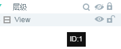

#Level Manager

The hierarchy manager is one of the core components of the design pattern, all of which are`场景编辑器`The components in the`层级管理器`Hierarchical structure is used to show.

###1. Hierarchical structure

####The 1.1 level

Unless you choose Dialog when creating UI pages, the root level is View and the ID is 1 for both UI and animation. As shown in Figure 1.

  (Fig. 1)

####1.2 Multilayer Nesting

Hierarchy Manager allows multi-tier nesting. Each parent level begins with a gray triangle label. Clicking on the triangle label expands the hierarchy, as shown in Figure 2.

  (Fig. 2)

####1.3 Hierarchical Structure Optimization

In the hierarchical manager, there are dots of different colors in front of the component icon. The same color represents the same set of nodes. If the color values are different, as shown in Figure 3, then optimization is needed.

< br /> (fig. 3) When the dots of different colors are crossed, they need to be optimized.

The way to optimize is very simple, so that the same color dots in the same level can be arranged together, here is a little trick to note, when dragged to a component, for a straight line, it is at the same level to change the order. If the display is a box when dragging a component, it is dragged to the sublevel of the target component. In addition, the hierarchical order can be changed by shortcut keys.`ctrl + 方向键向上`To move up a level,`ctrl+方向键向下`Move to the next level.

  (Figure 4)

When the color of the dots is the same after changing the display order of the layers, the optimization goal can be achieved. As shown in Figure 5.

  (Fig. 5)

###2. Functions of Hierarchical Manager Panel

####2.1 Display and Hide Components

When selected`层级管理器`Click on the right side of the component`眼睛图标`Meeting**hide**`场景编辑器`Medium**Corresponding components**Click again to unhide. The effect is shown in Figure 6.

  (Motion 6)

####2.2 Locking Components and Unlocking

Selection`层级管理器`Click on the right side of the component`锁形图标`Meeting**locking**`场景编辑器`The corresponding component in the lock will be unlocked by clicking again. The effect is shown in Figure 7.

  (Figure 7)

####2.3 Bottom Function Button

The bottom function button of the hierarchy manager is to operate on the whole hierarchy list.

click`刷新`Button, will refresh the entire hierarchy manager list;

click`眼睛`Buttons will hide or display all the components of the hierarchical manager.

click`锁形`The button will lock or unlock all the components of the hierarchical manager.

The specific effect is shown in Figure 8.

  (Motion 8)

####2.4 Component Finding and Filtering

Components can be found in the hierarchical manager. They can be filtered either by keywords of the original name of the component or by aliases of the component. The effect is shown in Figure 9.

  (Figure 9)

**Tips: An alias for a component, set by the name attribute of the property setter. It is convenient to find and locate components after setting aliases.**

###3. Right-click menu operation of hierarchical Manager

####3.1 Copy, Paste, Delete Components

After selecting the components in the hierarchical manager, right-click can perform common operations such as copy, clip, delete and paste. As shown in Figure 10.

  (Fig. 10)

**Tips:**You can also use shortcuts`ctrl+c`Reproduction,`ctrl+x`Shearing,`ctrl+v`Paste.`Delete`Delete.

####3.2 Conversion and Dispersion Containers

After selecting one or more components, right-click can`转换为容器`As shown in Figure 11.

  (Fig. 11)

**Tips:**You can also use shortcuts`ctrl+B`Components`转换为容器`。

Select Container Component, Right-click Select`打散容器`The container hierarchy can be released as shown in Figure 12.

  (Motion 12)

**Tips:**You can also use shortcuts`ctrl+U`Disintegrate the container.

####3.3 Full collection and development

Click on the triangle before the icon to expand or retrieve the components under the current container. Right-click`全部收起`and`全部展开`Components at the entire root level can be expanded or retracted, as shown in Figure 13.

  (Figure 13)

####3.4 Create Component Nodes

After selecting components, you can quickly create common components by right-clicking menu, right-clicking menu`创建2D`You can directly create 2D infrastructure components.`创建Graphics`You can create vector graphics components.`创建UI组件`You can create common UI components that create components in the corresponding component library, as shown in Figure 14.

< br / > (Figure 14)

**Tips**:*Right-click component creation corresponds to component libraries, so component creation can also be done through component libraries.*

###4. Other operations

####4.1 Multiple Operations

By holding down Shift, multiple adjacent components at the same level can be selected simultaneously.

Press Ctrl to select multiple adjacent or separated components at the same level at the same time.

####4.2 Adding Component Operations

In addition to creating components directly from the right-click menu, you can also create components from`组件库`as well as`资源管理器`Components are created in drag-and-drop mode. When multiple components are overlapped in the scene editor for complex scene design, they are directly created by drag-and-drop mode.`层级管理器`Creating and managing components is a more efficient way of development. Component addition operations are shown in Figure 15.

   (动图15)

