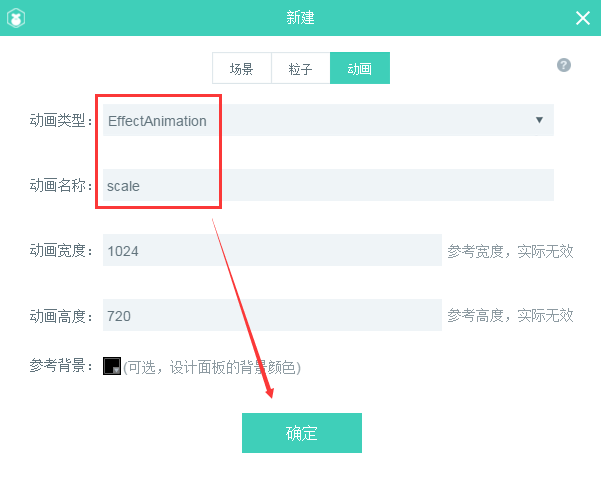
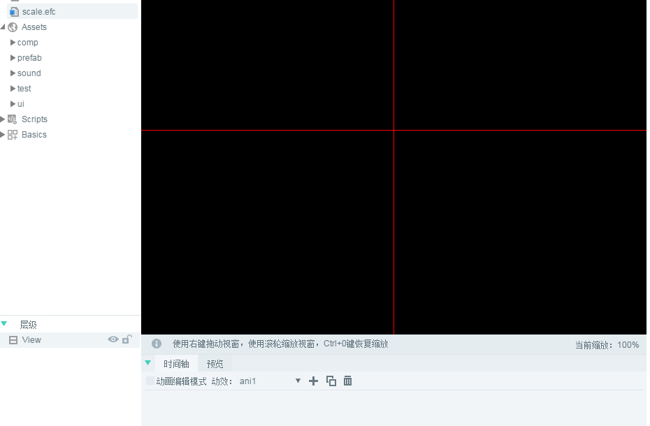
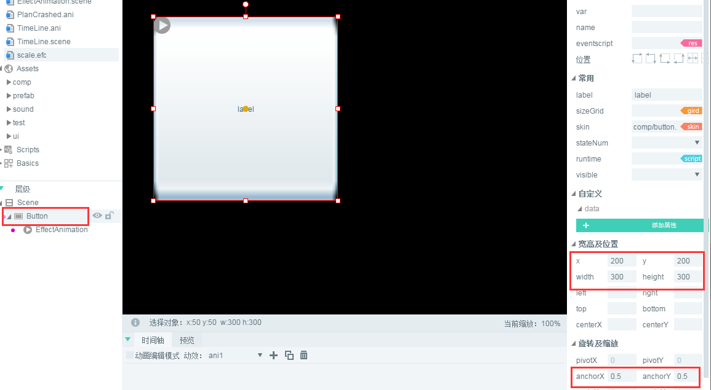

#Create Effect Animation

###1. What is dynamic template

Motion template is an animation effect based on the time axis, by presupposing the animation effect, and then attaching the effect to a component. The component does not need to be coded, but it can easily achieve the same animation effect as the coding. Kinetic template can not be displayed independently. It can only be used as a dynamic template to animate components in UI pages.


###2. Making and Using Action Template in IDE

####2.1 Create Effect Animation Template File

In Project Manager, mouse`右键`> selection`新建`>`动画`。 In the panel of the new animation, the animation type is selected as`EffectAnimation`。 Since we are going to create a zoom effect template, the animation name is named after us.`scale`As shown in Figure 1.

<br/> (Fig. 1)

click`确定`After that, a`scale.efc`Double-click the action template file and we see the animation editing scene as shown in Figure 2.

<br/> (Figure 2)


####2.2 Create dynamic template

**Goal: Create an animation effect template that shrinks first and then restores.**

**Step one**We drag an Image component from Resource Manager to`scale.efc`Scene Editor. As shown in Figure 3.

<br/> (Figure 3)


**Step two**Selection`动画编辑模式`Then select`第1帧`and`Image`Component, right-click on component`创建关键帧`。  As shown in Figure 4.

<br / > (Fig. 4)


**Step three**Select`第1帧`In the property manager, the`scaleX`And`scaleY`Attribute values are set to`0.2`。 As shown in Figure 5. After setting the attribute values, scaleX and scaleY are automatically added to the Image timeline. (* Since our dynamic template does not need displacement effects, we can delete the attributes X generated automatically by creating key frames. *)

<br/> (Fig. 5)

**Tips**It should be noted that there is an important difference between dynamic template and time axis animation, that is, if the animation effect is set in the first frame of the current animation effect of dynamic template, the animation effect is invalid. For example, when we want to reduce the size to 0.2 first, we can reduce the animation component directly to 0.2 in the time axis animation in the 0th frame, but in the dynamic template, we can not set the zoom effect directly in the 0th frame, we must set the zoom target effect in other frames (* such as the 1st frame *)(* 0.2*).


**Step four**Create a key frame in frame 13 (see Fig. 4), set`scaleX`And`scaleY`Attribute value is`1`Click Play to preview the animation effect.

<br/> (Fig. 6)


####2.3 Use dynamic template in IDE

**Step one**Create a UI page (in this case`EffectAnimation.scene`）, and then drag a button component to the scene editor, as shown in Figure 7. (* Note: the button component in this example is in the comp directory *).

<br/> (Figure 7)


**Step two**Drag and drop the scaled. EFC under the Button component, as shown in animation 8.

<br / > (Fig. 8)


**Step three**To achieve the center zoom effect, and let the button see more clearly. We select the Button component and set the pivot property in the Properties panel.`anchorX`And`anchorY`The value is`0.5`Then, set the width and height of Button and the XY axis position of the pivot point, as shown in Figure 9.

<br> (Fig. 9)

*Tips: Axis effects need to be set in the component properties of the UI. Axis effects set in the dynamic template are invalid for components.*


**Step four**Select the action template under the Button component and set the event attributes that trigger playback in the right property panel`playEvent`The value is`mousedown`。 As shown in Figure 10, then export the UI page according to F12, which can be used in the project.

<br/> (Fig. 10)


###3. Demonstrating the effect of dynamic template in the project

Create a`Main.as`The entry class is set to the default application. Write the code as follows:


```java

package
{
	import laya.net.Loader;
	import laya.utils.Handler;
	import ui.EffectAnimationDemoUI;

	
	public class Main
	{
		public function Main()
		{
			//初始化舞台
			Laya.init(1334,750);
			//设置舞台背景色
			Laya.stage.bgColor = "#ffffff"    
			
			//加载图集资源，加载成功后添加到舞台
			Laya.loader.load("./res/atlas/ui.atlas",Handler.create(this,onLoaded));
			
		}
		
		private function onLoaded():void
		{	
			//实例导出的UI类
			var efc:EffectAnimationDemoUI = new EffectAnimationDemoUI();
			
			//添加到舞台
			Laya.stage.addChild(efc);
		}
	}
}
```


After running, when the button is pressed, the animation effect is shown in Figure 11.

<br/> (Motion Fig. 11)


###4. Multiple dynamic effect templates to create complex dynamic effects

Just after the button is pressed, the animation effect becomes larger from a small age. We can make a dynamic template to achieve the reduction effect when the button is bounced. In order to realize the continuous animation effect demonstration of fast switching state between press and pop-up.

First, we create a dynamic template file, which is directly reduced. Just two key frames, as shown in Figure 12, are needed.`第12帧`To scale properties`scaleX`And`scaleY`The value is set to`0.2`。

 <br /> (图12)


Then, in the UI page, drag the action template under the Button component and set it`playEvent`Attribute is`mouseup`。 As shown in Figure 13.

<br/> (Fig. 13)


Finally, after saving, export the UI according to F12, and compile the code again in the project. As shown in Figure 14, the animation effect is very smooth in the event of continuous press and pop-up.

<br/> (Fig. 14)

At this point, the basic course of Effect Animation has been completed. Developers can quickly develop the animation effects of various components with the action template function of LayaAirIDE.


