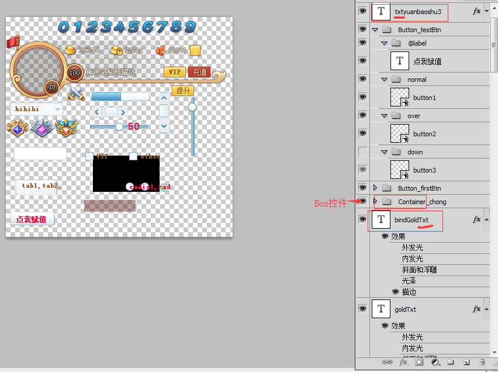
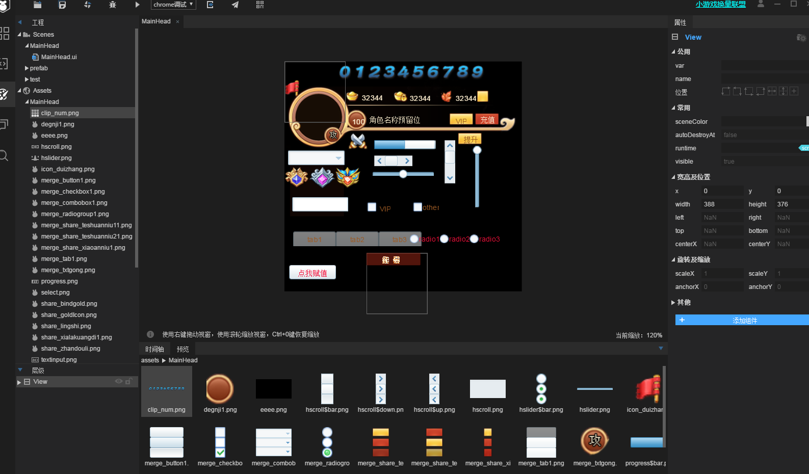

#PsDToUI and its usage

> author: Laya update: 2019.03.27

*[Note] LayaAirIDE 2.0.0 is the official version of this tutorial. If there are any differences, please refer to the latest version of LayaAirIDE.*

Psd2UI in laya's integration tool can convert PSD files made by PS according to certain rules into UI that Laya can use.

When you open the tool, you will see the following interface, drag in the folder containing psd, and click OK to convert.

As mentioned earlier, PSD can only be converted into the UI used by Laya according to certain rules. The rules are as follows:

1. All unrecognized types are image, which is consistent with IDE editors.

2. Except for box and Label, the others are consistent with the UI naming rules of IDE, prefix or suffix.

3. Controls need to be named according to the prefix and suffix rules. The three states are as follows: normal, over, down.

4. Container_prefix is recognized as Box container. Label uses not only text control, but also lowercase TXT as prefix, or upper case Txt as suffix.

   

After transformation, you will see two folders

We need to put the contents of the assets folder in the assets folder of the project, the contents of the pages folder in the pages folder of the project, or paste the two folders directly into the Laya folder and choose to merge the two folders.

Then open the editing mode of the project, and you can see that the UI has been made. The effect is as follows:

For more questions, visit ask.layabox.com