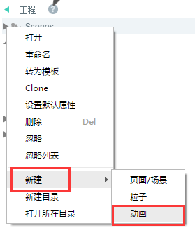
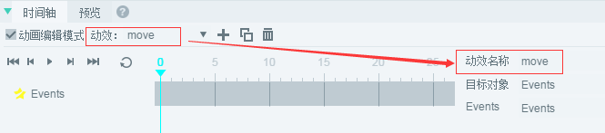
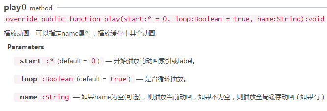
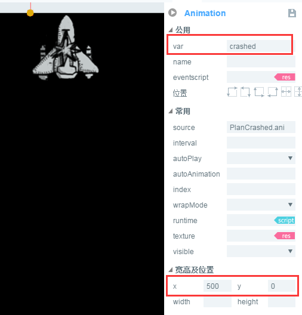

#Detailed Explanation of Time Axis Animation Editor

*[Note] This tutorial is based on LayaAirIDE version 2.0.0. If there are any differences, please refer to the latest version of LayaAirIDE.*
> Time-axis animation editor is the core module of Laya AirIDE. By making key frames on time-axis, animation frames in motion can be automatically generated, which can quickly realize the animation effects of alpha transparency gradient, displacement, rotation, scaling and so on. It saves most of the time of producers and improves the efficiency of development. From creating timeline animation to coding application, this article comprehensively introduces the function and use of timeline animation editor.
>


##1. Create timeline animation

　　**There are two ways to create timeline animation**。 One is to create`.ani`File timeline animation, the other is on the UI page（`.ui`File) Create timeline animation inside.

The two methods of making timeline animation are exactly the same.**Difference**Only lie in`.ani`The timeline animation created in the file can be used by other UI pages, while the timeline animation created in the UI page can only be used in the current UI page.

For general timeline animation, it is recommended that`.ani`Create in file. This article takes`.ani`The file format is an example.

**Tips**:

##- If you create a timeline animation in the UI page, you need to start with`场景编辑器`Select the animation component you want to edit, and then click on the Check Timeline panel`动画编辑模式`Then animation editing and production operations. 在UI页面中制作时间轴动画，`动画编辑模式`勾选状态时，不能直接将组件拖入`场景编辑器`We need to quit first.`动画编辑模式`The UI components to be used are dragged in first`场景编辑器`And then re-enter`动画编辑模式`Editor.


###1.1 Create timeline animation file ani

**Step one**In the Project Manager,`右键`In the menu, select`新建`>`动画`As shown in Figure 1.

<br/> (Fig. 1)


**Step two**Left Click`动画`After that, the timeline animation will pop up to create the panel. Select the Graphic Animation type in the panel and enter`动画名称`Click`确定`As shown in Figure 2.

<br/> (Figure 2)

*Tips: For the description of each column in the panel, please refer to the document "UI Pages, Particles, Animation, Additional Panel Details for Scripts"*

Click OK and it's done.`TimeLine.ani`Animation file creation, and automatically open, into the animation editing mode. As shown in Figure 3.

<br/> (Figure 3)

**Tips**:

- Open`.ani`or`.ui`Documents,`时间轴`Panel and`帧属性`By default, the panel is located below the IDE. The two panels need to be used in conjunction with the production of timeline animation. If you can't find them or turn them off carelessly, you can press the shortcut key.`F3`Restore to default panel layout.

- in`.ani`In a file, the starting coordinates of the scene editing area（`0,0`) The point is at the center of the intersection of two red lines. Unlike the top left corner of the UI file, you need to pay attention to it.


### 

###1.2 Create a displacement timeline animation

####1.2.1 Modify the name of the time axis

<br/>
(Fig. 4)

Multiple animation effects can be managed in the timeline panel. By default, ani1, ani2... For anix naming, we need to modify the dynamic name in order to make it easier to remember and distinguish. For example, we need to create a displacement effect, which can be named by move. No refresh is required after modification, and it will take effect immediately, as shown in Figure 5.

<br/> (Fig. 5)


####1.2.2 Enter Animation Editing Mode

Only when the animation editing mode is checked can the current animation effect be edited. After entering editing mode, it defaults to 0 frames, as shown in Figure 6. (* Time axis animation starts at 0 frames *)

<br/> (Fig. 6)


####1.2.3 Import Animation Resources

In the resource panel, dragging bitmap resources (Image components) onto the animation editing panel automatically creates a key frame in frame 0. As shown in Figure 7.

<br/> (Figure 7)

Figure 7`GraphicNode:2`For each animation node, select`第0帧`Can see`2`It is the value of the target object.


####1.2.4 Create Key Frames

There are three ways to create keyframes. They are right-click creation in the hierarchy panel, right-click creation in the scene editor, and automatic creation after changing any attribute value of the component.

**First: Create a hierarchical panel**

After selecting a frame, select the component node in the hierarchical panel.`右键`>`创建关键帧`As shown in Figure 8-1.

 <br /> (图8-1)


**Second: Right-click Create in Scene Editor**

In the Scene Editor, after selecting the components in the scene`右键`>`创建关键帧` 

<br/> (Figure 8-2)


**Third: automatic creation.**


在场景编辑器中，选中组件，改变组件的任意属性值后会自动创建关键帧。

In this case, we create it in a third way. First select with the mouse`第20帧`Then change the x-axis attribute value to`160`At this point, the key frame is automatically generated in the 20th frame, and an X-axis slave is successfully created.`0`reach`160`Time axis displacement animation. As shown in Figure 8-3.

<br/> (Fig. 8-3)


####1.2.5 Play Time Axis Animation

The buttons to play the animation are in turn left to right.`首帧`Button,`上一帧`Button,`播放/暂停`Button,`下一帧`Button,`尾帧`(* Last Key Frame*) Button,`循环播放`Button. Different buttons play animation as shown in Figure 9.

<br/> (Fig. 9)

**First button**After clicking, the playback pointer moves to the first frame of the time axis (* frame 0*).

**Last frame button**After clicking, the playback pointer moves to the last frame of the current frame. If the current frame is the first frame, the playback pointer moves to the last frame of the key frame.

**Play pause button**After clicking, the animation effect will be played from the location of the current frame and stopped at the last key frame. In playback mode, clicking will pause the animation, click playback again, and continue to play from the frame where the pause occurred.

**Next frame button**After clicking, the playback pointer moves to the next frame of the current frame. If the current frame is the last frame of the key frame, the playback pointer moves to the first frame.

**Tail frame button**: Click to move the playback pointer to the last frame of the timeline keyframe.

**Loop Play Button**: after clicking the select button, when clicking the play button, the animation will play in cycle, and clicking the cycle button again will cancel the cycle.


　　


###1.3 Make animation effect through attribute panel

In the attribute panel of the component, there are some attributes of assistant animation effect realization, which are illustrated separately in this section.

####1.3.1 Increase the effect of rotating animation

For example, on the basis of the previous displacement animation, we make a moving and rotating animation effect by changing the pivot point and rotation angle. As shown in Figure 10.

<br/> (Fig. 10)

**Operation steps:**

Select the last key frame (frame 20), select the component, and modify the value of the property panel:`x`The value is 235.`y`The value is 100.`pivotX`The value is 50.`pivotY`The value is 100.`rotation`The value is 270. Click Play.

**Attribute Interpretation:**

`x`And`y`It is the position coordinates of components.

`pivotX`And`pivotY`Is the axis coordinates x and y of the component.

`rotation`It is the rotation angle of the component.


####1.3.2 Increase zoom animation effect

On the basis of the previous animation, by changing the zoom ratio, we can see the zoom effect of the timeline animation, as shown in Motion 11.

<br/> (Motion Fig. 11)

**Operation steps:**

Select the last key frame (frame 20), select the component, and modify the value of the property panel:`scaleX`And`scaleY`The values are set to 0.3. take`rotation`Modified to 360

**Attribute Interpretation:**

`scaleX`It is the horizontal scaling of components. The default value is 1. It does not scale.

`scaleY`It is the component's vertical zoom, default value is 1, no zoom.


####1.3.3 Increase transparent gradient effect of animation

Transparent gradient effect is also one of the commonly used animation effects. By modifying alpha value, transparent gradient effect such as fading in and fading out can be easily achieved. We continue to extend on the basis of the previous animation. The effect is shown in Figure 12.

<br/> (Motion 12)

**Operation steps:**

Select the last key frame (frame 20), select the component, and modify the value of the property panel:`scaleX`And`scaleY`The values were revised to 0.2. take`rotation`Modified to 720.`alpha`Set to 0.

**Attribute Interpretation:**

`alpha`Is the transparency attribute value, default to 1, opaque. 0 is completely transparent, and the range of attributes is 0-1.


####1.3.4 Axis Point Animation Effect Settings

#####Create a new timeline animation

To distinguish from the displacement effect, we click on the plus sign Icon and create a timeline animation, as shown in Figure 13-1.

<br/> (Fig. 13-1)

After creation, change the name of the animation to pivot, and we can see the newly created animation from the animation list.`pivot`Animation and the original`move`Animation, as shown in Figure 13-2, can switch between different animations by clicking on the name in the list.

<br/> (Fig. 13-2)


#####Animate the center point

When the axis point is not set, the default axis is the upper left corner of the component. At this time, we rotate, as shown in Figure 14-1.

<br/> (Figure 14-1)

If you want to achieve the center of the image rotation how to operate, here we can use two ways to achieve.

**The first is through anchors.**

The anchor point is set in proportion to the maximum length of the X or Y axis of the component, and the value is`0-1`Between, for example, we will`anchorX`And`anchorY`All attribute values are taken`0.5`The coordinates of the axis center are obtained at 50% of the length of the X axis and the Y axis. In this way, a rotation angle value is set in the tail frame of the time axis.`rotation为360`The rotation effect with the center point as the axis is realized, as shown in Figure 14-2.

 <br />（动图14-2）


**Tips**:*It is a very convenient and fast way to set the pivot point by anchoring. However, the anchor mode can only set the pivot point for UI components, and for Graphics components and Sprite and other 2D basic components, the pivot point can only be realized by the second way.*


**The second way: through the pivot point attribute**

We want to rotate with the center point as the axis. We can also set the center of the component as the axis point through the axis point property. For example, the original size of the picture is`110*145`Then we divide the original width and height by 2 to get the center position.`pivotX`Attribute value is`55`,`pivotY`Attribute value is`72.5`。 Then the animation is played, just like the effect of the first method. As shown in Figure 14-3.

 <br />(动图14-3)


**Tips**:*Relative to the anchor point directly set 0.5 can get the center point as the axis point, axis point attribute setting needs simple calculation, a little trouble. But the axle-centered method is more widely used, not only components can be set up, but also containers and prites can be set up.*


####1.3.5 tilt angle animation effect settings

#####Coordinate system of inclined attributes

The coordinate systems of skewX and skewY are different from those of conventional coordinate systems.**The horizontal direction is y and the vertical direction is X.**。 As shown in Figure 15.

<br/> (Fig. 15)

In order to understand the skewX and skewY tilt angle changes. We use the timeline animation directly.

#####Demonstration of skewX's tilt effect

Operation: in`第0帧`No effect is set.`第20帧`Set skewX to`30`After clicking the playback, the skewX axis of the component changes counterclockwise. As shown in Figure 16-1.

 <br /> (动图16-1)


　　**Tips**:*If the skewX value is negative, the component X axis will move clockwise and deform.*

#####Demonstration of SkewY's Tilt Change Effect

Operation: in`第0帧`No effect is set.`第20帧`Set skewY to`30`, click play, the skewy axis of the component is in the clockwise direction. As shown in Figure 16-2.

 <br /> (图16-2)


　　**Tips**:*If the skewY value is negative, the side of component Y axis will move counterclockwise and deform.*

#####Demonstration of the effect of skew and skew at the same time

Operation: in`第0帧`No effect is set.`第20帧`Set skewX to`30`SkewY is set to`20`After clicking on the playback, the skewX of the component moves counterclockwise, and the skewY axis moves clockwise, and the component is deformed by co-extrusion. As shown in Figure 16-3.

<br/> (Figure 16-3)

#####Tilt animation without deformation

Previous examples are skew attributes are positive, because of the tilt angle changes in the deformation effect, if skew attributes are negative, then the direction of deformation is the opposite direction. Therefore, when skewX and skewY adopt the same numerical angle, one attribute is positive and the other is negative. Then the tilt angle and direction will be the same, but there will be no deformation. Next we use a simple pendulum effect to demonstrate the tilt animation effect without deformation.

Operation: in`第0帧`Set up`skewX`by`-50`,`skewY`by`50`。 Fifteenth frames`skewX`by`10`,`skewY`by`-10`。 Thirtieth frames`skewX`And`skewY`The value is consistent with frame 0. After setting, click on the playback effect as shown in Figure 16-4.

<br/> (Figure 16-4)


##2. Introduction of Animation Editor

There are two basic concepts in animation editor: display node layer and node attribute layer. As shown in Figure 17,`GraphicNode`In order to display the node, the following number is the ID of the target object. For each animation component added in the animation scene, a corresponding display node will be added in the time axis. Click on the expansion button on the left side of the node layer (* triangle *), and you can see all the animation attributes belonging to the node, as shown in the figure.`skewY`And`skewX`It is tilted animation attributes in time-axis animation. With each animation attribute added, a corresponding node attribute layer will be added under the display node layer.

<br/> (Fig. 17)

###2.1 New and Deleted Animations

Previous examples have been passed`+号`Button shows the new empty timeline animation operation, however, we can also copy the animation button, add a new animation like the original animation, new animation can continue to expand and adjust based on the original animation. As you can see from the list of animations in Figure 18, the new animation naming method for copying is“`原动画名_0,原动画名_1,.....`"For example, in Figure 18,`skew_0`And`skew_1`Is copied on`skew`,`skew_0_0_0`Copy in`skew_0_0`。 You can also modify the default animation naming in the frame properties panel.

<br/> (Fig. 18)

When you click the Delete button, you will be prompted whether to delete it or not, and when you click OK, you will delete the current animation, as shown in Figure 19-1.

<br/> (Fig. 19-1)

**Tips**:**It should be noted here that deleting timeline animation will only delete the animation effects and attributes on the timeline, but will not delete the animation nodes in the scene.**。 Especially when we delete the last animation, it will be more obvious that the node has not been deleted, as shown in Figure 19-2.

<br/> (Fig. 19-2)


###2.2 Addition and deletion of multi-node animation

####2.2.1 Node Layer and Node Naming

It used to be a time-axis animation demonstration with a node. Now we copy a new skew animation and drag a new component to the scene. A new node layer will be added automatically.

Because it is not intuitive to list multiple nodes together, it is easy to distinguish which node in the scene is being operated on. So we select the node and set the name attribute value in the property manager, as shown in Figure 20.

<br/> (Figure 20)

####2.2.2 Making Multi-node Animation

In the new node layer, we can set the key frames at different positions from the previous node layer according to the actual needs. For example, our node layer makes an animation to move back and forth, intentionally setting the second key frame at the position of the thirteenth frame. When the animation is finished, the effect is shown in Figure 21. (* The basic operations demonstrated earlier will not be explained in detail *)

<br/> (Motion Figure 21)

**Tips**Because the translation drawing in this example is located in the negative coordinate region. It needs special explanation here.`时间轴动画的负坐标区域内，无法触发点击事件`If click event interaction is needed, then X and Y of the animation must be in the positive coordinate area, that is, the lower right area where the cross red line intersects.

####2.2.3 Delete Nodes

<br/> (Figure 22-1)

If we select the node as shown in Figure 22-1, right-click`删除`It can't delete the current node just like deleting the attribute of the node. It can only delete the animation effect and the attribute of the node produced in the current node. As shown in Figure 22-2.

<br/> (Figure 22-2)

So how to delete nodes? Need to`层级`Select the node to delete in the panel, and right-click`删除`As shown in Figure 22-3. In the pop-up prompt`是否删除`Click on`确定`Yes. But if**When there are multiple animations in the animation list**It's important to note that the nodes you delete are also used in other animations, because the deletion of components will affect all animations.**Once deleted, the node and animation in other animations will disappear.**

<br/> (Figure 22-3)


###2.3 Node Attributes and Slowing Effect Settings

Under the node layer is the attribute layer of each node. When the frame of the node attribute is selected, the detailed frame attribute can be seen, as shown in Figure 23.

<br/> (Figure 23)

####Introducing Frame Attributes of Nodes

`x`X is the attribute name and - 260 is the value of the current frame. If skin is selected, the skin attribute name and its corresponding value are displayed. This column cannot be modified.

`标签label`After the column is set up, the frame can be manipulated by code with label name in the project. When a label is set, a red dot appears in the frame of the label, as shown in Figure 24.

<br/> (Figure 24)

`是否缓动`You can choose whether to use the slowing effect or not, and the default is the check state.

`缓动类型`The default is linearNone slowdown effect, which can be used by other slowdown effect developers themselves.

**Tips**:*The slow motion effect acts on the starting key frame position of the current animation. Special attention should be paid to those who need to change the slow motion type.*


###2.4 Make frame-by-frame animation

Frame-by-frame animation is also one of the most commonly used animations in games. There are two ways to make frame-by-frame animation in the time axis.

#####The first way is to create keyframes in succession

Step 1: Drag the component of the first frame into the scene editor. Step 2: Continuously create key frames in the time axis. As shown in Figure 25-1.

 <br > (图25-1)


Step 3: Replace the skin (skin) attributes of each frame, as shown in Figure 25-2. Then click Play to see the animation effect.

<br/> (Figure 25-2)

**Tips**:*If you drag components onto the timeline in batches, multiple animation nodes will appear in the scene. It's not the frame-by-frame animation you want.*

#####The second way: one-time creation

Dragging a batch of selected components onto the timeline will create a frame-by-frame animation directly, which is faster. As shown in Animation 25-3.

<br/> (Figure 25-3)


###2.5 Bottom Function Bar

<br/> (Figure 26)

In the bottom function bar of the timeline animation editor, it is specified as follows:

`帧率：`The default is 24 frames, which can be changed by changing the frame rate.

`加载后：`Select different actions, and the corresponding operations will be performed after loading. There are three options: no playback, once playback, and circular playback. The default is no playback.

*Tips: This setting is valid only for animation editing in the timeline of the UI, but not for animation editing of ani files.*

`帧：`By default, the current frame is displayed. Enter the number of target frames and return. It will jump directly to the number of target frames.

`圆形滑动条：`It is used to adjust the display spacing between frames on the time axis. As shown in Figure 27-1.

 <br />(动图27-1)


`矩形滑动条：`Drag the slider to move the time axis for sliding frames on the display time axis. As shown in Figure 27-2.

<br/> (Motion Figure 27-2)


##3. Using Time Axis Animation

###3.1 Derived Time Axis Animation

Pressing the shortcut key F12 or Ctrl + F12 in the IDE will generate the timeline animation.`.ani`The file will be generated in`项目根目录/bin/h5/`Under the directory. The resource atlas used in animation is located in`项目根目录/bin/h5/res/atlas/`Under the directory, as shown in Figure 28.

<br/> (Figure 28)


###3.2 Use timeline animation in projects

There are three steps to use timeline animation in the project.

Step 1: Load the atlas needed for animation.


```java

//加载图集成功后，执行onLoad回调方法
Laya.loader.load("res/atlas/ui.atlas", Handler.create(this, onLoaded));
```


Step 2: Create an Animation instance and load the animation file


```java

//创建一个Animation实例
var tl:Animation = new Animation();
//加载动画文件
tl.loadAnimation("TimeLine.ani");
```


Step 3: Add animation to the stage and play animation


```java

//添加到舞台
Laya.stage.addChild(tl);
//播放Animation动画
tl.play();
```


The complete sample code is as follows:

**Entry class TimeLineDemo.as**


```java

package
{
	import laya.display.Animation;
	import laya.utils.Handler;
	import laya.webgl.WebGL;

	public class TimeLineDemo
	{
		public function TimeLineDemo()
		{
          	//初始化舞台
			Laya.init(1334,750, WebGL);
          	//设置舞台背景色
			Laya.stage.bgColor = "#ffffff";
			//加载图集成功后，执行onLoad回调方法
			Laya.loader.load("res/atlas/ui.atlas", Handler.create(this, onLoaded));
			
		}
		
		private function onLoaded():void
		{
			//创建一个Animation实例
			var tl:Animation = new Animation();
			//加载动画文件
			tl.loadAnimation("TimeLine.ani");
			//添加到舞台
			Laya.stage.addChild(tl);
			//播放Animation动画
			tl.play();
			
		}
	}
}
```


The code runs as shown in Figure 29.

<br/> (Figure 29)


###3.3 Multi-timeline animation

We've made several animations in TimeLine. ani before, so how do we load and use other animations? At this time, the value of the animation name is reflected. Use playback by default`play()`The default (default) is to play the first animation. If you want to use other animations, you can set the animation name at the third parameter.`play()`The API parameters of the method are illustrated in Figure 30.

<br/> (Figure 30)

The example code modified to use multiple Animation animations is as follows:

**Entry class TimeLineDemo.as** 


```java

package
{
	import laya.display.Animation;
	import laya.utils.Handler;
	import laya.webgl.WebGL;

	public class TimeLineDemo
	{
		public function TimeLineDemo()
		{
			Laya.init(1334,750, WebGL);
			Laya.stage.bgColor = "#ffffff";
			//加载图集成功后，执行onLoad回调方法
			Laya.loader.load("res/atlas/ui.atlas", Handler.create(this, onLoaded));
			
		}
		
		private function onLoaded():void
		{
			//创建一个Animation实例
			var tl:Animation = new Animation();
			//加载动画文件
			tl.loadAnimation("TimeLine.ani");
			//添加到舞台
			Laya.stage.addChild(tl);
			//播放Animation动画
			tl.play();
			
			//创建一个新的Animation实例
			var tl2:Animation = new Animation();
			//加载动画文件
			tl2.loadAnimation("TimeLine.ani");
			//添加到舞台
			Laya.stage.addChild(tl2);
			//播放Animation动画的pivot动画
			tl2.play(0, true, "pivot");
			//动画的显示位置
			tl2.pos(300,0);
			
		}
	}
}
```


示例代码运行效果如动图31所示：

<br/> (Motion Figure 31)

#### 

###3.4 use timeline animation in UI and then invoke it in project code.

####3.4.1 Create UI pages and add Animation animation to the scene.

Let's create a`TimeLine.scene`UI page, then drag and drop directly`planCrashed.ani`To the scene, as shown in Figure 32.

<br/> (Figure 32)


####3.4.2 Setting Animation Animation Attribute Value

Select the animation in the UI scene, there are many attribute values to set. Let's set it up here first.`var`This value must be set, otherwise the animation cannot be invoked. Then set the x value of the location attribute to 500 and y to 0 (* is equivalent to setting POS value in the code *) to avoid overlapping with previous animations. Other attribute values will not be introduced one by one. Mouse to the attribute name will be introduced accordingly. As shown in Figure 33.

<br/> (Figure 33)


####3.4.3 invokes animation in UI in the project.

After exporting by F12, add code directly to the previous example. The code example is as follows:

**Entry class TimeLineDemo.as** 


```java

package
{
	import laya.display.Animation;
	import laya.utils.Handler;
	import laya.webgl.WebGL;
	
	import ui.TimeLineUI;

	public class TimeLineDemo
	{
		public function TimeLineDemo()
		{
			Laya.init(1334,750, WebGL);
			Laya.stage.bgColor = "#ffffff";
			//加载图集成功后，执行onLoad回调方法
			Laya.loader.load("res/atlas/ui.atlas", Handler.create(this, onLoaded));
			
		}
		
		private function onLoaded():void
		{
			//创建一个Animation实例
			var tl:Animation = new Animation();
			//加载动画文件
			tl.loadAnimation("TimeLine.ani");
			//添加到舞台
			Laya.stage.addChild(tl);
			//播放Animation动画
			tl.play();
			
			//创建一个新的Animation实例
			var tl2:Animation = new Animation();
			//加载动画文件
			tl2.loadAnimation("TimeLine.ani");
			//添加到舞台
			Laya.stage.addChild(tl2);
			//播放Animation动画的pivot动画
			tl2.play(0, true, "pivot");
			//动画的显示位置
			tl2.pos(300,0);
			
			
			//创建一个UI实例
			var plan:TimeLineUI = new TimeLineUI();
			//添加到舞台
			Laya.stage.addChild(plan);
			//播放UI场景中的动画
			plan.crashed.play();
			
		}
	}
}
```


The operation effect is shown in Figure 34.

<br/> (Motion Figure 34)

The animation used in the UI can easily control the animation attributes directly in the property manager of the UI. For example, we want to slow down the speed of the plane's explosion. Then we can select the animation directly in the UI and set the property value of interval. Interval controls the interval between animations (in milliseconds). When not set, the default is 50 milliseconds. Here we can change it to more so that the explosion speed of the aircraft can be reduced. As shown in Figure 35.

<br/> (Fig. 35)

After the change, press F12 to export, and then directly recompile without changing the project code. You can see that the operation effect has changed, as shown in Figure 36.

< br / > (Figure 36)


So far, the production and use of timeline animation has been introduced. More API usage for timeline animation can be seen[Animation API文档](http://layaair.ldc.layabox.com/api/index.html?category=Core&class=laya.display.Animation)。


  

 