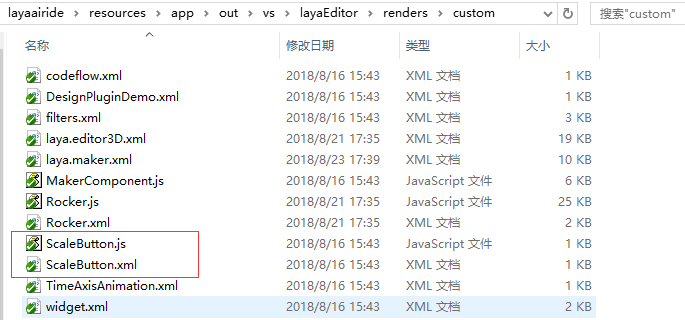
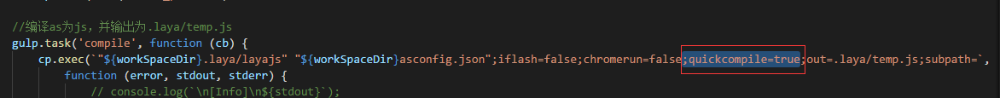

#The Making and Use of Custom Components

LayaAir IDE provides a variety of common UI components to meet basic needs, but in actual development, developers often need custom UI components to meet their special needs. LayaAir provides an interface for custom components. Developers can modify or add components as needed. New components can be identified and used by LayaAir IDE. This article takes the zoom button as an example to show how to add a new component and how to use it in LayaAirIDE.

### 	**1. Understanding Component Structure and Rules**   
#### 					**1.1 Component Directory Structure**

The component directory is located in the  resources app out vs layaEditor renders directory under the LayaAirIDE root directory. As shown in Figure 1:
​

(Fig. 1)

​**Introduction to Component Directory Structure:**

Custom: This directory is used to store JS and XML files of custom components.

Layera.editorUI.js: LayaAirIDE's function implementation code with its own components;

"Laya. editorUI. xml": configuration information of LayaAirIDE's own components;

#### 				**Description of XML configuration information for 1.2 components**

A complete component consists of JS and xml. JS is the functional implementation part of the component. XML is the component display and invocation part in the IDE, including the component image resource name (case-sensitive), the option and default value of the attribute panel, etc.

The following is an example of the TextArea component in laya.editorUI.xml:


```xml

	<TextArea className="laya.editorUI.TextArea" inherit="TextInput" defaultValue="text='TextArea'" skinLabel="skin" resName="area" icon="TextArea" groups="公用,常用,宽高及位置,旋转及缩放" drag="3">
		<prop name="vScrollBarSkin" tips="垂直滚动条皮肤" type="string" default="" accept="res" group="常用" />
		<prop name="hScrollBarSkin" tips="水平滚动条皮肤" type="string" default="" accept="res" group="常用" />
	</TextArea>
```


​

​**Component XML Description:**

TextArea: TextArea tags serve as the beginning and end of components. TextArea can be named differently from categories, but it should be easy to understand and memorize for display of component names in IDE.

ClasssName: The complete class path of the component, such as laya. editorUI. TextArea;

Inherit: the parent of inheritance;

Default Value: Default value of component attributes;

Skin Label: Skin-related settings in the property panel. The value of skinLabel corresponds to the name field and related settings of prop. If there is no one in prop, it will not be set, and there will be no such settings in the TextArea component.

"ResName": The component resource prefix (case-sensitive) identifies the resource with the prefix as the component; TextArea is configured as an abbreviation for TextArea, and TextArea is displayed on the component panel of the IDE. In terms of component naming, you can view the IDE component-based "Component Resource Naming Rules" document.

"Icon": The icon name (case-sensitive) displayed by the component in the IDE. The icon directory is located in the "resources app out vs layaEditor laya icons components" directory under the root directory of LayaAirIDE. Here we can create a new icon, or multiple components can use one icon together. For example: TextArea will correspond to TextArea. PNG in the component directory

Groups: Grouping display for attribute panels, separated by commas;

Drag: Drawing parameters: 1: there are two points, which can only be stretched horizontally, such as hscroll component; 2: there are two points, which can only be stretched vertically, such as vscroll component; 3: there are eight points, which can be stretched horizontally, vertically, enlarged and reduced;

"Prop": In prop is the setting of attributes in the attribute panel, and each prop tag corresponds to a component attribute.

Name: The name of the property will be displayed in the property panel.

Tips: The tips prompt displayed on the property name with the mouse;

Type: The type of attribute value in the input box;

Default: The default value of this property;

"Accept": This property receives two values of res and files. Res represents that the property bar can be dragged into a single resource; files represent that the property bar can be dragged into multiple resources;

Groups: Groups in which the attribute belongs; Groups that do not exist belong to "other" groupings;

###2. Import LayaAirIDE Component Library
####2.1 download layaairide component library (this is as version)

Download address:[https://github.com/layabox/layaair-ide-ui](https://github.com/layabox/layaair-ide-ui)

####2.2 Create a project and import it into the project directory

First, create an AS3 project using LayaAirIDE (see the relevant tutorials for creating the project, this article will not elaborate). Then the zip package downloaded is decompressed and the editorUI and IDE directories are placed in the "libs/laya/src/laya" directory under the project root directory. As shown in Figure 2:

! [] (img/1.png)

(Fig. 2)

###3. Making a custom component
####3.1 Create a Component Class

Create a component directory (package) "component" to facilitate the classification of other components in the future, and then create a scaleButton. as class under the component directory, as shown in Figure 3:

​

(Figure 3)

After the creation, we started to write the following code for the scaling component:


```javascript

package component
{
	import laya.editorUI.Button;
	import laya.events.Event;
	import laya.utils.Tween;
	
  	//继承button组件
	public class ScaleButton extends Button
	{
	
		//缩放时间100毫秒
		public var scaleTime:int = 100;
		public function ScaleButton(skin:String=null,label:String="")
		{
			//调用父类的构造函数
			super(skin,label);
			
			/* 设置按钮为单态按钮
			** 取值：
			** 1：单态。图片不做切割，按钮的皮肤状态只有一种。
			** 2：两态。图片将以竖直方向被等比切割为2部分，从上向下，依次为弹起状态皮肤、按下和经过及选中状态皮肤。
			** 3：三态。图片将以竖直方向被等比切割为2部分，从上向下，依次为弹起状态皮肤、经过状态皮肤、按下和选中状态皮肤
			*/
			this.stateNum = 1;
			
			//添加鼠标按下事件侦听。按时时缩小按钮。
			this.on(Event.MOUSE_DOWN,this,scaleSmal);
			//添加鼠标抬起事件侦听。抬起时还原按钮。
			this.on(Event.MOUSE_UP,this, scaleBig);
			//添加鼠标离开事件侦听。离开时还原按钮。
			this.on(Event.MOUSE_OUT,this, scaleBig);
			
		}
		
		private function scaleBig():void
		{
			//变大还原的缓动效果
			Tween.to(this, {scaleX:1,scaleY:1},scaleTime);
		}
		
		private function scaleSmal():void
		{
			//缩小至0.8的缓动效果
			Tween.to(this,{scaleX:0.8,scaleY:0.8},scaleTime);
		}
	}
}
```


####3.2 Compiling Component JS with Subcontracting Function

AS3 compiled JS is packaged by default, that is to say, all logic code and engine libraries are compiled into a JS file. For custom components, this JS needs to be copied to the component directory of IDE, and a lot of code is not available. So we need to subpackage compilation. (For a detailed subcontracting tutorial, please see the relevant official website documentation. This article only describes the steps that need to be used.)
Create a subcontracting configuration file module.def in the root directory of the project, open the file, and write the JS file name "scalebutton" generated by compilation and the compilation path "Src / component" to be subcontracted in the file according to subcontracting rules. References are as follows:


```

module:"ScaleButton"  	//设置组件编译后的分包JS文件名
path:"src/component"      //设置需要分包的组件所在目录路径
```


After the subcontracting rules are written and saved, we compile the ScaleButton. as we just wrote. (In this article, we directly set the ScaleButton. as file as a document class for the convenience of demonstration.) We can see that there is a ScaleButton. JS in the JS directory. As shown in Figure 4, when we open the js, we can see that the JS corresponds to the ScaleButton. as code we just wrote. This JS is our own. Define the JS functional implementation part of the component without any other code such as engine libraries.

​

(Figure 4)

####3.3 Writing XML configuration files for components
According to the XML configuration instructions mentioned above, we complete the XML configuration of the zoom button, and the custom component is even completed. The XML configuration information of the zoom button is written as follows:


```xml

<?xml version="1.0" encoding="utf-8" ?>
<uiComp>
	<ScaleButton className="component.ScaleButton" runClass="component.ScaleButton"  inherit="Button" skinLabel="skin" 
	defaultValue="label=''" resName="sButton" icon="Box" groups="公用, 常用, 宽高及位置" drag="3">
		<prop name="scaleTime" tips="缩放使用的时间" type="number" default="100" group="常用" />
	</ScaleButton>
</uiComp>
```


Tips: XML Configuration Information Content Interpretation refers to the component XML description above.

###4. Adding and Using Custom Components

####4.1 Adding components to the IDE's custom component directory

After compiling the XML configuration file, it is stored directly in the directory of the custom component (resources app out vs layaEditor renders custom) under the root directory of LayaAirIDE). The name of the component XML needs to be consistent with that of the component js. Here we call it ScaleButton. xml. Then we copy ScaleButton. JS generated by subcontracting compilation (under the "Project Root Directory / bin / H5 / js" directory, refer to Figure 4) to the directory of the custom component. As shown in Figure 5:

​

(Fig. 5)

####4.2 Displayed in IDE Component Panel

Open the IDE component directory (LayaAirIDE root directory resources app out vs layaEditor laya basics) and create a custom component storage directory Custom to store self-defined components, as shown in Figure 6.

​

(Fig. 6)

Then place a PNG icon named sButton in the Custom directory (the recommended size is 16*16), as shown in Figure 7. Once you complete this step, you can find the scaling button component we created in the component panel of the IDE, as shown in Figure 8.

​

(Figure 7) Icon naming the value of resName attribute in the corresponding component XML

​

(Figure 8) The component name of the IDE corresponds to the tag name of the component XML

​**Tips:**Additionally, the icon icon of the component is not sButton.png in the "LayaAirIDE root directory resources app out vs layaEditor laya basics Custom" directory. Icon icon is located in the "resources app out vs layaEditor laya laya icons components" directory under the root directory of LayaAirIDE, corresponding to the value of icon attribute in xml, which is described in the XML description above. If you create your own icon, refer to the icon size identification in the components directory, make it into the components directory, and then set the corresponding file name in xml.

####4.3 Displayed in IDE Resource Panel

In the resource panel, by default, skin resources of common UI components are placed in the comp file, and skin resources are easily identified as components by component naming rules (resources must be stored in the "project root directory laya assets" before they can be identified as components). Unlike the component attribute skin value of the component panel, the default value of the component attribute skin in the resource panel is the relative path in the " laya assets" directory.
To make it easier for projects to use components with skin resources, let's continue to show components in the resource panel. First, we prepare a skin resource. Since the custom component of the example above is the zoom button, we can directly copy any picture to experience the zoom effect of the zoom button component. Picture resources can be copied to the "project root directory laya assets" directory. Picture resources are named ScaleButton or prefixed with ScaleButton as the attribute value of resName in xml, as shown in Figure 9.


​	

(Figure 9)

After the resource replication is completed, we open the resource management panel of LayaAirIDE again, click the refresh resource tree button to see the newly replicated ScaleButton_mokey.png, click the picture, and we can see the preview of the picture. This shows that our custom component with skin default value was successfully added to the project's resource management panel, as shown in Figure 10.

​

(Fig. 10)

Tips: The components shown in the resource panel are only used for the current project, and adding them to the component panel is the common component for all projects.
​

####4.4 Use custom components

Create a demo page in the project management panel (this page is only for demonstrating the effects of components, without detailed description of the operation steps). There are two ways to use our custom zoom button component.

4.4.1 Used from Resource Panel

In the Resource Management Panel, find the component prefixed by sButton, drag it to the page directly, and click to see the zoom effect, as shown in Figure 11.


​	

(Figure 11)

4.4.2 is used from the component panel

Find the ScaleButton component in the component panel, drag it directly to the page, and click to see the zoom effect, as shown in Figure 12


​	

(Figure 12) The component panel does not contain image resources and needs to be set through the property skin

###5. Debugging of Components

According to the above, we have completed the whole process of making and using LayaAirIDE components. However, in the formal process of customizing components, there is a very important step. In order to simplify the process and achieve the goal of customizing components as soon as possible, this step is the debugging of components.

With the smooth operation of documents, the lack of debugging links is no problem, but in the actual development process, most people can not guarantee that there are no errors in coding. Adding components with errors to the IDE will not go as smoothly as in this document, and components are difficult to debug in the IDE. Therefore, in this section, we add the missing steps. After compiling the components, we debug them first, and then subcontract and compile them.

#### 	**5.1 Resource Path to Copy Pictures to Projects**

Copy an image to the resource path of the project under the project root directory / H5 / RES / img directory, as shown in Figure 13.

​

(Fig. 13)

####5.2 Modify class references for components

Open ScaleButton.as, the scaling button code written above, and introduce the original component library into "import laya.editorUI.Button;" instead of "importlaya.ui.Button;", the engine's UI library into "importlaya.ui.Button;", the others remain unchanged. Because laya. editorUI is used for LayaAirIDE, the engine library laya. UI must be referenced for project running. As shown in Figure 14:

​

(Fig. 14)

####5.3 Create an entry class

Create an entry class Main.as under Project Root Directory/src, coded as follows:


```javascript

package
{
	import component.ScaleButton;	
	import laya.utils.Handler;
	
	public class Main
	{
		public function Main()
		{
			//初始化舞台
			Laya.init(1136,640);
					
			//加载图片资源，回调
			Laya.loader.load("res/img/monkey1.png",Handler.create(this, onLoaded));
			
		}
		
		private function onLoaded():void
		{
			var scaleButton:ScaleButton = new ScaleButton();
			//组件skin的资源路径
			scaleButton.skin = "res/img/monkey1.png";
			//添加到舞台
			Laya.stage.addChild(scaleButton);
		}
	}
}
```


Setting the entry class as the document class, compiling and running, clicking in the browser can achieve scaling effect, as shown in Figure 15. Explain that this is a valid custom component that can be safely added to the IDE for use. (Note: The normal step is to debug before subcontracting. If the direct debugging will cause errors, it is necessary to rename or delete the subcontracting configuration file module. def before compiling and running. If any other category of errors $1 can not be found, modify the. laya gulpfile. js. As shown in the figure, delete the parameter in the red box.)




​	

(Fig. 15)

Tips: Successful debugging. When you are ready to release components, don't forget to restore the subpackage configuration file module.def. In addition, when issuing subcontracted JS code, laya. UI imported during debugging should also be restored to laya. editor.

###6. Registration of Components

Component registration is to associate a custom component with a class name, which is displayed as an instance according to the registration map.

For example:


```java

View.regComponent("ScaleButton",component.ScaleButton);//注册组件
```


###7. Other Notes

If the custom component is a container class component, if it needs to be used in the project, you need to open the project settings panel according to F9 in the Editor Mode of the LayaAir IDE project, and add the custom container component class name (in comma interval) to the Container List, as shown in Figure 16.

​

(Fig. 16)

If the custom component is a page class component, if you need to use it in the project, you need to open the project settings panel in the Editor Mode of the LayaAir IDE project and add a custom page component class name (in comma interval) to the Page List, as shown in Figure 17.

​

(Fig. 17)

This is the end of this article. If you have any questions, please go to the community and ask: http://ask.layabox.com.

