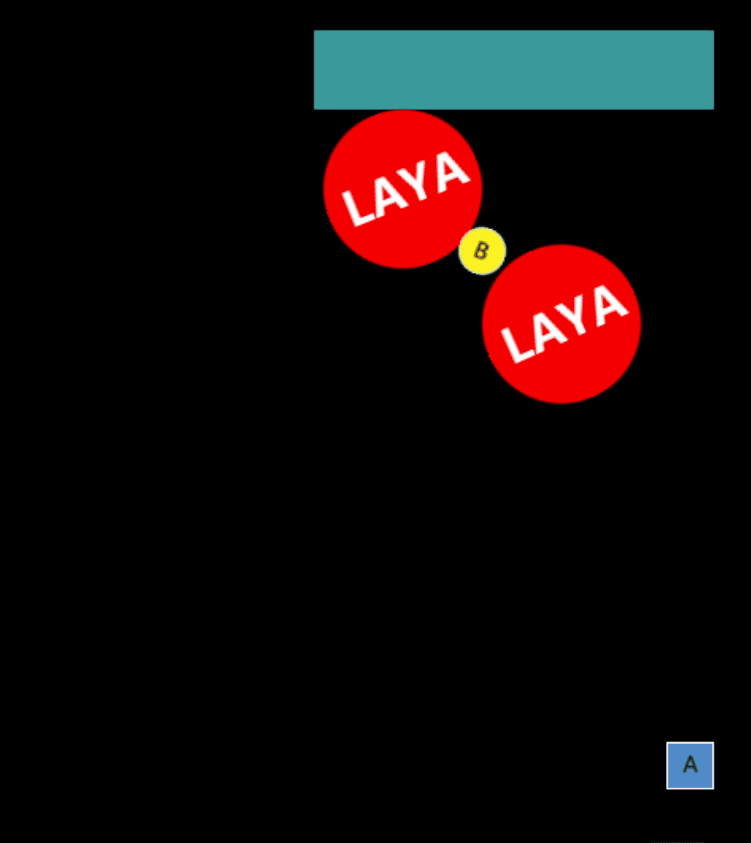
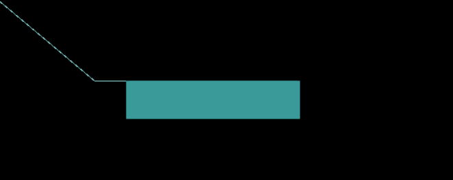
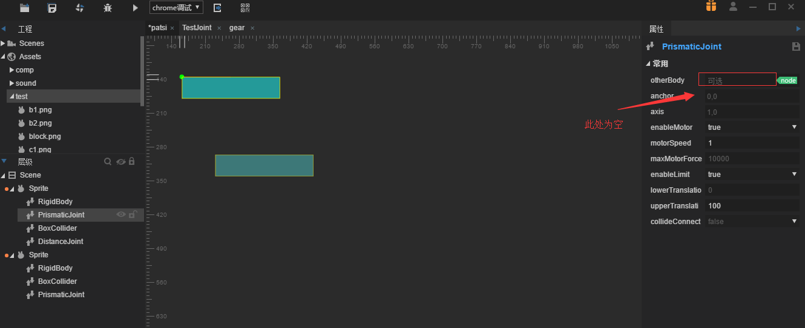
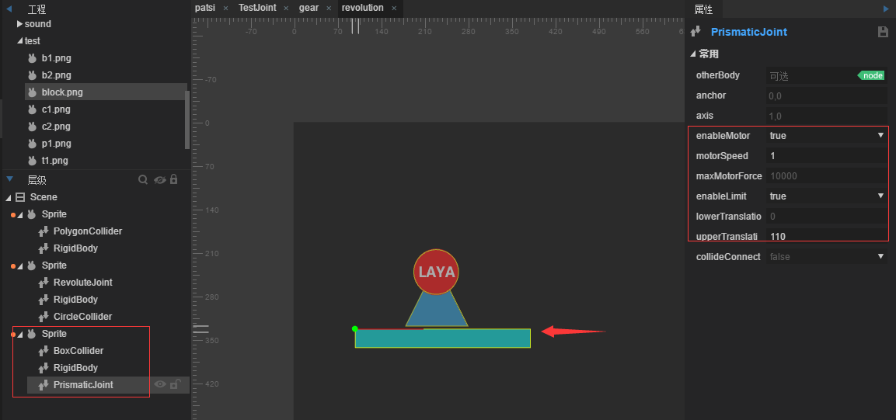
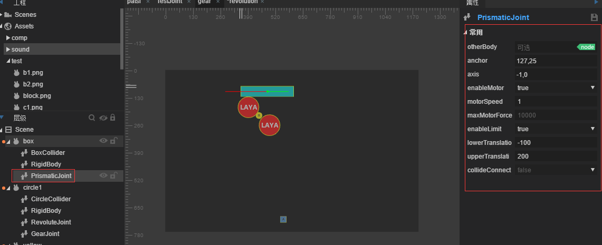

#Translation, rotation, and gear joints

##Content overview

In the game development, the design of checkpoint needs conveyor belt, gear transmission, mobile platform and other devices, using the following joint combinations, can quickly produce a system that can generate constraints.

Three types of joints are needed in this article:

Joint translation`PrismaticJoint`Rotating joint`RevoluteJiont`Gear Joints`GearJoint`。

With joint combination, some mechanism devices can be made, such as a transverse translation platform to drive the gear to rotate and lift the small square.

​

###1. Introduction of translational joints

prismatic joint`PrismaticJoint`Moving joints allow two objects to move relative along a specified axis, which prevents relative rotation.

#####Attribute introduction

#####OtherBody

The connection rigid body of the joint can not be set. It is empty rigid body in the upper left corner by default. It can be set by dragging into the rigid body object.

#####Anchor

For the first time, the control point of the joint is offset from the upper left corner of the rigid body.

#####Axis

[First set valid] A vector value that describes the direction of motion, such as 1,0 being right along the X-axis.

#####EnableMotor

Whether or not to turn on the motor, turn on the motor can make the target rigid body move.

#####MotorSpeed

When the motor is enabled, the maximum speed that can be achieved by moving on axis coordinate axis.

#####MaxMotorForce

When the motor is activated, the maximum force can be exerted.

#####EnableLimit

Whether to restrict the moving range of rigid body.

#####LowerTranslation

When constraints are enabled, the lower limit of the rigid body's moving range is the offset from anchor (negative value).

#####UpperTranslation

When constraints are enabled, the upper limit of the rigid body's moving range is the offset (positive value) from anchor.

#####CollideConnected

[valid for the first time] whether the two rigid bodies can collide, the default is false.

####Case drills

A basic translation joint, which is easy to use alone, is dragged into a box and added.`boxcollider`Collider, add translation joints to him`PrismaticJoint`In rigid body`rigidbody`gravity`gravityScale`Set it to 0, axis to (1,0) and set the motor to open at a speed of 1. Limit the maximum and minimum offset. The effect is shown in the figure.

The results are as follows. (The following figure shows the effect of the physical auxiliary line. The last document is introduced, and can be checked by f9.)

​      

In order to make the game more interesting, we need to use the platform to move with the platform, drag a box, pull a rectangle, and then add collisions, rigid bodies.`rigidbody`gravity`gravityScale`Set it to 0 and drag the rigid body into the translation joint of the first square`PrismaticJoint`Of`otherbody`On, turn on the motor, set the speed to 1, direction to 1,0 and limit the size offset, as shown in the figure

The operation effect will be problematic, because the second square also needs a translation joint. Add a translation joint to the second square. The operation effect is as follows.

At this point, developers will notice that the translation can only be opposite or backward, that is to say, it can only be near or far from an axis, and can not move in one direction at the same time. The translational joint is only relative movement. The author consulted the domestic and foreign documents and official manuals, but did not introduce the details of the joint in detail. The author realized the function by the combination method through experiments. So when we use the physical system, we must design and think according to the physical thought.

Let's continue with the previous example by translating the joint of the top square.`PrismaticJoint`Li`otherBody`Delete, as shown in Figure

Then add a distance joint to him.`DistanceJoint`And add a translation joint to the box below`PrismaticJoint`Then the object is rigid.`RigidBody`Distance Joint Dragged into the Upper Object`otherBody`As shown in Fig.

After setting up, the operation effect is as follows (the motor of the upper block moves the block to the right, and then the distant joint moves the object of the lower block to the right):

###2. Introduction of Rotating Joints

Revolving joint`RevoluteJiont`Force two objects to share an anchor point and rotate relative to each other.

#####Attribute introduction

#####OtherBody

The connection rigid body of the joint can not be set. It is empty rigid body in the upper left corner by default. It can be set by dragging into the rigid body object.

#####Anchor

For the first time, the control point of the joint is offset from the upper left corner of the rigid body.

#####EnableMotor

Whether or not to turn on the motor, turn on the motor can make the target rigid body move.

#####MotorSpeed

When the motor is activated, the maximum rotation speed can be achieved.

#####MaxMotorTorque

When the motor is activated, the maximum torque that can be applied will not rotate if the maximum torque is too small.

#####EnableLimit

Whether to restrict the rotation range of rigid body.

#####LowerAngle

When constraints are enabled, the lower limit of the rigid body's moving range is the offset from anchor (negative value).

#####UpperAngle

When constraints are enabled, the upper limit of the rigid body's moving range is the offset (positive value) from anchor.

#####CollideConnected

[First set valid] Whether two rigid bodies can collide by default is false.

####Case drills

Create a new scene, then drag in a circular image and add a circular Collider to it`CircleCollider`IDE automatically adds rigid bodies`RigidBody`Then add a rotating joint to it.`RevoluteJoint`The anchor point of the joint is set at the center of the circle, and the motor is turned on and the rotation speed is set to 1. As shown in the picture:

Click to run and we can see the rotating circle:

It's very simple to use it alone. Next, we'll use a combination of this: on the basis of this example, add a collider with a block.`BoxCollider`A rectangular strip serves as a platform, as shown in the figure.

Then move the joint.`PrismaticJoint`And a collider with a polygon added`PolygonCollider`The triangle is used as the base to rotate the circle around the point on the triangle. (Note that the triangle node should be above the level of the circle node and displayed at the front below). The final effect is as follows. The process of adding the triangle is to be completed by the developer himself.

Click to run, the effect is as follows:

###3. Introduction of Gear Joints

Gear joint`GearJoint`To simulate the constraint relationship between two gears, there are two ways to output the momentum generated when the gear rotates, one is the angular speed of the gear itself, the other is the linear speed of the gear surface.

#####Attribute introduction

#####Joint1

The first joint to be bound can be RevoluteJoint or Prismatic Joint.

#####Joint2

The second joint to be bound can be RevoluteJoint or Prismatic Joint.

#####Ratio

Angular speed ratio of two gears, default 1.

#####CollideConnect

Whether two rigid bodies can collide is false by default.

####Case drills

After mastering the translation and rotation joints, we can use the gear joints to connect the two joints, so that we can restrict the joints in turn and complete a whole system. Now let's make a slightly more complex group.

Create a new empty scene named gear. Drag a box, circle into the scene and put it in the following picture:

Sprite names from top to bottom are box, circle 1, yellow, circle 2, sprite. Naming is for the convenience of locating specific objects. The IDE will automatically add a rigid body to each object by adding the corresponding collision body. (This step needs to use the knowledge described earlier. If you don't know how to add it, please go back to the previous content to learn.)

Add a translation joint to the top box after setting up the position`PrismaticJoint`And set the corresponding attributes to make them consistent with the figure below.

Then, add the corresponding joints to the circle 1 object, and add the rotating joints.`RevoluteJoint`Gear Joints`GearJoint`And drag the translation joint and rotation joint to join 1 and join 2 to make the two joints related.

Similarly, add rotating joints to the remaining circles`RevoluteJoint`And with gear joints`GearJoint`Connect two objects in turn, yellow connects circle 1, circle 2 connects yellow, sprite connects circle 2, sprite's translation joint`PrismaticJoint`Set it as follows. Notice his Y-axis symbol:

It should be noted that only the first box box motor is turned on, which will drive all objects in the scene to move or rotate, and the final effect is as follows:

For more questions, visit the community http://ask.layabox.com