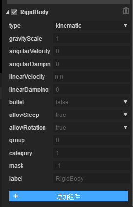

# 2D关节系统

### 1. 2D关节

​        在物理游戏开发中，如果想要复杂的系统来提高可玩性，就需要对物体之间进行各种约束，Box2D提供了关节系统。 关节可以对两个或多个物体进行一种约束。

**Box2D支持的关节有**：

距离关节`DistanceJoint`：两个物体上面各自有一点，两点之间的距离固定不变。

齿轮关节`GearJoint`：用来模拟两个齿轮间的约束关系，齿轮旋转时，产生的动量有两种输出方式，一种是齿轮本身的角速度，另一种是齿轮表面的线速度。

发动机关节`MotorJoint`

鼠标关节`MouseJoint`：用于鼠标操控物体。它试图将物体拖向当前鼠标光标的位置。而在旋转方面就没有限制。

平移关节`PrismaticJoint` ：  移动关节允许两个物体沿指定轴相对移动，它会阻止相对旋转。

滑轮关节`PulleyJoint`：它将两个物体接地(ground)并彼此连接，当一个物体上升，另一个物体就会下降。

旋转关节`RevoluteJiont`：强制两个物体共享一个锚点，两个物体相对旋转。

绳索关节`RopeJoint` ：限制两个点之间的最大距离。即使在很大的负载下也阻止连接的物体之间的拉伸。

焊接关节`WeldJoint`：使两个物体不能相对运动，两个刚体的相对位置和角度都保持不变，像一个整体。

轮子关节`WheelJoint`：围绕节点旋转，包含弹性属性，使得刚体在节点位置发生弹性偏移。

所有的关节均继承自 Component。

### 2.关节组件介绍

#### 2.1 距离关节

 

距离关节约束两个节点的距离始终保持不变，用于木棍，骨骼，弹簧一样的约束关系。

##### 属性说明

##### otherBody 

[首次设置有效]关节的连接刚体，可不设置，默认为左上角空刚体。

##### otherAnchor  

[首次设置有效]链接刚体链接点，是相对于otherBody的左上角位置偏移。

##### selfAnchor

[首次设置有效]自身刚体链接点，是相对于自身刚体的左上角位置偏移。

##### frequency

弹簧系统的震动频率，可以视为弹簧的弹性系数

##### damping

刚体在回归到节点过程中受到的阻尼，建议取值0~1。

##### length

约束的目标静止长度。

##### collideConnect

[首次设置有效]两个刚体是否可以发生碰撞，默认为false。（截图为true注意不要混淆）

##### 示例演练

我们首先用距离关节`DistanceJoint`做一个单摆效果：

新建一个2d示例项目，取名为test，展开Assets目录下的test文件夹，可以看到预留的图形，供测试物理引擎用，

在编辑模式下，按f9可以勾选显示或不显示物理辅助线。如图：

点击确定后，在场景中拖入一个block.png,一个c1.png, 效果如图所示：

然后我们要给这两个sprite添加组件，选中方块之后，点击右侧属性面板的添加组件按钮，添加`BoxCollider`组件，IDE会自动也添加刚体`RigidBody`，如下所示：

同理，给圆球添加`CircleCollider`和joint菜单里面的`DistanceJoint`IDE会自动添加`RigidBody`,最终效果如图：

按CTRL + S 保存后 ，运行，会看到如下效果：

并没有出现单摆的效果，那是因为方块的刚体类型是`dynamic`动态的，我们要给他设置成`kinematic`运动类型，使其不受重力影响，固定在一点。选择方块物体，在type属性的下拉菜单中，选择`kinematic`如图：

保存后运行，我们可以看到，单摆的效果就做出来了：

下面，我们要做一个稍微丰富一点的物理效果。

在场景中，拖入两个圆形，并添加圆形碰撞器`CircleCollider`，给其中一个圆添加距离关节`DistanceJoint`,并绑定另一个圆的刚体，把两个锚点设置在圆的中心，在IDE左下方“层级”面板中中右键添加一个sprite，并添加线性碰撞器`ChainCollider` ，点击`ChainCollider` 把两个点距离拉长，然后单机“线“ 会在线上添加一个折点，反复上述步骤，做出一个折梯型的碰撞体,然后将折线的刚体`RigidBody`的`type`属性设置为`static`静态类型（我们不需要他进行物理运动），然后在碰撞体上方拖入一个方块，并添加矩形碰撞器`BoxCollider`，将他的`restitution` 摩擦力属性设置为0.5，使其拥有弹力。再给折梯的底部做一个小山坡，拖入一个三角形，添加多边形碰撞器`PolygonCollider` ，并将三角形的`RigidBody`刚体类型设置为`Kinematic` 运动类型，使其不受力的影响。最终效果和层级结构如图所示：

完成上述步骤后，保存运行，我们就会看到如下效果：

本篇示例完成后，将会理解和掌握，所有类型的碰撞体，三种刚体类型，弹力系数和距离关节的使用。

后续的文档，会陆续介绍下图所展示的全部效果。

