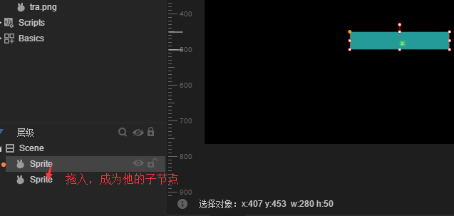
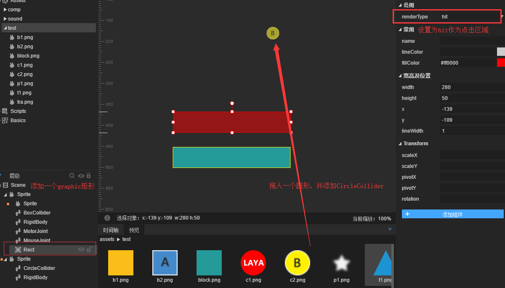
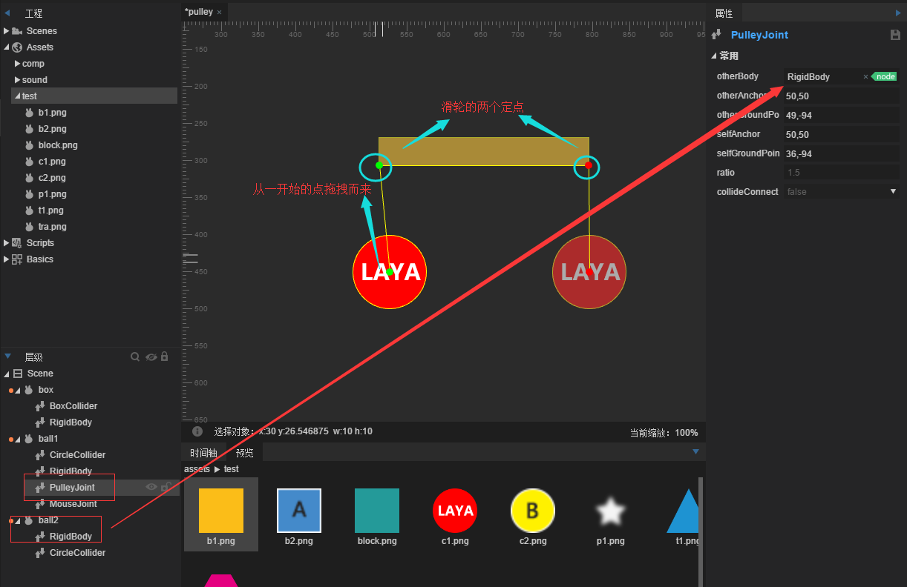

#Motor joint, wheel joint, pulley joint

###1. Motor Joints

Motor joint`MotorJoint`It is used to restrict two rigid bodies so that their relative positions and angles remain unchanged.

The motor joint always moves to the target point and keeps a specific angle.

#####Attribute specification

#####OtherBody

The joint rigid body is set up for the first time.

#####LinearOffset

The offset based on the position of otherBody coordinate is also the target position of selfBody.

#####Angular Offset

The angle offset based on otherBody is also the target angle of selfBody.

#####MaxForce

When selfbody deviates from the target position, the maximum force exerted by the motor joint is used to restore it to the target position.

#####MaxTorque

When the angle of selfbody is different from that of the target, the maximum torque exerted by the motor joint is used to achieve the target angle.

#####CorrectionFacto

When selfbody moves to the target position, the slowing factor is 0-1. The larger the value, the faster the speed.

#####CollideConnect

Whether two objects can collide is false by default.

####Case drills

The introduction of motor joints is not easy to understand. Let's take a simple example to better understand motor joints, create a scene motor. scene, drag a square to stretch the strip, create a sprite node by right mouse button in the hierarchy, and move the anchor (upper left corner) of the node to the center of the strip (because the motor joints only act on the rigid body). The rigid body is in the upper left corner of the object and can't be changed, so in this way, the graph sprite is the rendering child node.

Then drag the long sprite onto the empty sprite node to make it a child of the empty node. As shown in the picture:

Add a rectangular Collider to the parent node`BoxCollider`At this point, the size of the collider is not the same as that of the strip, but is the same as that of the parent sprite. We need to adjust the size and position of the Collider to match the size and position of the strip, as shown in the figure:

Then add the motor joint (default property) to the parent sprite, the mouse joint (for dragging and pulling, the mouse joint does not set the anchor point where to add, if set the anchor point is fixed position). Add a graphical rectangle to the parent sprite, set the size to the same size as the graph, and set its renderType to hit, so that the graph can be used as the mouse click decision area. Drag a circle into the scene and add a circular collider as the target point of the motor joint.

After completing this step, overlap the rectangular position with the strip, as shown in the figure:

Then drag the circular node or rigid body into the other body of the motor joint, as shown in the figure:

At this point, it is done, very simple, save and run, you can see the effect of motor joint:

###2. Wheel joint

Wheel joint`WheelJoint`Rotating around the node, including the elastic properties, makes the rigid body elastic offset at the node position.

Used for making physical wheels.

#####Attribute specification

#####Otherbody

The joint rigid body is set up for the first time.

#####Anchor

For the first time, the link point of the joint is offset from the upper left corner of the rigid body.

#####Axis

[First set valid] A vector value that describes the direction of motion, such as 1,0 being right along the X-axis.

#####EnableMotor

Whether or not to turn on the motor, turn on the motor can make the target rigid body move.

#####MotorSpeed

When the motor is activated, the maximum rotation speed can be achieved.

#####MaxMotorTorque

When the motor is activated, the maximum torque that can be applied will not rotate if the maximum torque is too small.

#####Frequency

The vibration frequency of spring system can be regarded as the elastic coefficient of spring.

#####Damping

The damping of the rigid body in the process of returning to the joint is 0-1.

#####CollideConnect

[First set valid] Whether two rigid bodies can collide by default is false.

####Example drill

Wheel nodes, as the name implies, are used to make wheels. Examples are very simple and need not be elaborated. According to the figure below, the ground (rigid body is set to static type) and the shape of a car are laid out. The other body of the wheel joint is pulled into the body to be bound. Set up according to the figure below, and pay attention to setting friction to prevent skidding. Then run, a physical car is made.

The operation results are as follows:

We see that the car rolls down because of gravity, because we don't have a motor to turn on the wheel.

Next, we set the enableMotor property of the two wheel joints to true and motorSpeed to 3, respectively: as shown in the figure:

In this way, the car is powered by the motor of the wheel itself to keep it running.

A car driven by a motor-powered wheel is ready.

###Pulley joint

Pulley joint`PulleyJoint`It ground two objects and connect them. When one object rises, the other object falls. It's like a rope platform in Super Marie. If you step on another platform, it will go up.

#####Attribute specification

#####OtherBody

The joint rigid body is set up for the first time.

#####OtherAnchor

[First set valid] Link Rigid Link Point is offset from the upper left corner of the other Body.

#####OtherGroundPoint

The node on the pulley connected to the other Anchor is offset from the upper left corner of the other Body.

#####SelfAnchor

For the first time, the link point of the rigid body is offset from the upper left corner of the rigid body.

#####SelfGroundPoint

[Effective setting for the first time] The node on the pulley connected with the node selfAnchor is offset from the upper left corner position of the rigid body itself.

#####Ratio

The ratio of moving distance between two rigid bodies is valid for the first time.

#####CollideConnect

[First set valid] Whether two rigid bodies can collide by default is false.

####Example drill

Create a new scene, then drag a square as a board, two circles as a ball, and add corresponding collision bodies, add mouse joint and pulley joint to ball1, drag ball2 to the other body in the pulley joint, and set four anchor points of the joint, as shown in the figure:

Only need to connect two circles, the wooden board is used as background reference. After running, it looks like there are two pulleys at both ends of the wooden board, and you can drag ball1 with the mouse to observe the effect:

For more questions, visit the community http://ask.layabox.com