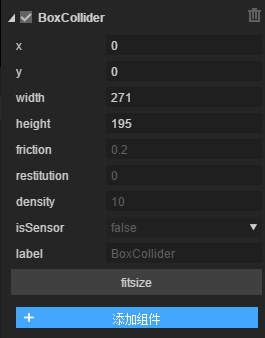

#2D Physical System

###1. Overview of 2D Physical Systems

In game development, physical system is not necessary for every game, but it is one of the important factors to enhance the user experience. Some classical physical games, such as Angry Birds, Little Crocodile Naughty and Bath-loving, are rich checkpoints made by physical system, which are popular all over the world. With the needs of game developers and the iteration of engine, Laya 2.0 integrates B. Ox2D physical system, after encapsulating Box2D, makes it possible for developers to avoid all kinds of difficulties and inconvenience in accessing Box2D physical system.

Box2D physical systems integrated in LayaAir engines need to understand rigid bodies first`rigidbody`Collision body`collider`When an object contains a rigid body, it can receive the influence of the physical engine. When an object contains a collision body, it can collide. When an object contains a collision body and does not contain a rigid body, it can collide without physical kinematics and dynamics.

rigid body`rigidbody`Rigid body refers to an object whose shape and size remain unchanged and the relative position of each point remains unchanged in motion and after being acted upon by force.

Collision body`collider`The collision body is to add a judgment box to the object. When the collision frame overlaps, two objects collide.

joint`joint`Joints can constrain two or more objects.

**Box2D-supported joints include**:

Distance joint`DistanceJoint`There is one point on each object, and the distance between the two points is fixed.

Gear joint`GearJoint`To simulate the constraint relationship between two gears, there are two ways to output the momentum generated when the gear rotates, one is the angular speed of the gear itself, the other is the linear speed of the gear surface.

Motor joint`MotorJoint`It is used to restrict two rigid bodies so that their relative position and angle remain unchanged. The motor joints always move to the target point and maintain a specific angle.

Mouse joint`MouseJoint`Used for mouse control object. It tries to drag the object to the current mouse cursor position. There are no restrictions on rotation.

prismatic joint`PrismaticJoint`: a moving joint allows two objects to move relative to each other along a specified axis, which prevents relative rotation.

Pulley joint`PulleyJoint`It ground two objects and connect them. When one object rises, the other object falls.

Revolving joint`RevoluteJiont`Force two objects to share an anchor point and rotate relative to each other.

Rope joint`RopeJoint`Limit the maximum distance between two points. Even under heavy loads, it prevents tension between connected objects.

Welded joint`WeldJoint`The relative position and angle of the two rigid bodies remain unchanged as a whole.

Wheel joint`WheelJoint`Rotating around the node, including the elastic properties, makes the rigid body elastic offset at the node position.

###2. Introduction of Rigid Body Components

####2.1 rigid body

The RigidBody class inherits from Component, and rigid bodies support three types:`static`,`dynamic`and`kinematic`The default is`dynamic`。

`static`Static type, static, not affected by gravity, infinite mass, can be controlled by node movement, rotation, zooming;

Static objects do not move in simulated environments, as if they had infinite mass. Inside Box2D, the quality is reversed and stored to zero. Static objects have zero velocity. Static objects cannot collide with other static or kinematic objects.

`dynamic`It is a dynamic type, influenced by gravity.

Dynamic objects can be fully simulated. They can be moved manually by the user, but usually by force. Dynamic objects can collide with any object. Dynamic objects always have finite non-zero mass. If you try to set the mass of a dynamic object to zero, it will automatically set an object with a mass of 1 kilogram.

`kinematic`For the type of motion, which is not affected by gravity, it can be made to move by applying speed or force.

Kinematic objects move at their own speed in a simulated environment. The kinematic object itself is not affected by force. Although users can move it manually, we usually set its speed to move. Kinematic objects behave as if they have infinite mass. Nevertheless, within Box2D, the mass of a kinematic object is set to zero. Kinematic objects cannot collide with other static or kinematic objects.

The type of rigid body is mandatory. The rigid body components are as follows:

 

####Attribute specification

#####Type

Three types are mentioned in the preceding article:`static`,`dynamic`and`kinematic`The default is`dynamic`。

#####GravityScale

Gravity scaling coefficient, default 1, that is, normal gravity, set to zero for no gravity.

#####Angular Velocity

Angular speed, set will lead to rotation, unit of radian, practical use needs to be constrained.

#####Angular Dampin

The damping coefficient of rotating speed ranges from 0 to infinity, 0 means no damping, infinity means full damping, and usually the value of damping should be between 0 and 0.1.

#####Linear Velocity

Linear velocity requires input vectors, such as 10,10, representing the x-axis right velocity of 10 and the y-axis downward velocity of 10.

#####Linear Damping

Linear velocity damping coefficients range from 0 to infinity, 0 means no damping, infinity means full damping, usually the value of damping should be between 0 and 0.1.

#####Bullet

Whether or not high-speed moving objects, set to true, can prevent high-speed penetration.

#####AllowSleep

Whether dormancy is allowed or not, and whether dormancy is allowed can improve performance, this is usually set to true.

#####Allow Rotation

Whether rotation is allowed or not, if you do not want the rigid body to rotate, this is set to false.

#####Group

Specifies the collision group to which the subject belongs, defaulting to 0.

The collision rules are as follows:

1. If two object groups are equal and

Group values are greater than zero, and they will always collide

Group values are less than zero, and they will never collide

If the group value is equal to 0, rule 3 is used

2. If the group values are not equal, rule 3 is used

3. Each rigid body has a category category, which receives bit fields ranging from the power of 2 in the [1,2^31] range.

Each rigid body also has a mask class, specifying the sum of the class values that collide with it (the value is the value of all categories in bits AND)

#####Category

The collision category is specified by the power of 2. There are 32 different collision categories available.

#####Mask

Specifies the category of collision between collision bitmasks and the result of category bit operations.

#####Label

Custom Label

####2.2 Collider

The collision body is the frame for detecting physical collision. It always follows the rigid body of the object and does not produce deviation.

There are four types of colliders:

Rectangular collision body, circular collision body, linear collision body and polygon collision body. As shown in the figure, each collider inherits from the base class of the collider.

#####Base class attributes of collision bodies

#####X, y

The relative node x, Y axis offset.

#####Friction

Friction, the value range is 0-1, the larger the value, the greater the friction, the default value is 0.2.

#####Restitution

Elasticity coefficient, range 0-1, the greater the value, the greater the elasticity, default value is 0.

#####Density

Density can be zero or positive. Similar density is recommended to improve stack stability. The default value is 10.

#####IsSensor

Whether it is a sensor or not, the sensor can trigger collision events, but will not produce collision response. It can be understood as Trigger.

#####Label

Custom Label

####Rectangular Collider

#####Attribute specification

#####Width, height

The width and height of the rectangle.

#####Fitsize button

Click on this button and the size of the collider will be adapted to the node width and height.

####Circular Collider

#####Attribute specification

#####Radius

The radius of a circle must be positive.

####Linear impactor

#####Attribute specification

#####Points

A set of points separated by commas, in the form of x, y, x, y... after setting points, the line connecting the first point to the last point in turn is a linear collider. In the editor, click the left key online to add a point, which can be dragged, and double-click will delete the point.

####Polygon Collider

#####Attribute specification

#####Points

A set of points separated by commas in the form of x, y, x, y..

2-D polygon collider, temporarily does not support concave polygon, if it is concave polygon, first manual split into several convex polygons

The maximum number of nodes is B2 ﹣ maxpolygonvertices, which is 8 by default, so the number of points is not recommended to exceed 8.

###3. Physical demonstration

####Demonstration of Physical System

Create a new 2D sample project and create a scene in editing mode. Then a series of operations will be done. Finally, if the effect is as follows, subsequent chapters will explain in detail how to make these effects.

