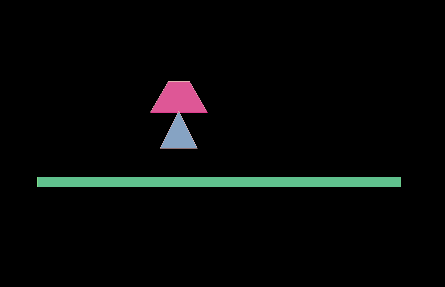

# 焊接关节，绳索关节，鼠标关节

###1. Welded joints

Welded joints`WeldJoint`The relative position and angle of the two rigid bodies remain unchanged as a whole.

#####Attribute specification

#####OtherBody

The joint rigid body is set up for the first time.

#####Anchor

For the first time, the link point of the joint is offset from the upper left corner of the rigid body.

#####Frequency

The vibration frequency of spring system can be regarded as the elastic coefficient of spring.

#####Damping

Damping of a rigid body in the process of returning to a node is 0-1.

#####CollideConnect

Whether two rigid bodies can collide or not, default is false

####Case drills

Welding joint is relatively simple, that is to fix two rigid bodies at one point, just like welding (note, this welding is also flexible)

We create a new scene, drag a box into the scene as the ground, add a box collider, and set the rigid body type to static static type. Then drag in a triangle and a trapezoid, add polycollider, and set the collision size (the polygon needs to set its own shape), as shown in the figure:

After saving the scene and running, we will see the effects of gravity and collision.

After doing this, we add a welded joint to the triangle: and drag the trapezoid into the other body of the joint.

In this way, the two rigid bodies are welded together, saved and operated, and we will see the effect:

###2. Rope Joint

Rope joint`RopeJoint`Limit the maximum distance between two points. Even under heavy loads, it prevents tension between connected objects.

#####Attribute specification

#####Otherbody

The joint rigid body is set up for the first time.

#####Anchor

For the first time, the link point of the joint is offset from the upper left corner of the rigid body.

#####Frequency

The vibration frequency of spring system can be regarded as the elastic coefficient of spring.

#####Damping

The damping of the rigid body in the process of returning to the joint is 0-1.

#####CollideConnect

[First set valid] Whether two rigid bodies can collide by default is false.

####Example drill

The use of the rope joint is similar to that of the distance joint. Drag a box and a circle into the scene, add the corresponding box Collider and circle collider, add a rope joint to the circle, and set the distance (the length of the joint should be greater than the distance between the two objects). We will see the effect of a pendulum different from the distance joint. The rope can be contracted to the maximum limit. Distance.

The operation results are as follows:

​

###Mouse joint

Mouse joint`MouseJoint`Used for mouse control object. It tries to drag the object to the current mouse cursor position. There are no restrictions on rotation.

#####Attribute specification

#####Anchor

For the first time, the link point of the joint is offset from the upper left corner of the rigid body. If not, the mouse click point is used as the link point.

#####MaxForce

The maximum force exerted by the mouse joint when dragging the rigid body body B.

#####Frequency

The vibration frequency of spring system can be regarded as the elastic coefficient of spring.

#####Damping

The damping of the rigid body in the process of returning to the joint is 0-1.

####Example drill

Continue with the previous scenario, add a mouse joint to the ladder node, or add it to other objects, as shown in the figure:

The simplest joint is the mouse joint. Let's run it and see the effect of these joints.

We can see the effect of mouse dragging, welding joints, mouse joints are elastic.

Attached is the combination effect map. More combinations are to be completed by the developer himself.

For more questions, visit the community http://ask.layabox.com