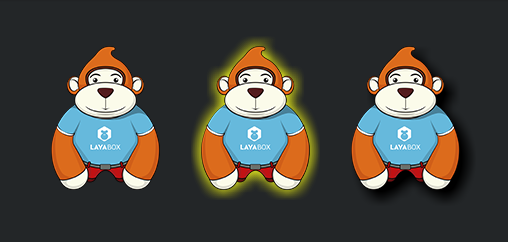
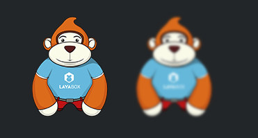

#Setting up filter effect

>The layaair engine provides three effects: color filter, light (or shadow) filter and blur filter. Among them, the color filter supports canvas and webgl mode, while the luminous filter and blur filter only support webgl mode due to their high performance consumption.


##1. Setting up color filters

###1.1 Color Filter API

The color filter class, ColorFilter, is located in the laya. filters package and changes the color channels by specifying a matrix (* arranged into 4 x 5 matrices *).

click[laya.filters.ColorFilter ](http://layaair.ldc.layabox.com/api/index.html?category=Filter&class=laya.filters.ColorFilter)Check the API instructions.


###1.2 Setting Color Filter

If you want to set a color filter for a bitmap, you need to set a color matrix first, and then create an example of a color filter using the ColorFilter method, as shown in the following code:


```java

//颜色矩阵，红色
var colorMatrix = 
  [
  1, 0, 0, 0, 0, //R
  0, 0, 0, 0, 0, //G
  0, 0, 0, 0, 0, //B
  0, 0, 0, 1, 0, //A
];

//创建颜色滤镜
var redFilter = new Laya.ColorFilter(colorMatrix)
```


Finally, the color filter effect is superimposed on the bitmap through the filter attribute of Spriter. Let's create a Main.js class and write the following code:


```javascript

(function()
{
	var Sprite      = Laya.Sprite;
	var Stage       = Laya.Stage;
	var ColorFilter = Laya.ColorFilter;
	var Texture     = Laya.Texture;
	var Browser     = Laya.Browser;
	var Handler     = Laya.Handler;
	var WebGL       = Laya.WebGL;

	var ApePath = "../../res/apes/monkey2.png";

	var apeTexture;

	(function()
	{
		// 不支持WebGL时自动切换至Canvas
		Laya.init(Browser.clientWidth, Browser.clientHeight, WebGL);

		Laya.stage.alignV = Stage.ALIGN_MIDDLE;
		Laya.stage.alignH = Stage.ALIGN_CENTER;

		Laya.stage.scaleMode = "showall";
		Laya.stage.bgColor = "#232628";

		Laya.loader.load(ApePath, Handler.create(this, setup));
	})();

	function setup()
	{
		normalizeApe();
		makeRedApe();
		grayingApe();
	}

	function normalizeApe()
	{
		var originalApe = createApe();

		apeTexture = Laya.loader.getRes(ApePath);
		originalApe.x = (Laya.stage.width - apeTexture.width * 3) / 2;
		originalApe.y = (Laya.stage.height - apeTexture.height) / 2;
	}

	function makeRedApe()
	{
		//由 20 个项目（排列成 4 x 5 矩阵）组成的数组，红色
		var redMat =
			[
				1, 0, 0, 0, 0, //R
				0, 0, 0, 0, 0, //G
				0, 0, 0, 0, 0, //B
				0, 0, 0, 1, 0, //A
			];

		//创建一个颜色滤镜对象,红色
		var redFilter = new ColorFilter(redMat);

		// 赤化猩猩
		var redApe = createApe();
		redApe.filters = [redFilter];

		var firstChild = Laya.stage.getChildAt(0);
		redApe.x = firstChild.x + apeTexture.width;
		redApe.y = firstChild.y;
	}

	function grayingApe()
	{
		//由 20 个项目（排列成 4 x 5 矩阵）组成的数组，灰图
		var grayscaleMat = [0.3086, 0.6094, 0.0820, 0, 0, 0.3086, 0.6094, 0.0820, 0, 0, 0.3086, 0.6094, 0.0820, 0, 0, 0, 0, 0, 1, 0];
	
		//创建一个颜色滤镜对象，灰图
		var grayscaleFilter = new ColorFilter(grayscaleMat);
		
		// 灰度猩猩
		var grayApe = createApe();
		grayApe.filters = [grayscaleFilter];

		var secondChild = Laya.stage.getChildAt(1);
		grayApe.x = secondChild.x + apeTexture.width;
		grayApe.y = secondChild.y;
	}

	function createApe()
	{
		var ape = new Sprite();
		ape.loadImage("../../res/apes/monkey2.png");
		Laya.stage.addChild(ape);

		return ape;
	}
})();
```


In the code above, we create an original bitmap, a red filter effect bitmap, and a gray filter effect bitmap. The operation effect is shown in Figure 1.

<br/> (Fig. 1)


##2. Setting up Luminescent and Shadow Filters

###2.1 Luminescent Filter API

The GlowFilter class is located in the laya. filters package. It can also be used as a shadow filter by adjusting the light-emitting offset angle. The parameter description is shown in Figure 2. Note: This filter only supports WebGL mode.

<br/> (Figure 2)

click[laya.filters. GlowFilter](http://layaair.ldc.layabox.com/api/index.html?category=Filter&class=laya.filters.GlowFilter)Check the API instructions.


###2.2 Setting up Luminescent Filter and Shadow Filter

The settings of luminous and shadow filters are relatively simple. We can see the effect of the example directly by encoding.

First create a Main.js class and write the following code:


```javascript

(function()
{
	var Sprite     = Laya.Sprite;
	var Stage      = Laya.Stage;
	var GlowFilter = Laya.GlowFilter;
	var Texture    = Laya.Texture;
	var Browser    = Laya.Browser;
	var Handler    = Laya.Handler;
	var WebGL      = Laya.WebGL;

	var apePath = "../../res/apes/monkey2.png";

	var ape,apeGlow,apeshadow;

	(function()
	{
		// 不支持WebGL时自动切换至Canvas
		Laya.init(Browser.clientWidth, Browser.clientHeight, WebGL);

		Laya.stage.alignV = Stage.ALIGN_MIDDLE;
		Laya.stage.alignH = Stage.ALIGN_CENTER;

		Laya.stage.scaleMode = "showall";
		Laya.stage.bgColor = "#232628";

		Laya.loader.load(apePath, Handler.create(this, setup));
	})();

	function setup()
	{
		createApe();
		filterGlow();
		filterShadow();
	}

	function createApe()
	{
		ape = new Sprite();
		ape.loadImage(apePath);

		apeGlow = new Sprite();
		apeGlow.loadImage(apePath);

		apeshadow = new Sprite();
		apeshadow.loadImage(apePath);

		ape.pos(100,50);
		apeGlow.pos(250,50);
		apeshadow.pos(400,50);
		

		Laya.stage.addChild(ape);
		Laya.stage.addChild(apeGlow);
		Laya.stage.addChild(apeshadow);
	}

	function filterGlow()
	{
		//创建一个发光滤镜
		var glowFilter = new GlowFilter("#ffff00", 10, 0, 0);
		//设置滤镜集合为发光滤镜
		apeGlow.filters = [glowFilter];
	}
	function filterShadow()
	{
		//创建一个阴影滤镜
		var glowFilter = new GlowFilter("#000000", 8, 8, 8);
		//设置滤镜为阴影滤镜
		apeshadow.filters = [glowFilter];
	}
})();
```


In the code above, we create an original bitmap, a light-emitting filter effect bitmap, and a shadow filter effect bitmap. The operation effect is shown in Figure 3.

<br/> (Figure 3)


##3. Setting up a Fuzzy Filter

###3.1 Brief Introduction of Fuzzy Filter API

BlurFilter is located in laya. filters package. By adjusting the strength parameter to set the intensity of the blurred filter, the greater the value, the more blurred the filter. The parameter description is shown in Figure 4. Note: This filter only supports WebGL mode.

<br/> (Figure 4)

click[laya.filters. BlurFilter](http://layaair.ldc.layabox.com/api/index.html?category=Filter&class=laya.filters.BlurFilter)Check the API instructions.


###3.2 Setting up Fuzzy Filter

The setting of the blur filter is relatively simple. Create an example of the blur filter, then set the blur intensity and superimpose it on the bitmap. We can see the effect of the example directly by coding.

First create a Main.js class and write the following code:


```javascript

(function()
{
	var Sprite     = Laya.Sprite;
	var Stage      = Laya.Stage;
	var BlurFilter = Laya.BlurFilter;
	var Browser    = Laya.Browser;
	var Handler    = Laya.Handler;
	var WebGL      = Laya.WebGL;

	var apePath = "../../res/apes/monkey2.png";

	(function()
	{
		// 不支持WebGL时自动切换至Canvas
		Laya.init(Browser.clientWidth, Browser.clientHeight, WebGL);

		Laya.stage.alignV = Stage.ALIGN_MIDDLE;
		Laya.stage.alignH = Stage.ALIGN_CENTER;

		Laya.stage.scaleMode = "showall";
		Laya.stage.bgColor = "#232628";

		Laya.loader.load(apePath, Handler.create(this, createApe));
	})();

	function createApe()
	{
		var ape = new Sprite();
		ape.loadImage(apePath);
		ape.pos(100,50);

		var apeBlur = new Sprite();
		apeBlur.loadImage(apePath);
		apeBlur.pos(250,50);

		Laya.stage.addChild(ape);
		Laya.stage.addChild(apeBlur);

		applayFilter(apeBlur);
	}

	function applayFilter(ape)
	{
		var blurFilter = new BlurFilter();
		blurFilter.strength = 5;
		ape.filters = [blurFilter];
	}
})();
```


In the code above, we created an original bitmap, a blurred filter effect bitmap. The operation effect is shown in Figure 5.

<br/> (Fig. 5)


