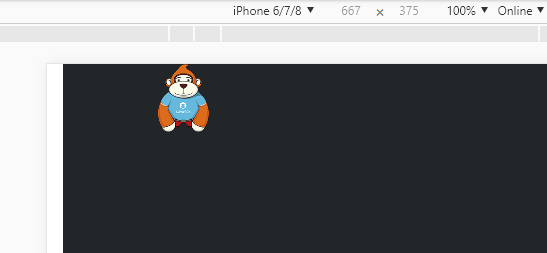

#Display and Switch Pictures

> Picture display is the basis of game development. This article introduces two methods of displaying pictures, Sprite. loadImage and Graphics. drawTexture, from API to examples.

##1. Displaying and Switching Pictures by Loading Image Method

###1.1 Overview of the loadImage API

Searching for laya. display. Sprite in the API document, you can find the loadImage () method. As shown in Figure 1, let's familiarize ourselves with the parameters of this method.

<br/> (Fig. 1)

###1.2 An example of loading images with loadImage

Create a Main.js entry class and write the following code:


```javascript

(function()
{
	var Sprite  = Laya.Sprite;
	var Stage   = Laya.Stage;
	var Texture = Laya.Texture;
	var Browser = Laya.Browser;
	var Handler = Laya.Handler;
	var WebGL   = Laya.WebGL;

	(function()
	{
		// 不支持WebGL时自动切换至Canvas
		Laya.init(Browser.clientWidth, Browser.clientHeight, WebGL);

		Laya.stage.alignV = Stage.ALIGN_MIDDLE;
		Laya.stage.alignH = Stage.ALIGN_CENTER;

		Laya.stage.scaleMode = "showall";
		Laya.stage.bgColor = "#232628";

		showApe();
	})();

	function showApe()
	{
		// 方法1：使用loadImage
		var ape = new Sprite();
		Laya.stage.addChild(ape);
		ape.loadImage("../../res/apes/monkey3.png");		
	}
})();
```


In the sample code, "`100,50`” It is the display coordinate information of the picture. The example code runs as shown in Figure 2-1:

<br/> (Figure 2-1)

###1.3 Examples of switching pictures with loadImage

Switching pictures is based on displaying pictures, adding empty drawing, and then getting new picture resources through code logic to redraw. Specific code description can refer to code annotations and API, combined with the example running experience.

Next, we modify the code in the Main.js class as follows:


```javascript

(function()
{
	var Sprite  = Laya.Sprite;
	var Stage   = Laya.Stage;
	var Texture = Laya.Texture;
	var Browser = Laya.Browser;
	var Handler = Laya.Handler;
	var WebGL   = Laya.WebGL;

	var texture1 = "../../res/apes/monkey2.png";
	var texture2 = "../../res/apes/monkey3.png";
	var flag = false;

	var ape;

	(function()
	{
		// 不支持WebGL时自动切换至Canvas
		Laya.init(Browser.clientWidth, Browser.clientHeight, WebGL);

		Laya.stage.alignV = Stage.ALIGN_MIDDLE;
		Laya.stage.alignH = Stage.ALIGN_CENTER;

		Laya.stage.scaleMode = "showall";
		Laya.stage.bgColor = "#232628";

		Laya.loader.load([texture1, texture2], Handler.create(this, onAssetsLoaded));
	})();

	function onAssetsLoaded()
	{
		ape = new Sprite();
		Laya.stage.addChild(ape);
		ape.pivot(55, 72);
		ape.pos(200, 200);

		// 显示默认纹理
		switchTexture();

		ape.on("click", this, switchTexture);
	}

	function switchTexture()
	{
		var textureUrl = (flag = !flag) ? texture1 : texture2;

		// 更换纹理
		ape.graphics.clear();
		ape.loadImage(textureUrl);
		var texture = Laya.loader.getRes(textureUrl);
	}
})();
```


The effect of running the code is shown in Figure 2-2.

<br/> (Motion 2-2)


##2. Display and Switch Pictures by DraTexture Method

###2.1 DraTexture API Overview

Searching for laya. display. Graphics in API documents can find the drawTexture () method. In addition, you need to understand the load () method and getRes () method in laya. net. Loader Manager, and the create () method in laya. utils. Handler. The parameters of each method are shown in Figures 3, 4, 5 and 6.

<br/> (Figure 3)

<br/> (Figure 4)

<br/> (Fig. 5)

<br/> (Fig. 6)


###2.2 Examples of loading and displaying pictures with drawTexture

The loadImage () method can load external image resources in real time, or read image resources from the buffer. The drawTexture () method must first load the image, then draw it and add it to the stage, so it needs to be used in the sample code to load the image resources.（`Laya.loader.load()`) and callback（`Handler.create()`) Here we show a picture through simple sample code loading. Please see the comment section of the code and the related API instructions.

Create a Main.js class and write the following code:


```javascript

(function()
{
	var Sprite  = Laya.Sprite;
	var Stage   = Laya.Stage;
	var Texture = Laya.Texture;
	var Browser = Laya.Browser;
	var Handler = Laya.Handler;
	var WebGL   = Laya.WebGL;

	(function()
	{
		// 不支持WebGL时自动切换至Canvas
		Laya.init(Browser.clientWidth, Browser.clientHeight, WebGL);

		Laya.stage.alignV = Stage.ALIGN_MIDDLE;
		Laya.stage.alignH = Stage.ALIGN_CENTER;

		Laya.stage.scaleMode = "showall";
		Laya.stage.bgColor = "#232628";

		showApe();
	})();

	function showApe()
	{
		//方法2：使用drawTexture
		Laya.loader.load("../../res/apes/monkey2.png", Handler.create(this, function()
		{
			var t = Laya.loader.getRes("../../res/apes/monkey2.png");
			var ape = new Sprite();
			ape.graphics.drawTexture(t, 0, 0);
			Laya.stage.addChild(ape);
			ape.pos(200, 0);
		}));
	}
})();
```


The code runs as shown in Figure 7-1.

<br/> (Figure 7-1)


###2.3 Examples of switching pictures with drawTexture

Switching pictures is based on displaying pictures, adding empty drawing, and then getting new picture resources through code logic to redraw. For specific code description, please refer to code annotation and API, combined with instance operation experience.

Next, we modify the code in the Main.js class as follows:


```javascript

(function()
{
	var Sprite  = Laya.Sprite;
	var Stage   = Laya.Stage;
	var Texture = Laya.Texture;
	var Browser = Laya.Browser;
	var Handler = Laya.Handler;
	var WebGL   = Laya.WebGL;

	var texture1 = "../../res/apes/monkey2.png";
	var texture2 = "../../res/apes/monkey3.png";
	var flag = false;

	var ape;

	(function()
	{
		// 不支持WebGL时自动切换至Canvas
		Laya.init(Browser.clientWidth, Browser.clientHeight, WebGL);

		Laya.stage.alignV = Stage.ALIGN_MIDDLE;
		Laya.stage.alignH = Stage.ALIGN_CENTER;

		Laya.stage.scaleMode = "showall";
		Laya.stage.bgColor = "#232628";

		Laya.loader.load([texture1, texture2], Handler.create(this, onAssetsLoaded));
	})();

	function onAssetsLoaded()
	{
		ape = new Sprite();
		Laya.stage.addChild(ape);
		ape.pivot(55, 72);
		ape.pos(200, 200);

		// 显示默认纹理
		switchTexture();

		ape.on("click", this, switchTexture);
	}

	function switchTexture()
	{
		var textureUrl = (flag = !flag) ? texture1 : texture2;

		// 更换纹理
		ape.graphics.clear();
		var texture = Laya.loader.getRes(textureUrl);
		ape.graphics.drawTexture(texture, 0, 0);

		// 设置交互区域
		ape.size(texture.width, texture.height);
	}
})();
```


The code runs as shown in Figure 7-2.

<br/> (Figure 7-2)


