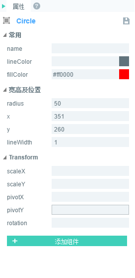

# 绘制圆形与扇形


### 一、绘制圆形

圆形的绘制理解起来比较简单，通过圆形的中心点坐标与半径，即可方便的通过LayaAir引擎laya.display.Graphics这个API的“drawCircle();”方法实现。该方法的详细说明如下图所示：

​	<br/>
​	（图1）

下面我们用LayaAir引擎绘制一个圆形，示例代码如下：

```javascript
(function()
{
    var Sprite = Laya.Sprite;
    var Stage  = Laya.Stage;
  
    (function()
    {
        //初始化舞台
        Laya.init(500, 300);
        drawSomething();
    })();
  
    function drawSomething()
    {
        var sp = new Sprite();
        Laya.stage.addChild(sp);
        //画圆
        sp.graphics.drawCircle(80,80,50,"#ff0000");
     }
})();
```

代码运行效果如下图所示：

​	<br/>
​	（图2）

​        圆形绘制比较简单，“80，80”是圆形中心点坐标。50是半径，"#ff0000"是圆形填充颜色值。


### 二、绘制扇形

​        下面继续延伸，介绍一下比圆形稍复杂一点的扇形绘制方法“drawPie();”该方法的详细说明如下图所示：

​	<br/>
​	（图3）

下面我们用LayaAir引擎绘制一个扇形，示例代码如下：

```javascript
(function()
{
    var Sprite = Laya.Sprite;
    var Stage  = Laya.Stage;
  
    (function()
    {
        //初始化舞台
        Laya.init(500, 300);
        drawSomething();
    })();
  
    function drawSomething()
    {
        var sp = new Sprite();
        Laya.stage.addChild(sp);
        //画圆
        sp.graphics.drawPie(80,80,50,90,180,"#ff0000");
     }
})();
```

代码运行效果如下图所示：

​	<br/>
​	（图4）
绘制扇形与圆形类似，前三个参数的用法也是一样的，只是增加了绘制开始与结束的角度。为了让大家更好的理解，扇形的绘制代码与参数沿用圆形代码示例，除了方法名的改变，只增加了90与180两个角度参数。大家可在编码过程中通过调整参数，再深入理解。


### 三、通过LayaAirIDE拖动控件绘制圆形

**步骤一：**打开我们的LayaAirIDE，点击设计模式，新建一个View页面

​	<br/>
​   	（图5）  

**步骤二：**将组件中的曲线组件拖动到View页面上，就会自动生成默认的圆形

​	<br/>
​   	（图6）  

**步骤三：**修改（添加/减少）Circle组件属性中的数值，改变圆形的大小、颜色、外框等等。

​   	<br/>
​   	（图7）  

​   	<br/>
​   	（图8）  


### 四、通过LayaAirIDE拖动控件绘制扇形

**步骤一：**打开我们的LayaAirIDE，点击设计模式，新建一个View页面

​	<br/>
​   	（图9）  

**步骤二：**将组件中的曲线组件拖动到View页面上，就会自动生成默认的扇形

​	<br/>
​   	（图10）  

**步骤三：**修改（添加/减少）Pie组件属性中的数值，改变扇形的角度、大小、颜色等等。

​   	<br/>
​   	（图11）  

​   	<br/>
​   	（图12）  

到此我们通过LayaAirIDE的组件绘制圆形和扇形就完成了。