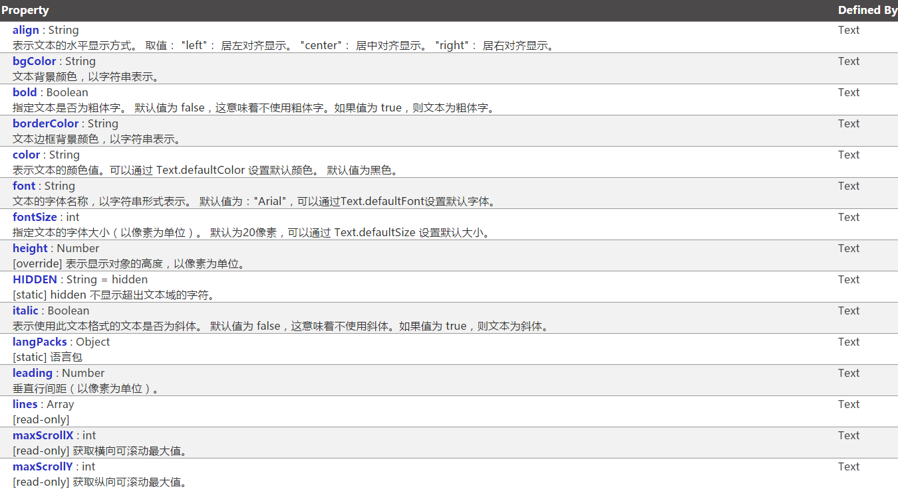

#An Overview of APIs for Text Classes in LayaAir

LayaAir can add text through the laya. display. Text class to set font style, color, size, etc. for text. The way to style text in the Text class is as follows:

These attributes in the figure above are basically the most commonly used methods of our Text. For more detailed usage of the Text API, you can click on the API document URL below to view them.

[https://layaair.ldc.layabox.com/api/index.html?category=Core&class=laya.display.Text](https://layaair.ldc.layabox.com/api/index.html?category=Core&class=laya.display.Text)

