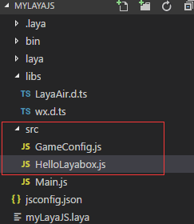

#First program: display text "Hello Layabox"


 **[Tips] Before reading this article, you must first read Create JS Projects and Detail the Directory Structure.**


Step 1: Select the SRC right-click, then left-click "New File", create a HelloLayabox. JS file in the SRC directory, and annotate the main. JS code. In the compile.js folder of.laya, 33 lines of entries: ['src/Main.js'] are changed to entries: ['src/HelloLayabox.js']. Hello Layabox is used as a startup class and is actually developed as a scripted development without changing it here. This example is to familiarize itself with the engine quickly. You can also write the code directly in Main. JS without changing the entry.

​<br/>


Step 2: Click HelloLayabox. JS in the SRC directory to start writing the following code:


```javascript

//创建舞台，默认背景色是黑色的
Laya.init(600, 300); 
var txt = new Laya.Text(); 
//设置文本内容
txt.text = "Hello Layabox";  
//设置文本颜色为白色，默认颜色为黑色
txt.color = "#ffffff";  
//将文本内容添加到舞台 
Laya.stage.addChild(txt);
```


Step 3: Save the code after completion, compile it according to F5. In the pop-up page, we can see the result of the code, as shown in the following figure:
​<br/>


Step 4: Close the display window after the display is successful. We continue to write code to make the text more beautiful. Continue to improve the code as follows:


```java

//创建舞台，默认背景色是黑色的
Laya.init(600, 300); 
var txt = new Laya.Text(); 
//设置文本内容
txt.text = "Hello Layabox";  
//设置文本颜色
txt.color = "#FF0000";
//设置文本字体大小，单位是像素
txt.fontSize    = 66;  
//设置字体描边
txt.stroke = 5;//描边为5像素
txt.strokeColor = "#FFFFFF";  
//设置为粗体
txt.bold = true;  
//设置文本的显示起点位置X,Y
txt.pos(60,100);  
//设置舞台背景色
Laya.stage.bgColor  = '#23238E';  
//将文本内容添加到舞台 
Laya.stage.addChild(txt);
```


Step 5: Save after compiling and compile again according to F5. The beautified results are shown as follows:
​<br/>


At this point, if you can follow this introductory tutorial, complete the display above, congratulations on your successful introduction, we have completed the first LayaAir engine HTML5 program developed in JavaScript language. For more information on how to use the API for LayaAir engine development, please visit the Layabox Developer Center on the official website for a tutorial.