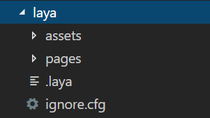

# 用LayaAirIDE创建JS项目并详解目录结构

>* author: Charley version: LayaAirIDE 2.0.0 update: 2019-02-18*

##I. Download and install LayaAirIDE

Using LayaAir IDE and LayaAir engine, you need to add engine logo to any visible position in the game: Powered by LayaAir Engine.
For those who carry the engine logo, they can use it free of charge. Otherwise, they need to contact Weichat 2-D code in the download terms to get payment authorization.

After accepting the terms, you can download and decompress them. The IDE is a green version without installation. The IDE already contains the corresponding engine version without additional download.

LayaAirIDE 2.0 Download Address: https://ldc2.layabox.com/layadownload/?Type=layaairide


##2. Creating JS Project with LayaAirIDE

The first time you open LayaAir IDE, you can create a sample project. IDE automatically generates a clear directory structure when it is created. Here we will introduce the process of creating a project by LayaAir IDE and the directory structure generated by IDE.

####Step one:

Open LayaAirIDE and click`新建`Icons or text, as shown in Figure 1, can enter the new project interface.

 


(Fig. 1)


####Step two:

Choice`LayaAir 2D示例项目`After filling in the project name, project path, and selecting the programming language and engine version, click“`创建`” A new empty project can be established. As shown in Figure 2.

 


(Fig. 2)

####Additionally, there are options:

#####Quick Debugging of Bin Directory in Weixin/Baidu Games

After checking this option, when creating the project, the project files of Weixin and Baidu will be created under the project debugging directory (bin), so that when Weixin or Baidu game development tools debug the project, the bin directory can be directly designated as the local debugging directory. This saves a lot of time for frequent debugging, because the official version of debugging will release only exported local packages, each export requires a certain release time, which will affect the efficiency of debugging and development.


####Step three:

After clicking "Create", you can see the structure of the project. The project folder structure is shown in Figure 3.

   


(Fig. 3)

So far, we have successfully created a TS project.

*Tips:*

> For developers new to the LayaAir engine, we recommend creating sample projects to quickly understand the complete project structure. Of course, you can try to create other project types at the beginning of development.


##3. Introducing the project structure

Next, we will introduce the role of each directory in conjunction with the project structure created in the previous section.

###3.1 Project Configuration Directory (.laya folder)


 `.laya`Under the folder are some configuration information of the project in development and operation, as shown in Figure 4.

  


(Fig. 4)

#### `compile.js`Document introduction

`compile.js`Gulp is a script file that customizes the compilation process of gulp. If the developer is familiar with gulp, he can modify it. Otherwise, don't move here.

#### `launch.json`Document introduction

`launch.json`The file saves some configuration information of project debugging, which are LayaAirIDE debugging configuration and Chrome browser debugging configuration. Don't change it easily, it will affect the debugging of the project.

#### `publish.js`Document introduction

`publish.js`Gulp is a script file for a project. Developers don't move here.

#### **Other instructions**

Some configuration files do not exist by default, but they are also saved to the. Laya directory when they are published. For example, the web version, Weixin, Baidu and other small games, will be released after each different type of survival of different JSON configuration files, such as wxgame. JSON is Weixin small game release configuration files, bdgame. JSON is Baidu small game release configuration files.

The old version of the release configuration file is called pubset. json.

All of these people have some understanding, usually, developers do not need to modify. Therefore, there is no need to understand in depth.


###3.2 Project Output Directory (bin)


 `bin`The directory stores the output files of the current project. As shown in Figure 5.

   


(Fig. 5)

This directory is used to store the project running files such as js, HTML, game resources, etc. output from the project, as well as the game project files (if the quick debugging option of the game is checked when creating the project).

The default layaAir debugging or chrome debugging is to run the files in that directory.


###2.3 UI project directory (laya)

`laya`The directory is used to store LayaAirIDE's current UI projects.

 


(Fig. 6)

####"`assets`Catalog

Used to store the components pictures, audio files and other resources needed in UI scenarios.

####"`pages`Catalog

Used to store IDE scenarios, animations, presets and other configuration files.

####"`.laya`Document

Note that this. Laya is a file, not a directory, and the. Laya file is the UI project configuration file of LayaAirIDE.


###2.4 Project Library Directory (libs)

"`libs`” The directory is the project library directory, under which are the layaAir engine LayaAir. D. TS file and wx. D. ts. For code hints, if a developer has three libraries to use, the relevant. D. TS files should be placed in this directory. For example, wx.d.ts is used to develop code hints for Wechat games. As shown in Figure 7.

    


(Fig. 7)


###2.5 Project Source Code Directory (src)

The source code files used in the project are stored in the SRC directory by default. The source code project structure of the sample code is shown in Figure 8.


   


(Fig. 8)


###2.6 Project Profile

 


(Fig. 9)

####  `项目名.laya` 

In Figure 9`JS_2D_DEMO_190218.laya`It is the project configuration file of the LayaAirIDE project, which records the project name of the current project, the version number of the class library used and so on.

For example:


```json

{"proName":"JS_2D_DEMO_190218","engineType":1,"proType":2,"layaProType":1,"version":"2.0.0"}
```


#### `语言版本config.json`

In Figure 9`jsconfig.json`Store the compilation configuration information of IDE, do not delete it.


###2.7 Publishing Directory

The publishing directory does not exist by default. You need to click the publishing button to generate the corresponding version directory after publishing the project, as shown in Figure 10. (There is a special publishing function documentation, not detailed here)

 


(FIG. 10)

The directory structure shown in Figure 10 is the corresponding post-release version directory.


###Concluding remarks

So far, the basic content of project creation has been introduced, if you want to know more about the introduction of IDE or IDE design patterns, you can see the IDE chapter.