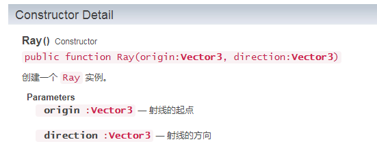

#LayaAir3D Basic Mathematics Tool

Having said the coordinate system, the following is an introduction to some commonly used mathematical tools in 3D. (The example mentioned in this article is a sample project for the Quick Start Chapter)

**vector**

​**Vector2**Two-dimensional vectors,**Vector3**Three-dimensional vector,**Vector4**Four-dimensional vectors, which are frequently used in LayaAir 3D engine, can be seen everywhere from two-dimensional vectors to four-dimensional vectors. The most basic usage is for assignment in the example.

Vector 3 is used to assign axially coordinates of x, y and Z in the transformation of moving, rotating and scaling of 3D objects in the code. More detailed usage can be seen[API](https://layaair2.ldc2.layabox.com/api2/Chinese/index.html?category=Core&class=laya.d3.math.Vector3)。

**colour**

On the assignment of various color attributes, the values in the three-dimensional vector represent R, G and B respectively, which are red, green and blue. In some places, four-dimensional vectors are used as color parameters, and the W value of Vector 4 represents the Alpha value. In LayaAir 3D engine, the maximum value of three colors is 1, which is set by percentage. The larger the overall value, the brighter the color, the smaller the color, the darker the color. If the value exceeds 1, the exposure effect will be produced.

As for the color of red, green and blue, beginners can consult and learn from game art designers, such as red plus green for yellow, red plus blue for purple, etc. In the process of project development, programmers need to adjust the color values repeatedly to test the good results.

In the example, the following code uses vectors as color assignments:


```typescript

	//设置方向光的颜色
	directionLight.color = new Laya.Vector3(0.6, 0.6, 0.6);
```


**Quaternion**

Quaternions are used to calculate rotation in LayaAir. They are compact and efficient, free from the trouble of universal joint lock, and can interpolate spherical surface conveniently and quickly.

The use of quaternions is self-explanatory. Here we only provide[API](https://layaair2.ldc2.layabox.com/api2/Chinese/index.html?category=Core&class=laya.d3.math.Quaternion)。

**Bound Box**

The bounding box algorithm is a method to solve the optimal bounding space of discrete point set. The basic idea is to replace the complex geometric object approximately by a geometric body with a slightly larger volume and simple characteristics (called bounding box). LayaAir3D supports bounding boxes in 3. More detailed interface instructions can be viewed[API](https://layaair2.ldc2.layabox.com/api2/Chinese/index.html?category=Core&class=laya.d3.math.BoundBox)。

**Matrix**

A matrix is a set of complex or real numbers arranged in rectangular arrays. Support in LayaAir3D**3X3 matrix ([API](https://layaair2.ldc2.layabox.com/api2/Chinese/index.html?category=Core&class=laya.d3.math.Matrix3x3))**and**4X4 matrix ([API](https://layaair2.ldc2.layabox.com/api2/Chinese/index.html?category=Core&class=laya.d3.math.Matrix4x4))**There are two kinds of matrices.

**Ray**

Radiation is a data type, not a display object. It has**Origin origin**And**Direction**Two attributes.

<br> (Fig. 1)
