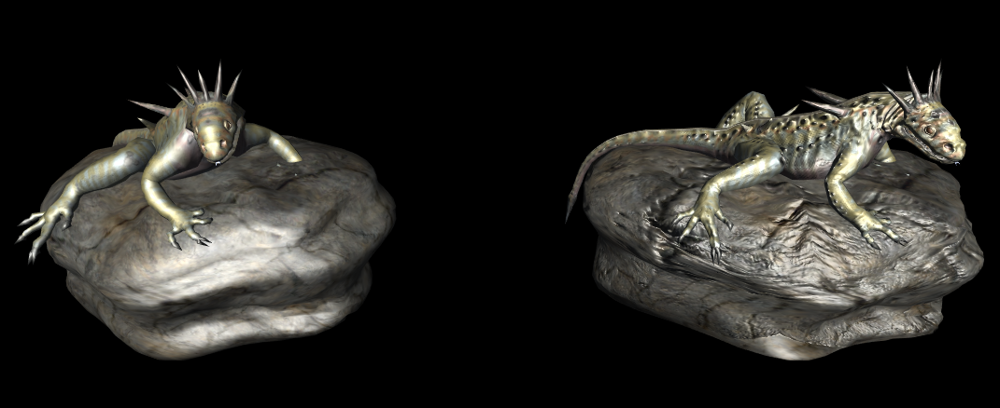

# BlinnPhong材质详解

###### *version :2.1.0beta   Update:2019-5-14*

​	因为Unity中标准和其他材质与LayaAir标准材质有所差异，因此开发者使用导出的3D资源时，我们会发现美术效果与Unity中会有不同，需要在代码中修改各种材质属性参数或调节灯光后才能达到所需效果，为开发者们带来了不便。

​	为了使LayaAir引擎中运行效果与Unity中调整的美术效果一致，LayaAir官方在Unity导出插件中和引擎中增加BlinnPhongMaterial材质，可以让开发者们所见即所得，减少代码修改美术效果的时间，提高工作效率。因此建议以后的开发中尽量都使用该材质。

#### 主要属性和方法详解：

> 属性

`albedoColor:Vector4`反照率颜色。

`albedoIntensity:Number` 反照率强度。

`albedoTexture:BaseTexture` 反照率贴图。

`enableLighting:Boolean` 是否启用光照。

`normalTexture:BaseTexture` 法线贴图。

`renderMode:int` [write-only] 设置渲染模式。

`shininess:Number`  高光强度,范围为0到1。

`specularColor:Vector4`  高光颜色。

`specularTexture:BaseTexture`高光贴图。

`tilingOffset:Vector4`  纹理平铺和偏移。


#### 场景一键转换成BlinnPhong材质

​	安装好新插件后，在Untiy  LayaAir3D菜单中增加了一键将场景材质转化成BlinnPhong材质功能（图6），点击菜单LayaAir Tool--------> Switch Shader to LayaBlinnPhong选项后，可以发现资源界面中的模型会变成紫色，场景中的效果也有所变化，说明材质类型修改成功。

<br>（图1）

​	鼠标选择场景中的任意模型，我们可以看到在右侧Inspector面板中出现了新的材质Shader类型（图7）。材质属性与Unity中Standard标准材质有所不同，简化了很多，去掉了LayaAir不支持的一些属性。我们可以通过修改这些属性来改变模型的显示。

<br>（图2）

#### 	手动修改为BlinnPhong材质

​	一般情况我们推荐使用菜单中的一键转化成BlinnPhong材质，这样场景中的所有材质都会被修改，不会发生某个材质因找不到或忽略，导致未修改的情况发生。

​	当然，在创建新材质的时候，默认生成的是标准材质，这时需要开发者手动修改材质的Shader类型为BlinnPhong。当我们安装好插件后，材质面板的Shader类型中就会出现LayaAir3D选项供我们进行修改使用。（图3）

<br>（图3）

BlinnPhong材质光色贴图属性基本与标准材质基本一致，在Unity中材质面板可调节以下属性：

##### 漫反射贴图

**DiffuseMap(漫反射贴图)**在游戏中表现出物体表面的反射和表面颜色。换句话说，它可以表现出物体被光照射到而显出的颜色和强度。如图9，更详细的可以查看原demo：([demo地址](<https://layaair.ldc.layabox.com/demo2/?language=ch&category=3d&group=Material&name=BlinnPhong_DiffuseMap>))。

```typescript
var material = new Laya.BlinnPhongMaterial();
//漫反射贴图
Laya.Texture2D.load("res/threeDimen/texture/earth.png", Laya.Handler.create(this, function(texture) {
    //设置材质纹理
	material.albedoTexture = texture;
}));

earth2.meshRenderer.material = material;
```

<br>(图4)

##### 法线贴图

**Normal maps(法线贴图)**是一个灰度图，可以将它作为物体的一个高度图以便显示一个凹凸的表面，如图10所示，更详细的可以查看官方示例([demo地址](<https://layaair.ldc.layabox.com/demo2/?language=ch&category=3d&group=Material&name=BlinnPhong_NormalMap>))。

```typescript
var material = meshSprite3D.meshRenderer.material;
//法线贴图
Laya.Texture2D.load(normalMapUrl[i], Laya.Handler.create(this, function(texture) {
    //设置发现贴图
    material.normalTexture = texture;
}));
```

<br>(图5)

##### 高光贴图

**SpecularMap（高光贴图）**是用来表现当光线照射到模型表面时,其表面属性的.(如金属和皮肤、布、塑料反射不同量的光)从而区分不同材质。高光贴图再引擎中表现镜面反射和物体表面的高光颜色。材质的反光程度就越强。如图7，更详细的可以查看官方示例([demo地址](<https://layaair.ldc.layabox.com/demo2/?language=ch&category=3d&group=Material&name=BlinnPhong_SpecularMap>))。

```typescript
//获取Sprite3D上的蒙皮网格精灵节点
var skinnedMeshSprite3d = dude2.getChildAt(0).getChildAt(0);
//历遍蒙皮网格节点的材质列表
for (var i:int = 0; i < skinnedMeshSprite3d.skinnedMeshRenderer.materials.length; i++) {
    //获取对应材质
    var material = skinnedMeshSprite3d.skinnedMeshRenderer.materials[i];
    //加载对应的贴图
	Laya.Texture2D.load(specularMapUrl[i], Laya.Handler.create(this,function(mat, tex) {
        mat.specularTexture = tex;//设置高光贴图
    }, [material]));
}
```

<br>(图6)
