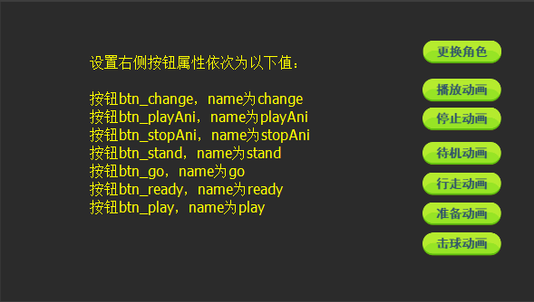

#3D Character Switching and Animation

###3D case analysis and resource preparation

Through the study of technical documents, we have mastered the basic knowledge of 3D game development. Next, we will explain the comprehensive application of 3D technology through examples.

To observe the following example effect (Figure 1), which is similar to the 3D role selection interface in the game, let's first analyze the components of the 3D game world in the example.

(Fig. 1) </br>

####Combination of 2D Interface and 3D

In this example, the UI part of the interface is edited by LayaAirIDE, including the resource loading progress page and the control UI page in the game. They are made in exactly the same way as 2D games. If you are not familiar with the editing interface of IDE, you can refer to "Technical Documents - LayaAirIDE Chapter".


####3D scene

In the example, the scenario model is produced and exported into FBX in 3ds max, and then imported into unty to edit. There are two main tasks:

One is to create a scene lighting map for editors, which can produce static shadows, lighting color and atmosphere between models. Therefore, it is very important to enhance the art quality of the game.

Second, edit the material of mobile advertising UV animation. It should be noted that material UV animation in 3ds Max is not supported in unty, so it needs to be made in unity.

For the method of making material UV animation unit, see "Technical Document - LayaAir 3D Engine - Animation II of LayaAir3D"


####3D Characters and Skeletal Animation

Both 3D character model and skeleton animation are edited and exported in 3ds max, then imported into unit to process animation clips and add animation components.

Note that when the character's skeleton animation is made in Max, it's better to edit many actions at one time on the timeline. If you edit the actions separately and then make the animation through animation connection, the wrong actions and jitter will appear easily after importing the unit.

In this example, several animation links are made. After linking, there are many problems in the animation, such as jitter and intersection of models. It takes a long time to achieve the above effect.

For editing method of skeletal animation unit, see "Technical Document - LayaAir 3D Engine - Animation I of LayaAir3D"


####3D special effects

The halo effect is rigid animation (transform animation: rotation, displacement, zoom). It can be edited and imported into Unity in 3ds max. However, it is recommended that only 3ds Max be used to make models and animation in Unity, because in unty, animation combining material with rigid body can be made, and the effect is better.

The halo effect unit animation is similar to the process and material animation.

After the above 3D resources are produced in Unity, they are exported into four resource folders through LayaAir export tool, namely, scene resource LayaScene_scene02, two role resources LayaScene_girl and LayaScene_boy, and halo special effect resource LayaScene_effect. Copy the resources to the project H5 directory for use.


###Code Implementation of 3D Instance Function

####Implementation of UI Interface Function

Edit the interface in IDE, and set the VaR and name attributes of the elements in the interface for code invocation, such as (Figure 2) (Figure 3).

Notice that the interface resolution is the same as the resolution set in Laya. init (), and the screen adaptation will be correct.

Resource loading progress interface ProgressBar.ui parsing

(图2)</br>


Role Control Button Interface Control.ui Analysis

(Fig. 3) </br>

After editing the above interface, resources are exported in IDE, and corresponding packaged resources and UI classes are generated in the project folder. We build two UI display control classes that inherit from them, respectively. The code is as follows:

The progress UI displays the control class ProgressView, in which we use false progress bars (otherwise, if the initial resources are small, the interface will flash by)


```typescript

var ProgressView = (function(_super){
    function ProgressView(){
        ProgressView.super(this);
        this.progress = 0;
        //进度增加的帧循环
        Laya.timer.loop(30,this,this.onLoop);
    }
    Laya.class(ProgressView,"ProgressView",_super);
    var _proto = ProgressView.prototype;
    /*资源加载进度模拟（假进度）*/
    _proto.onLoop = function(){
        //进度增加
        this.progress++;
        //最高100%进度
        if(this.progress > 100){
            this.progress = 100;
            this.tips.text = "游戏加载完毕，即将进入游戏...";
            //清除所有事件监听，包括帧循环
            Laya.timer.clearAll(this);
            //进度100%后，自动移除界面
            this.removeSelf();
        }
        else{
            //更新组件显示进度
            this.pro.value = this.progress/100;
            this.tips.text = "游戏正在加载中，当前进度为："+this.progress+"%!";
        }
    }
    return ProgressView;
})(ui.ProgressUI);
```


The role control UI displays the control class ContorlView, which sends the name of the button currently clicked to the main class by event.


```typescript

var ControlView = (function(_super){
    function ControlView(){
        ControlView.super(this);
        //监听UI鼠标点击事件
        this.on(Laya.Event.MOUSE_DOWN,this,this.onClick);
    }
    Laya.class(ControlView,"ControlView",_super);
    var _proto = ControlView.prototype;
    _proto.onClick = function(e){
        //发送点击的组件名称
        this.event("btn_action",e.target.name);
    }
    return ControlView;
})(ui.ControlUI);
```


Realization of the Combination of 2D and 3D

The Scene class of 3D scene is inherited from the Sprite class of 2D display object, so it can be loaded onto the stage like a 2D display object, and its hierarchy is adjusted by setChildIndex () method to deal with its occlusion relationship with the upper and lower layers of background and interface.

In this example, the resource loading progress interface and the role control interface need to be set to the upper level of the 3D scene. We can use the above method to achieve the code of Laya. stage. setChildIndex (scene, 0). The code of loading interface and scene in the main class is as follows:


```typescript

//初始化引擎
Laya3D.init(1280, 720, true);
/*****角色资源名数组******/
this.roleArray= ["LayaScene_girl/girl.lh", "LayaScene_boy/boy.lh"];
//适配模式
Laya.stage.scaleMode = Laya.Stage.SCALE_EXACTFIT;
Laya.stage.screenMode = Laya.Stage.SCREEN_NONE;

//加载2D界面资源
Laya.loader.load(["res/atlas/comp.atlas","res/atlas/myAssets.atlas"], Laya.Handler.create(this, onUIComplete));

/*界面资源加载完成后*/
function onUIComplete() {
    //加载3D场景与角色资源（资源资源后缀名，会创建默认3D显示对象类型）
    Laya.loader.create([{ url: "LayaScene_scene02/scene02.ls" },
    { url: this.roleArray[0] }, { url: this.roleArray[1] },
    { url: "LayaScene_effect/effect.lh" }
    ], Laya.Handler.create(this, this.onSceneOK));
    //创建角色控制界面
    this.control = new ControlView();
    Laya.stage.addChild(this.control);
    //创建资源载入界面
    var assetLoad = new ProgressView();
    Laya.stage.addChild(assetLoad);
}
/**
 * 场景角色加载完成后回调
 */
function onSceneOK() {
    //创建加载场景
    this.scene = Laya.loader.getRes("LayaScene_scene02/scene02.ls");
    Laya.stage.addChild(this.scene);
    //设置场景在2D界面最后（最底层为第0层）
    Laya.stage.setChildIndex(this.scene, 0);
    //创建摄像机(横纵比，近距裁剪，远距裁剪)
    var camera = new Laya.Camera(0, 0.1, 1000);
    //加载到场景
    this.scene.addChild(camera);
    //移动摄像机位置
    camera.transform.position = new Laya.Vector3(-3, 1.5, 6);
    //旋转摄像机角度
    camera.transform.rotate(new Laya.Vector3(-6, 0, 0), true, false);
    //设置摄像机视野范围（角度） 
    camera.fieldOfView = 33;
}
```


By compiling and running the above code, we can see that after the end of the resource interface, there is a 3D scene, and the control interface is above the 3D scene.

There is material UV animation in 3D scene. After loading. Ls, the animation will be automatically loaded and played out. If you need to control the animation, you can press the character's animation control mode, get the animation component first, and then control it through the animation component.


####Creation and Control of 3D Characters

The most important thing in character animation control is to acquire the animation components, because the preload is used in this case, so the role can be created directly from the role model.

Tips: If you don't use preloading, use Sprite. load () to load asynchronously directly. You need to add listening resources to load events before you can get the animation components, otherwise you will report an error.

#####Create roles:

In the main class, add the global attributes related to roles, including current role resources, current role animation components, current role action names, and add the method of creating roles. The code is as follows:


```typescript

//初始化引擎
Laya3D.init(1280, 720, true);
/*****角色资源名数组******/
this.roleArray= ["LayaScene_girl/girl.lh", "LayaScene_boy/boy.lh"];
/*当前场景中角色资源*/
this.currentRole = "LayaScene_girl/girl.lh";
/*当前角色动作名*/
this.currentActive = "stand";
//适配模式
Laya.stage.scaleMode = Laya.Stage.SCALE_EXACTFIT;
Laya.stage.screenMode = Laya.Stage.SCREEN_NONE;

//加载2D界面资源
Laya.loader.load(["res/atlas/comp.atlas","res/atlas/myAssets.atlas"], Laya.Handler.create(this, onUIComplete));

/*界面资源加载完成后*/
function onUIComplete() {
    //加载3D场景与角色资源（资源资源后缀名，会创建默认3D显示对象类型）
    Laya.loader.create([{ url: "LayaScene_scene02/scene02.ls" },
    { url: this.roleArray[0] }, { url: this.roleArray[1] },
    { url: "LayaScene_effect/effect.lh" }
    ], Laya.Handler.create(this, this.onSceneOK));
    //创建角色控制界面
    this.control = new ControlView();
    Laya.stage.addChild(this.control);
    //创建资源载入界面
    var assetLoad = new ProgressView();
    Laya.stage.addChild(assetLoad);
}
/**
 * 场景角色加载完成后回调
 */
function onSceneOK() {
    //创建加载场景
    this.scene = Laya.loader.getRes("LayaScene_scene02/scene02.ls");
    Laya.stage.addChild(this.scene);
    //设置场景在2D界面最后（最底层为第0层）
    Laya.stage.setChildIndex(this.scene, 0);
    //创建摄像机(横纵比，近距裁剪，远距裁剪)
    var camera = new Laya.Camera(0, 0.1, 1000);
    //加载到场景
    this.scene.addChild(camera);
    //移动摄像机位置
    camera.transform.position = new Laya.Vector3(-3, 1.5, 6);
    //旋转摄像机角度
    camera.transform.rotate(new Laya.Vector3(-6, 0, 0), true, false);
    //设置摄像机视野范围（角度） 
    camera.fieldOfView = 33;

    //创建角色
    this.createRole3D();
}
/*创建角色并获取动画组件*/
function createRole3D(){
    //创建角色
    this.role3D = Laya.loader.getRes(this.currentRole);
    //获取角色动画组件（.lh格式会把scene当做一层Sprite3D导出，因此组件是在子对象上）
    this.roleAni = (this.role3D.getChildAt(0)).getComponentByType(Laya.Animator);
    //监听动画完成事件
    this.roleAni.on(Laya.Event.COMPLETE,this,this.onAniComplete);
    //播放上一个角色的当前动作
    this.roleAni.play(this.currentActive);
    //角色位置
    this.role3D.transform.position = new Laya.Vector3(-3,0,1);
    this.scene.addChild(this.role3D);
}
/*动画播放完成后回调*/
function onAniComplete(){
    //如果当前的完成动画剪辑名为“play”击球
    if(this.roleAni.currentPlayClip.name == "play"){
        //完成击球后播放准备动作动画
        this.roleAni.play("ready");
        this.currentActive = "ready";
    }
}
```


In the above code, we also add callbacks after animation playback.`this.roleAni.on(Laya.Event.COMPLETE,this,this.onAniComplete);`It is basically the same as 2D animation. It refers to the scheduling of an animation clip after playback. It can judge which animation is completed by the name of current PlayClip. name of the current animation clip. It is convenient for developers to edit the game logic.


#####Character animation control

Role control is controlled by clicking the button in the UI. We add the listening event callback of the control interface to the main class.`this.control.on("btn_action",this,this.onBtnAction)`Control roles.

The role switching method is to change the role resource and recreate it. However, when Laya. loader. create () loads the resource, the role has been created according to the type and put into the object pool. Therefore, when the role switching method createRole3D () is called repeatedly, there is no need to worry about the performance problem, it will be created directly from the object pool.

Animation switching mainly through animation components to play, stop, switch action. The code modifications are as follows:


```typescript

/*界面资源加载完成后*/
function onUIComplete() {
    ......
    //创建角色控制界面
    this.control = new ControlView();
    Laya.stage.addChild(this.control);
    //监听控制界面按钮信息
    this.control.on("btn_action", this, onBtnAction);
    ......
}
/*控制界面动作监听回调
action：当前执行的控制名称
*/
function onBtnAction(action) {
    if (action == "change") {
        //切换角色
        this.changeRole();
    } else if (action == "playAni") {
        //播放当前动作
        this.roleAni.play(this.currentActive);
    } else if (action == "stopAni") {
        //停止动画
        this.roleAni.stop();
    } else if (action == "stand" || action == "go" || action == "ready" || action == "play") {
        //播放动作
        this.roleAni.play(action);
        this.currentActive = action;
    }
}
/*切换角色*/
function changeRole() {
    //移除角色
    this.role3D.removeSelf();
    //移除所有事件监听
    this.roleAni.offAll();
    //当前角色索引
    var index = this.roleArray.indexOf(this.currentRole);
    //下一个角色
    index++;
    if (index > this.roleArray.length - 1) {
        index = 0;
    }
    this.currentRole = this.roleArray[index];
    //创建角色
    this.createRole3D();
}
/**
 * 场景角色加载完成后回调
 */
function onSceneOK() {
    //创建加载场景
    this.scene = Laya.loader.getRes("LayaScene_scene02/scene02.ls");
    Laya.stage.addChild(this.scene);
    //设置场景在2D界面最后（最底层为第0层）
    Laya.stage.setChildIndex(this.scene, 0);
    //创建摄像机(横纵比，近距裁剪，远距裁剪)
    var camera = new Laya.Camera(0, 0.1, 1000);
    //加载到场景
    this.scene.addChild(camera);
    //移动摄像机位置
    camera.transform.position = new Laya.Vector3(-3, 1.5, 6);
    //旋转摄像机角度
    camera.transform.rotate(new Laya.Vector3(-6, 0, 0), true, false);
    //设置摄像机视野范围（角度） 
    camera.fieldOfView = 33;

    //创建角色
    this.createRole3D();
}
```


####Creation of special effects animation

Special effects animation calls are fairly simple. We don't need to control it here, so we can load it directly into the foot of the character. The code is as follows:


```typescript

/*创建特效*/
function createEffect3D() {
    //创建特效
    this.effect3D = Laya.loader.getRes("LayaScene_effect/effect.lh");
    this.scene.addChild(this.effect3D);
    //特效位置
    this.effect3D.transform.position = new Laya.Vector3(-3, 0.01, 1.2);
    //特效缩放
    this.effect3D.transform.localScale = new Laya.Vector3(0.15, 0.15, 0.15);
}
```


After compiling and running, the effect is shown in Figure 1.


####The final code of the main class


```typescript

//初始化引擎
Laya3D.init(1280, 720, true);
/*****角色资源名数组******/
this.roleArray = ["LayaScene_girl/girl.lh", "LayaScene_boy/boy.lh"];
/*当前场景中角色资源*/
this.currentRole = "LayaScene_girl/girl.lh";
/*当前角色动作名*/
this.currentActive = "stand";
//适配模式
Laya.stage.scaleMode = Laya.Stage.SCALE_EXACTFIT;
Laya.stage.screenMode = Laya.Stage.SCREEN_NONE;

//加载2D界面资源
Laya.loader.load(["res/atlas/comp.atlas", "res/atlas/myAssets.atlas"], Laya.Handler.create(this, onUIComplete));

/*界面资源加载完成后*/
function onUIComplete() {
    //加载3D场景与角色资源（资源资源后缀名，会创建默认3D显示对象类型）
    Laya.loader.create([{ url: "LayaScene_scene02/scene02.ls" },
    { url: this.roleArray[0] }, { url: this.roleArray[1] },
    { url: "LayaScene_effect/effect.lh" }
    ], Laya.Handler.create(this, this.onSceneOK));
    //创建角色控制界面
    this.control = new ControlView();
    Laya.stage.addChild(this.control);
    //监听控制界面按钮信息
    this.control.on("btn_action", this, onBtnAction);
    //创建资源载入界面
    var assetLoad = new ProgressView();
    Laya.stage.addChild(assetLoad);
}
/*控制界面动作监听回调
action：当前执行的控制名称
*/
function onBtnAction(action) {
    if (action == "change") {
        //切换角色
        this.changeRole();
    } else if (action == "playAni") {
        //播放当前动作
        this.roleAni.play(this.currentActive);
    } else if (action == "stopAni") {
        //停止动画
        this.roleAni.stop();
    } else if (action == "stand" || action == "go" || action == "ready" || action == "play") {
        //播放动作
        this.roleAni.play(action);
        this.currentActive = action;
    }
}
/*切换角色*/
function changeRole() {
    //移除角色
    this.role3D.removeSelf();
    //移除所有事件监听
    this.roleAni.offAll();
    //当前角色索引
    var index = this.roleArray.indexOf(this.currentRole);
    //下一个角色
    index++;
    if (index > this.roleArray.length - 1) {
        index = 0;
    }
    this.currentRole = this.roleArray[index];
    //创建角色
    this.createRole3D();
}
/**
 * 场景角色加载完成后回调
 */
function onSceneOK() {
    //创建加载场景
    this.scene = Laya.loader.getRes("LayaScene_scene02/scene02.ls");
    Laya.stage.addChild(this.scene);
    //设置场景在2D界面最后（最底层为第0层）
    Laya.stage.setChildIndex(this.scene, 0);
    //创建摄像机(横纵比，近距裁剪，远距裁剪)
    var camera = new Laya.Camera(0, 0.1, 1000);
    //加载到场景
    this.scene.addChild(camera);
    //移动摄像机位置
    camera.transform.position = new Laya.Vector3(-3, 1.5, 6);
    //旋转摄像机角度
    camera.transform.rotate(new Laya.Vector3(-6, 0, 0), true, false);
    //设置摄像机视野范围（角度） 
    camera.fieldOfView = 33;

    //创建角色
    createRole3D();
    //创建特效
    createEffect3D();
}
/*创建特效*/
function createEffect3D() {
    //创建特效
    this.effect3D = Laya.loader.getRes("LayaScene_effect/effect.lh");
    this.scene.addChild(this.effect3D);
    //特效位置
    this.effect3D.transform.position = new Laya.Vector3(-3, 0.01, 1.2);
    //特效缩放
    this.effect3D.transform.localScale = new Laya.Vector3(0.15, 0.15, 0.15);
}
/*创建角色并获取动画组件*/
function createRole3D() {
    //创建角色
    this.role3D = Laya.loader.getRes(this.currentRole);
    //获取角色动画组件（.lh格式会把scene当做一层Sprite3D导出，因此组件是在子对象上）
    this.roleAni = (this.role3D.getChildAt(0)).getComponentByType(Laya.Animator);
    //监听动画完成事件
    this.roleAni.on(Laya.Event.COMPLETE, this, this.onAniComplete);
    //播放上一个角色的当前动作
    this.roleAni.play(this.currentActive);
    //角色位置
    this.role3D.transform.position = new Laya.Vector3(-3, 0, 1);
    this.scene.addChild(this.role3D);
}
/*动画播放完成后回调*/
function onAniComplete() {
    //如果当前的完成动画剪辑名为“play”击球
    if (this.roleAni.currentPlayClip.name == "play") {
        //完成击球后播放准备动作动画
        this.roleAni.play("ready");
        this.currentActive = "ready";
    }
}
```
