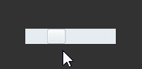

#HScrollBar Component Reference


##I. Creating HScrollBar Components through LayaAirIDE

###1.1 Create HscrollBar

The HScrollBar component is a horizontal scrollbar component.
When there is too much data to accommodate the display area, the end user can use the HScrollBar component to control the data portion displayed.
The scrollbar consists of four parts: a track map, a slider button and two arrow buttons.
Click on the HScrollBar component in the Resource Panel and drag it into the page editing area to add the HScrollBar component to the page.
For the script interface of hscrollbar component, please refer to[HScrollBar API](http://layaair.ldc.layabox.com/api/index.html?category=Core&class=laya.ui.HScrollBar)。
Examples of image resources for HScrollBar components:

​<br/>
(Fig. 1)

​<br/>
(Figure 2)

​<br/>
(Figure 3)

​<br/>
(Figure 4)

Drag and drop HScrollBar into the editor area to display the effect:

​<br/>
(Figure 5)

After setting the value of attribute max of HScrollBar to 10, the value of attribute min to 0, and the value of attribute value to 3, the display effect is as follows:

​<br/>
(Fig. 6)

When running the program, you can drag the slider or click the arrow button to control the value of the progress bar:

​<br/>
(Figure 7)

Set the value of showButtons of HScrollBar to false:

​<br/>
(Figure 8)

The effect of running a program:

​<br/>
(Figure 9)


 


###1.2 Common attributes of HScrollBar components

​<br/>
(Figure 10)

A kind of**attribute**A kind of**Function description**A kind of
| -----------------------------------------------------------------------------------------------------------------------------------------------------------------|
| Skin | scrollbar image resource address. A kind of
| SizeGrid | Scroll Bar Track Map Resource Scales Grid Data Effectively (Nine-Palace Data). A kind of
| Value | Number indicating the current scrolling position. A kind of
| min | A number representing the lowest scrolling position. A kind of
| Max | A number representing the highest scrolling position. A kind of
| scrollSize | represents the increment of page scroll when the scrollbar track is pressed. A kind of
| mouseWheelEnable | A Boolean value that specifies whether the pulley is rolling or not, and the default value is true. A kind of
| touchScrollEnable | A Boolean value that specifies whether to turn on the touch, with the default value of true. A kind of
| AutoHide | A Boolean value that specifies whether the scrollbar is automatically hidden (without scrolling), and the default value is false. A kind of
| ShowButton | A Boolean value that specifies whether the up and down buttons are displayed. The default value is true. A kind of


 


##2. Creating HScrollBar Components by Code

When we write code, we inevitably control the UI through code and create it.`UI_ScrollBar`Class that sets HScrollBar-related properties by code.

**Run the example effect:**
​<br/>
(Figure 11) Create HScrollBar through code

Other attributes of HScrollBar can also be set by code. The following example demonstrates how to create HScrollBar by code. Interested readers can set HScrollBar by code and create HScrollBar that meets their needs.

**Sample code:**


```javascript

var Stage = Laya.Stage;
var Text = Laya.Text;
var HScrollBar = Laya.HScrollBar;
var ScrollBar = Laya.ScrollBar;
var VScrollBar = Laya.VScrollBar;
var Handler = Laya.Handler;
var WebGL = Laya.WebGL;

/***水平滚动条资源**/
this.skins = ["res/ui/hscroll.png",
    "res/ui/hscroll$bar.png",
    "res/ui/hscroll$down.png",
    "res/ui/hscroll$up.png"];

Laya.init(800, 600, WebGL);
//画布垂直居中对齐
Laya.stage.alignV = Stage.ALIGN_MIDDLE;
//画布水平居中对齐
Laya.stage.alignH = Stage.ALIGN_CENTER;
//等比缩放
Laya.stage.scaleMode = Stage.SCALE_SHOWALL;
//背景颜色
Laya.stage.bgColor = "#232628";
//加载资源
Laya.loader.load(this.skins, Handler.create(this, onSkinLoadComplete));
/***加载资源完成***/
function onSkinLoadComplete(e) {
    //创建水平滚动条
    createHScroller();
}
/***创建水平滚动条***/
function createHScroller() {
    //实例化垂直滚动条
    this.hScrollBar = new HScrollBar();
    //加载皮肤资源（其他资源根据规范命名后，会自动加载）
    this.hScrollBar.skin = "res/ui/hscroll.png";
    //设置宽度
    this.hScrollBar.width = 400;
    //设置位置
    this.hScrollBar.pos(150, 170);
    //最低滚动位置数字
    this.hScrollBar.min = 0;
    //最高滚动位置数字
    this.hScrollBar.max = 100;
    //滚动变化事件回调
    this.hScrollBar.changeHandler = new Handler(this, onChange);
    //加载到舞台
    Laya.stage.addChild(this.hScrollBar);
    //创建提示信息
    createPromptText(this.hScrollBar)
}
/***创建提示信息***/
function createPromptText(scrollBar) {
    //实例化提示信息
    this.promptText = new Text();
    //提示框字体
    this.promptText.font = "黑体";
    //提示框字体大小
    this.promptText.fontSize = 26;
    //提示框字体颜色
    this.promptText.color = "#FFFFFF";
    //提示框初始文本
    this.promptText.text = "您的选择是： ";
    //加载到舞台
    Laya.stage.addChild(this.promptText);
    //设置提示框位置
    this.promptText.pos(scrollBar.x, scrollBar.y - 50);
}
/***滚动条位置变化回调***/
function onChange(value) {
    this.promptText.text = "滚动条的位置： value=" + value;
}
```


