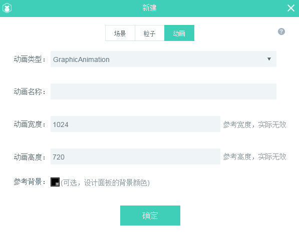

#UI page, particle, animation, script add panel details

In the Project Manager, right-click can create new UI pages, particles, animations, scripts, as shown in Figure 1. This article will introduce some parameters of these functions.

​ 
(Fig. 1)

###New UI Pages

**In the newly built panel,`页面`In the column, you can create two UI interfaces, View and Dialog. As shown in Figure 2**:

​         
(Figure 2)

**[parameter description]**

**Page type**:

The default is View, a type of page that has no shutdown function and is usually used for game background and hierarchical pages that remain open all the time. Another option type is Dialog, which inherits from View. In addition to all the functions of View, Dialog can also realize the functions of pop-up, drag, closing windows, etc. It is often used in the pop-up interface of games.

**page name**:

File name of the new page, which must be filled in.

**Reference view**:

Reference View is a reference picture which is easy to make and match the original design by loading an original picture of art design in the background of the design interface. This item is optional. The background image of the reference view is not exported to the project, but is only used as a reference for UI production.

**Page width**:

The width of the page will not be calculated if it exceeds the width after setting. Checking "only as reference width" requires real-time calculation of the width, which will cause additional pressure on performance. Checking is not recommended.

**Page height**:

The height of the page will not be calculated if it exceeds the height after setting. Checking "only as the reference width" requires real-time calculation of the height, which will cause additional pressure on performance. Checking is not recommended.

**Reference background**:

The reference background is similar to the reference view. It is only used as a reference for UI production and will not work in the project. It is optional.

### **2. New Particles**

In the new particle, we can create 2D example animation of gravity mode and radius mode, and 3D particle animation. As shown in the following figure:

​ 
(Figure 3)

**[Description of parameters]**

**Particle type**:

Particle types are gravity mode, radius mode and particle 3D mode, and gravity mode is defaulted.

Gravity-mode particles are particles that emit at one angle in another direction.

The radius mode is a rotating particle effect with radius around the center point. There is no fundamental difference between radius model and gravity model. The effect of radius model can be achieved by adjusting parameters of gravity model. The effect of radius model can also be adjusted to gravity model. The difference lies only in the different configuration of initial parameters.

Particle 3D mode is based on three-dimensional particle effects.

**Particle name**:

The new particle file name must be filled in.

### **3. New Animation**

In the new animation, you can create a frame animation.

​         
(Figure 4)

**[Description of parameters]**

**Animation type**:

Animation types are Graphic Animation and Effect Animation.

Graphic Animation is the default option to create a timeline animation with multiple animation effects.

Effect Animation is an animation template. It can only create a template of animation effect, which acts on a component, but can not display the animation effect independently.

**Animation name**:

New frame animation file name, the item must be filled in.

**Animation width**:

The setting of animation width is only used as the background width at design time, which is invalid during game operation.

**Animation height**:

The setting of animation height is only used as the background height at the time of design, which is invalid in the game operation.

**Reference background**:

Reference background is only used for background color contrast in animation production, and will not work in the project. It is optional.
