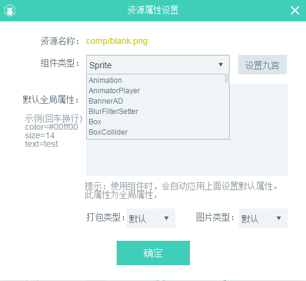

#Introduction to Resource Manager

Resource managers are the working areas we use to access and manage project resources. Adding resources is a necessary step to get started. This article will introduce the functional use of resource managers and resource naming rules.

##1. Introduction of Interface

The resource manager displays the contents of the project resource folder in a tree structure, as shown in Figure 1. Here we introduce the various interface elements.

  (Fig. 1)

​`资源预览界面`The selected resource in the resource list will be directly in the`资源预览界面`Show it.

​`资源列表`In`项目根目录/laya/assets/`The resources in the directory will all be in the`资源列表`Display in. Select the resources in the directory or directory, right-click`打开所在目录`It opens the directory in the operating system directly.

​`常用功能按钮`: at the bottom of explorer are common function buttons, including opening directory, setting default properties, refreshing resource list, keyword filtering.

##2. Introduction of Functions

###2.1 Open the directory where you are located

All resources in resource manager can be managed in IDE or directly in system. Therefore, when`选中`When directories or resources are available,`右键菜单`Click inside`打开所在目录`Or click directly to open the directory where you are located`功能按钮`Open it directly. The operation is shown in Figure 2.

  (Figure 2)

###2.2 Create, delete, refresh

####Create resources and directories

When we open the directory, we can easily create resources and directories. For example, paste the required resources or directories directly into the resource manager root directory (* project root directory / Laya / assets /*), refresh by F5, and the resources can be used in the IDE.

####delete

There are two ways to delete directories or resources. The first is to select the resource or directory to delete in the IDE, click on the delete option in the right-click menu or press the Delete key directly to delete. The second is to open the directory where it is located and delete it directly in the system directory. The difference between the two is that deletion in the IDE will automatically refresh, deletion in the system directory needs to click the refresh button or F5 to refresh in the IDE.

####Refresh

Refresh is a common operation in resource managers. Click on the bottom of Resource Manager`刷新按钮`perhaps`快捷键F7`The resource list of resource managers can be refreshed to be consistent with the system list. You can also press F5 to refresh the list of resource managers.

*Tips: The F5 shortcut key not only refreshes the resource manager, but also refreshes the project manager. If the modified resources are used in UI projects, you need to press the F5 shortcut key.*

For the creation, deletion and refresh of resources and directories, you can refer to Figure 3 of Motion.

  (Motion 3)

###2.3 Filtering Resources

When there are more resources, we can filter resources by entering text keywords in the resource manager search box, which is convenient to find resources quickly. The operation is shown in Figure 4.

  (Motion 4)

###2.4 Setting default properties

If you select a resource or directory, you can set the default properties by right-clicking, or you can directly click on the bottom function button of the resource manager, as shown in Figure 5.

  (Fig. 5)

click`设置默认属性`After that, the bullet resource property settings panel will be set, as shown in Figure 6.

  (Fig. 6)

**Introduction to Settings Panel**

`资源名称`Display the resource name and path in Resource Manager.

`组件类型`Within the drop-down options for component types are all component types (* All component types can be viewed in the document IDE Component Details*). If we want to change the component type recognized by IDE by default and specify it as other component types, we can set it here.

`设置九宫`The effect of this function is the same as that of the nine palaces in the property setter. The specific operation refers to the description of the nine palaces in the property setter.

`默认全局属性`The column corresponds.`属性设置器`For instance, if the width of a component wants to be set to 800, then set "width = 800" in this column. If you want to set more than one attribute in advance, you can set more than one attribute value directly by newline. As shown in Figure 7

  (Figure 7)

**Tips:`设置九宫`And`默认全局属性`Settings belong to the pre-set of component properties. When the same component resource is used in many places and the same properties need to be configured, this setting can reduce a lot of repetitive operations.**

`打包类型`:`默认`Packing rules in Project Settings (F9) will be adopted. In addition, resources can be manually set to`打包`or`不打包`。 When set to a non-default option, the priority of the specified packing type is higher than the project setting.

`图片类型`When two adjacent pictures in IDE are well stitched, but there is stitching gap (usually black line) when the browser runs, set the image type to`Repeat`It can be solved.

###2.5 Use of resources

After selecting the resource, drag and hold the mouse to the scene editor to use the resource component, as shown in Motion 8.

   (动图8)

###2.6 Find References and Text Replacement

####Find references

After selecting the resource component,`右键`click`查找引用`In the Find Replacement Panel, Click`查找`You can find which project pages are referenced by the currently selected component. The operation is shown in Figure 9.

  (Fig. 9)

####replace text

stay`查找替换`In the panel, Click`替换`Can replace all with`查找文本`The same value in`skin属性`Content. As shown in Figure 10.

  (Fig. 10)

###2.7 One-click Replacement of Selected Components in Scene Editor

First select`场景编辑器`Components in, and then`右键`Selection`资源管理器`To replace resources, click on the right-click menu`替换选中对象`That is to replace the components in the scene editor with one click, as shown in Figure 11. This function is more practical when the position has been adjusted and other resources are only wanted to be switched.

  (Motion Fig. 11)

 *Tips: One-click substitution can replace not only the same type of components, but also different types of components.*

##3. Resource Naming Rules

Resources in resource managers are recognized as components in scenario editors, and the default way to identify component types is the named prefix of resources. For example, BTN? XXX will be recognized as a button, and tab? XXX will be recognized as a tab component. Next, we will introduce the detailed rules of resource naming. Developers must be proficient in memory. For developers who don't know about components, read the IDE Component Details document first.

###3.1 Naming Rules for Base Components

The default resource naming rules for LayaAirIDE infrastructure components are listed below:

| Basic Component Name | Chinese Name of Component | Resource Prefix (Full-Written, Case-insensitive) | Resource Prefix (Abbreviation, Case-insensitive)|
| ----------------------------------------------------------------------------------------------------------------------------------------------------------------------------------------------------------------|
| Label | Text Box | Label | -- ___________|
| TextInput | input box | textinput | input_|
| TextArea | Textfield with scrollbar | textarea | area_|
| Button | Button | button | btn_|
| CheckBox | Multiple Choice Box | Checkbox | Check_|
| Radio | radio box | radio | -- ____________|
| Tab | Label | tab | -- ___________|
| Radio Group | Radio Box Button Group | Radio Group | -- ___________|
| VSlider | Vertical Slider | vslider | -- ___________|
| HSlider | Horizontal slider | hslider | ---.|
| Clip | bitmap slice | clip | --|
| fontclip | font slice | fontclip | --|
| ProgressBar | progress bar | ProgressBar | progress_|
| ComboBox | drop-down box | ComboBox | combo_|
| VScrollBar | Vertical scrollbar | vscrollbar | vscroll_|
| HScrollBar | Horizontal scrollbar | hscrollbar | hscroll_|
| Image | Bitmap | Image | img_|
| Sprite | Wizard | Names that do not follow component rules are considered sprite||

**Tips**: resources can be written in full or abbreviated form without underlining. such as`textinput.png`and`input.png`。 But if you follow other characters, you have to underline them, such as`inputAAA.png`It will not be recognized as an input box component.`input_AAA.png`It is recognized as a TextInput component.

###3.2 Special Components

There are five special components in IDE, namely vertical slider component VSlider, horizontal slider component HSlider, progress bar component ProgressBar, vertical scroll bar component VScrollBar, horizontal scroll bar component HScrollBar.

####Composition of special components

The special component is not a single picture, but consists of multiple pictures. The naming rules of the main resource image obey the naming rules of the basic components, and the additional resources are composed of two parts, which are used for each other.`$`Symbols are connected.`$`Previously, it was the name of the primary resource.`$`Then is the name of the associated state.

`bar`Refer to`滑动\移动`Status. such as`ProgressBa$bar.png`From the naming, it can be seen that he belongs to the ProgressBar component when a progress bar is generated（`bar`Use of time`ProgressBa$bar.png`Resources.

`down`Refer to`向下`Status. If it is a horizontal scroll bar,`down`Usually`向右`The default state or click state.

`up`Refer to`向上`Status. If it is a horizontal scroll bar,`up`Usually`向左`The default state or click state.

For a more intuitive understanding of the naming and composition of special components, you can compare the resource naming in Figure 12.

  (Figure 12)

**Tips**:*Because`资源管理器`Additional resources for special components are not displayed separately, and only the main resource components are displayed in the list. If you want to operate on a particular component resource, you need to go through`打开所在目录`Function, in the system file directory for management operations.*

###3.3 Container Components

Container components include Box, List, Tab, RadioGroup, ViewStack, Panel, HBox, VBox, Tree, Sprite. Except for Tab, it usually does not appear in the list of resources, but in the list of resources.`场景编辑器`Conversion from, when in`场景编辑器`When selecting a single or multiple component, use the shortcut key`Ctrl + B`It can be converted to containers, and the various types of containers can be viewed in the drop-down list, as shown in Figure 13.

  (Fig. 13)

###3.4 Prefixes for Custom Component Recognition

If we don't want to adopt the default component prefix of IDE, how can we modify it? modify`laya.editorUI.xml`The component configuration corresponding to the file is enough, and all the information related to the components brought by the IDE is stored in the file.

`laya.editorUI.xml`Be located`LayaAirIDE根目录\resources\app\out\vs\layaEditor\renders\`Under the directory.

`resName`The value in the component is the prefix abbreviation name of the component (the prefix of the component is not modifiable), modified`resName`The value of this is OK. For example, we will`Button`The identification prefix of the component is`resName="btn"`Change to resName= "bt". After saving and refreshing the IDE editor, it is found that the original Button resource named with the BTN prefix is recognized as the Image resource, while the resource named with the BT prefix is recognized as the Button component. As shown in Figure 14.

  (Fig. 14)

*Tips: In the absence of special requirements, it is recommended not to modify the default prefix.*

###3.5 Recognizable resource types (resource suffixes)

LayaAir IDE recognizes only standard PNG and JPG image formats for image resources. Do not use other types of image resources or other types of resources renamed PNG and JPG image resources.

