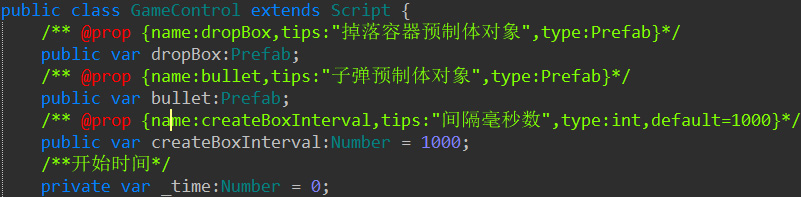

# LayaAir脚本参数说明

LayaAir2.0开始，支持自定义脚本到编辑器，方便扩展已有组件功能


如果想在编辑器内展示脚本定义的属性，可用通过特殊注释来实现

比如下面的脚本类：



在IDE内显示如下：


这样就可用在脚本里面设计显示参数，在IDE内输入参数，然后在脚本里面使用

这种标记同时支持AS,JS,TS三种语言，甚至还可用只写标记，脚本本身没有具体实现（在继承属性时会用得到）


一个完整的标签主要由下面几个部分：

- type	IDE属性类型，此类型是指IDE属性类型，非真正的属性类型，不过大多情况下是一样的

- name      IDE内显示的属性名称

- tips          IDE内鼠标经过属性名称上后，显示的鼠标提示，如果没有则使用name（可选）

- default    输入框显示的默认值（可选）

  ​


IDE默认提供了不少类型供脚本使用，主要参数类型如下：


| 属性名称        | 说明                                       |
| :---------- | :--------------------------------------- |
| name        | 属性显示名称，必须与变量名一致                          |
| tips        | 鼠标经过显示标签                                 |
| type        | 类型：Int,Number,sNumber,String,Bool,Option,editOption,Check,Color,ColorArray,Node,Nodes,Prefab,SizeGrid,Vec,Vector,Ease |
| accept      | String的关联属性，accept:res 为接收资源地址           |
| acceptTypes | Node和accept的关联属性， 接收的类型，比如和节点使用RevoluteJoint,PrismaticJoint,RigidBody;与accept:res使用jpg,png,txt限制后缀 |
| option      | Option和editOption的关联属性 option:可选择列表,如aaa,bbb,ccc |
| min         | Number和sNumber的最小值                       |
| max         | Number和sNumber的最大值                       |
| label       | Nodes的关联属性，展示的属性名(  可选) 如果有则根据labels确定长度 没有就显示长度输入框 |
| types       | Nodes的关联属性,每个元素的类型（可选）                   |
| xCount      | Nodes的关联属性,水平方向显示多少个                     |
| sType       | Nodes的关联属性,单个元素的类型                       |
| default     | 默认值                                      |


```
	/** @prop {name: resType, tips:"abc",type:string,accept:res} */
    
    /** @prop {name:int1,tips:"11",type:Int} */

    /** @prop {name:String,tips:"abc",type:String} */
   
    /** @prop {name:bool,tips:"1,0",type:Bool}*/

	/** @prop {name:Option,tips:"opt",type:Option,option:"aaa,bbb,ccc"}*/

	/** @prop {name:editOption,tips:"editopt",type:EditOption,option:"aaa,bbb,ccc"}*/

	/** @prop {name:check,tips:"ch11eck",type:Check}*/
	
	/** @prop {name:color1,tips:"opt",type:Color}*/
	
	/** @prop {name:snumber1,type:sNumber,min:10,max:100}*/
	
	/** @prop {name:node1,type:Node}*/

	/** @prop {name:sizegrid1,type:SizeGrid}*/
    
    /** @prop {name:colorarray,type:ColorArray}*/
	
    /** @prop {name:vec1,type:Vec}*/   
	
    /** @prop {name:vector1,type:Vector,labes:abc,types:"Node,String,Number,Boolean",xCount:2,sType:Number}*/
    
    /** @prop {name:nodes2,type:Nodes}*/ // 这一条必须选中组件上赋值才有效，在场景选择会失效
    

	/** @prop {name:ease1,type:Ease}*/
	
   
```

部分显示效果如下：

