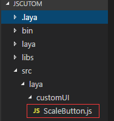
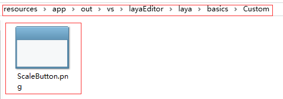
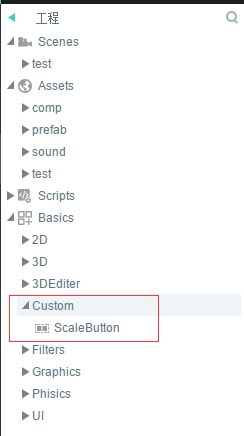
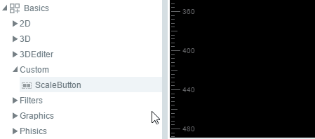
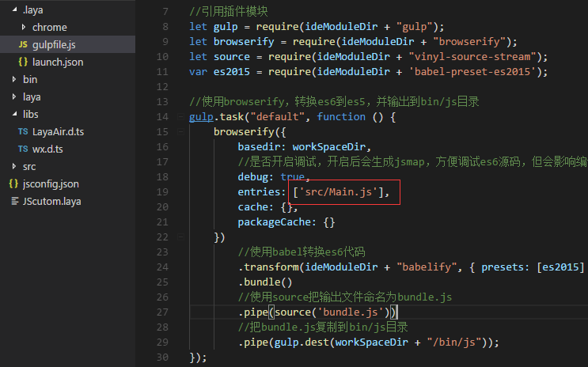
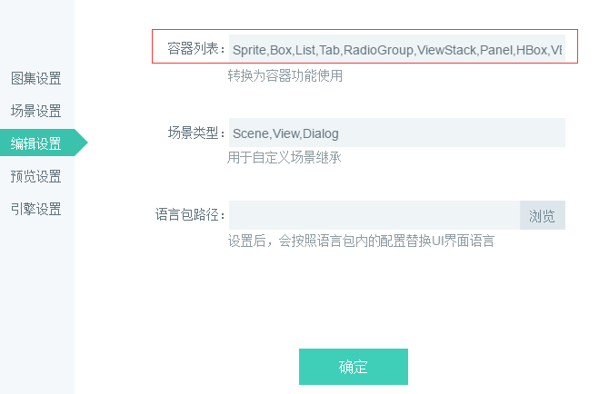

#The Making and Use of Custom Components

LayaAir IDE provides a variety of common UI components to meet basic needs, but in actual development, developers often need custom UI components to meet their special needs. LayaAir provides an interface for custom components. Developers can modify or add components as needed. New components can be identified and used by LayaAir IDE. This article takes the zoom button as an example to show how to add a new component and how to use it in LayaAirIDE.


##1. Understanding Component Structure and Rules

###1.1 Component Directory Structure

The component directory is located in the  resources app out vs layaEditor renders directory under the LayaAirIDE root directory. As shown in Figure 1:


(Fig. 1)

**Introduction to Component Directory Structure**:

Custom: This directory is used to store JS and XML files of custom components.

"Laya. editorUI. js": LayaAirIDE's own component function implementation code;

"Laya. editorUI. xml": configuration information of LayaAirIDE's own components;

###Description of XML configuration information for 1.2 components

A complete component consists of JS and xml. JS is the functional implementation part of the component. XML is the component display and invocation part in the IDE, including the component image resource name (case-sensitive), the option and default value of the attribute panel, etc.

Take the textarea component in laya.editorui.xml as an example:


```xml

<TextArea className="laya.editorUI.TextArea" inherit="TextInput" defaultValue="text='TextArea'" skinLabel="skin" resName="area" icon="TextArea" groups="公用,常用,宽高及位置,旋转及缩放" drag="3">
	<prop name="vScrollBarSkin" tips="垂直滚动条皮肤" type="string" default="" accept="res" group="常用" />
	<prop name="hScrollBarSkin" tips="水平滚动条皮肤" type="string" default="" accept="res" group="常用" />
</TextArea>
```


**Component XML Description**:

"`<textarea></textarea>`": TextArea tags serve as the beginning and end of components. TextArea can be named differently from categories, but it should be easy to understand and memorize for display of component names in IDE.

"`classsName`": The complete class path of the component, such as laya. editorUI. TextArea;

"`inherit`": Inherited parent class;

"`defaultValue`": Default values for component properties;

"`skinLabel`": For skin-related settings in the properties panel. The value of skinLabel corresponds to the name field and related settings of prop. If there is no one in prop, it will not be set, and there will be no such settings in the TextArea component.

"`resName`": Component resource prefix (case-sensitive), resources with the prefix are recognized as the component; TextArea is configured as the abbreviation mode of TextArea, and TextArea is displayed in the component panel of IDE. In terms of component naming, you can view the IDE component-based "Component Resource Naming Rules" document.

"`icon`": The icon name (case-sensitive) displayed by the component in the IDE. The icon directory is located in the"resources app out vs layaEditor laya icons components"directory under the LayaAirIDE root directory. Here we can create a new icon, or multiple components can use one icon together. For example: textarea will correspond to textarea.png in the component directory

"`groups`": Group display for attribute panel, separated by commas;

"`drag`": Drawing parameters: 1: there are two points, which can only be stretched horizontally, such as hscroll component; 2: there are two points, which can only be stretched vertically, such as vscroll component; 3: there are eight points, which can be stretched horizontally, vertically, enlarged and reduced;

"`<prop>`": In prop is the setting of attributes in the attribute panel, and each prop tag corresponds to a component attribute.</prop>

"`name`": The name of the property will be displayed in the property panel.

"`tips`": The tips prompt displayed on the property name is hovered over the mouse;

"`type`": Type of attribute values in the input box;

"`default`": The default value of this property;

"`accept`": This property receives res and files values. Res represents that the property bar can be dragged into a single resource; files represent that the property bar can be dragged into multiple resources;

"`group`": The group in which the attribute is located; corresponding to the group in the group, the non-existent group belongs to the"other"group;


##2. Import LayaAirIDE Component Library

###2.1 Download LayaAirIDE Component Library (JS version)

**Download address**:[https://layabox.github.io/layaair-doc/resources/2D/Component/layaeditor.d.zip](https://layabox.github.io/layaair-doc/resources/2D/Component/layaeditor.d.zip)

*Tips: TS and JS versions can use the same component library*

###2.2 Create a project and import it into the project directory

First, create a JS project with LayaAirIDE (see the relevant tutorials for creating the project, this article will not elaborate). Then the zip package downloaded is decompressed and the layaeditor.d.ts file is placed in the LIBS directory. As shown in Figure 2:


(Fig. 2)


##3. Making a custom component

###3.1 Create a Component Class

First create a component directory (package) "laya/customUI" to facilitate the classification of other components in the future, and then create a scaleButton.js class under the customUI directory, as shown in Figure 3:


(Fig. 3)

After the creation is complete, we begin to write the following code for the scaling component:


```javascript


    export default class ScaleButton extends laya.editorUI.Button {
        constructor(skin,label=""){
           
            super(skin, label);
            /* 设置按钮为单态按钮
            ** 取值：
            ** 1：单态。图片不做切割，按钮的皮肤状态只有一种。
            ** 2：两态。图片将以竖直方向被等比切割为2部分，从上向下，依次为弹起状态皮肤、按下和经过及选中状态皮肤。
            ** 3：三态。图片将以竖直方向被等比切割为2部分，从上向下，依次为弹起状态皮肤、经过状态皮肤、按下和选中状态皮肤
            */
            this.stateNum = 1;
            //添加鼠标按下事件侦听。按时时缩小按钮。
            this.on(Laya.Event.MOUSE_DOWN, this, this.scaleSmall);
            //添加鼠标抬起事件侦听。抬起时还原按钮。
            this.on(Laya.Event.MOUSE_UP, this, this.scaleBig);
            //添加鼠标离开事件侦听。离开时还原按钮。
            this.on(Laya.Event.MOUSE_OUT, this, this.scaleBig);
        }
        scaleSmall(){
            //缩小至0.8的缓动效果
            Laya.Tween.to(this, {scaleX:0.8, scaleY: 0.8}, 100);
        }
        scaleBig(){
            //变大还原的缓动效果
            Laya.Tween.to(this, {scaleX:1, scaleY:1}, 100);
        }
    }

```


###3.2 Writing XML configuration files for components

According to the XML configuration instructions mentioned above, we complete the XML configuration of the zoom button, and the custom component is even completed. The XML configuration information of the zoom button is written as follows:


```xml

<?xml version="1.0" encoding="utf-8" ?>
<uiComp>
	<ScaleButton className="laya.customUI.ScaleButton" runClass="laya.customUI.ScaleButton"  inherit="Button" skinLabel="skin" 
	defaultValue="label=''" resName="sbtn" icon="sbtn" groups="公用，常用，宽高及位置" drag="3">
		<prop name="scaleTime" tips="缩放使用的时间" type="number" default="100" group="常用" />
	</ScaleButton>
</uiComp>
```


*Tips: XML Configuration Information Content Interpretation refers to the component XML description above.*


##4. Adding and Using Custom Components

###4.1 Adding components to the IDE's custom component directory

After compiling the XML configuration file, it is stored directly in the directory of the custom component (resources app out vs layaEditor renders custom) under the root directory of LayaAirIDE). The name of the component XML needs to be consistent with that of the component js. Here we call it ScaleButton. xml. Then we copy the written ScaleButton. JS ("project root directory / SRC / Laya / customUI" directory, refer to Figure 3) to the directory of the custom component. As shown in Figure 4:


(Fig. 4)


###4.2 Displayed in IDE Component Panel

Open the IDE component directory (LayaAirIDE root directory resources app out vs layaEditor laya basics) and create a custom component storage directory Custom to store self-defined components, as shown in Figure 5.


(Fig. 5)

Then place a PNG icon named SBTN in the custom directory (the recommended size is 16 * 16), as shown in Figure 6. After completing this step, we can find our own zoom button component in the component panel of IDE, as shown in Figure 7.


(Figure 6) Icon naming the value of resName attribute in the corresponding component XML


(Figure 7) The component name of the IDE corresponds to the tag name of the component XML

**Tips:**Additionally, the icon icon of the component is not sbtn.png in the "LayaAirIDE root directory resources app out vs layaEditor laya basics Custom" directory. Icon icon is located in the "resources app out vs layaEditor laya laya icons components" directory under the root directory of LayaAirIDE, corresponding to the value of icon attribute in xml, which is described in the XML description above. If you create your own icon, refer to the icon size identification in the components directory, make it into the components directory, and then set the corresponding file name in xml.


###4.3 Displayed in IDE Resource Panel

In the resource panel, by default, skin resources of common UI components are placed in the comp file, and skin resources are easily identified as components by component naming rules (resources must be stored in the "project root directory laya assets" before they can be identified as components). Unlike the component attribute skin value of the component panel, the default value of the component attribute skin in the resource panel is the relative path in the " laya assets" directory.

To facilitate project use of components with skin resources, we continue to describe how to display components in the resource panel. First, we prepare a skin resource. Since the custom component of the example above is the zoom button, we can directly copy any picture to experience the zoom effect of the zoom button component. Picture resources can be copied to the "project root directory laya assets" directory. Picture resources are named ScaleButton or prefixed with ScaleButton as the attribute value of resName in xml, as shown in Figure 8.


(Fig. 8)

After the resource replication is completed, we open the resource management panel of LayaAirIDE again, click the refresh resource tree button to see the newly replicated ScaleButton_monkey.png, click the picture, and we can see the preview of the picture. This shows that our custom component with skin default value was successfully added to the project's resource management panel, as shown in Figure 9.


(Fig. 9)

　　*Tips: The components displayed in the resource panel are only used for the current project. Adding them to the component panel is the common component for all projects.*

###4.4 Use custom components

Create a demo page in the project management panel (this page is only for demonstrating the effects of components, without detailed description of the operation steps). There are two ways to use our custom zoom button component.

####4.4.1 Used from Resource Panel

In the Resource Management Panel, find the component prefixed by sbtn, drag it directly to the page, and click to see the zoom effect, as shown in Figure 10.


(FIG. 10)

####4.4.2 Used from Component Panel

Find the ScaleButton component in the component panel, drag it directly to the page, and click to see the scaling effect, as shown in Figure 11.


(Figure 11) The component panel does not contain image resources and needs to be set through the property skin


##5. Debugging of Components

According to the above, we have completed the whole process of making and using LayaAirIDE components. However, in the formal process of customizing components, there is a very important step. In order to simplify the process and achieve the goal of customizing components as soon as possible, this step is the debugging of components.

With the smooth operation of documents, the lack of debugging links is no problem, but in the actual development process, most people can not guarantee that there are no errors in coding. Adding components with errors to the IDE will not go as smoothly as in this document, and components are difficult to debug in the IDE. Therefore, in this section, we add the missing steps. After compiling the components, we debug them first, and then subcontract and compile them.


###5.1 Resource Path to Copy Pictures to Projects

Copy a picture to the project's resource path under the project root directory / RES / img directory, as shown in Figure 12.


(Fig. 12)


###5.2 Modify class references for components

Open ScaleButton.js, the scaling button code written above, and modify the button inherited from the ui. As shown in Figure 13:


(FIG. 13)


###5.3 Create an entry class

Create an entry class Main.js under Project Root Directory/src, coded as follows:


```javascript

import ScaleButton from "./laya/customUI/ScaleButton"
import GameConfig from "./GameConfig";

class Main {
	constructor() {
		//根据IDE设置初始化引擎		
		if (window["Laya3D"]) Laya3D.init(GameConfig.width, GameConfig.height);
		else Laya.init(GameConfig.width, GameConfig.height, Laya["WebGL"]);

	

		Laya["Physics"] && Laya["Physics"].enable();
		Laya["DebugPanel"] && Laya["DebugPanel"].enable();
		Laya.stage.scaleMode = GameConfig.scaleMode;
		Laya.stage.screenMode = GameConfig.screenMode;
		Laya.stage.alignV = GameConfig.alignV;
		Laya.stage.alignH = GameConfig.alignH;

		//打开调试面板（通过IDE设置调试模式，或者url地址增加debug=true参数，均可打开调试面板）
		if (GameConfig.debug || Laya.Utils.getQueryString("debug") == "true") Laya.enableDebugPanel();
		if (GameConfig.stat) Laya.Stat.show();
		Laya.alertGlobalError = true;

		//激活资源版本控制，version.json由IDE发布功能自动生成，如果没有也不影响后续流程
		Laya.ResourceVersion.enable("version.json", Laya.Handler.create(this, this.onVersionLoaded), Laya.ResourceVersion.FILENAME_VERSION);
	}

	onVersionLoaded() {
		//激活大小图映射，加载小图的时候，如果发现小图在大图合集里面，则优先加载大图合集，而不是小图
		Laya.AtlasInfoManager.enable("fileconfig.json", Laya.Handler.create(this, this.onConfigLoaded));
	}

	onConfigLoaded() {
		//加载资源
                     Laya.loader.load("img/monkey.png",Laya.Handler.create(this,this.onLoaded),null,Laya.Loader.IMAGE)

	}
	 onLoaded(){
		var scaleButton = new ScaleButton();
		//组件skin的资源路径
		scaleButton.skin = "img/monkey.png";
		//添加到舞台上
		Laya.stage.addChild(scaleButton);
	}
}
//激活启动类
new Main();

```


Main is set as the startup class in gulpfile.js file, as shown in Figure 14. Then click in the browser to achieve the zoom effect, as shown in Figure 15. Explain that this is a valid custom component that can be safely added to the IDE for use.


(FIG. 14)


(FIG. 15)

*Tips: Successful debugging, don't forget to debug when you are ready to release components`export default class ScaleButton extends Laya.Button `We should also restore to`export default class ScaleButton extends laya.editorUI.Button;`。*


##6. Registration of Components

Component registration is to associate a custom component with a class name, which is displayed as an instance according to the registration mapping.

**For example:**


```javascript

View.regComponent("ScaleButton",laya.customUI.ScaleButton);//注册组件
```


##7. Other Notes

If the custom component is a container class component, if it needs to be used in the project, you need to open the project settings panel according to F9 in the Editor Mode of the LayaAir IDE project, and add the custom container component class name (in English comma interval) to the Container List, as shown in Figure 16.


(FIG. 16)


If the custom component is a page class component, if you need to use it in the project, you need to open the project settings panel in the Editor Mode of the LayaAir IDE project and add a custom page component class name (in comma interval) to the Page List, as shown in Figure 17.


(FIG. 17)


This is the end of this article. If you have any questions, please come to the community and ask:[http://ask.layabox.com](http://localhost/LayaAir2_Auto/img/http://ask.layabox.com)