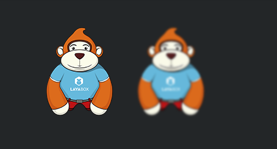

# 设置滤镜效果

> LayaAir引擎提供了颜色滤镜、发光（或阴影）滤镜、模糊滤镜三种效果。其中颜色滤镜支持Canvas与WebGL模式，而发光滤镜与模糊滤镜由于对性能的消耗较大，因此仅支持WebGL模式。


## 1、设置颜色滤镜

### 1.1 颜色滤镜 API 简述

颜色滤镜类 ColorFilter位于laya.filters包中，通过指定矩阵（*排列成4 x 5 的矩阵*）改变各颜色通道。

点击   [laya.filters.ColorFilter ](http://layaair.ldc.layabox.com/api/index.html?category=Filter&class=laya.filters.ColorFilter) 查看API说明。


### 1.2 设置颜色滤镜

如果要给一个位图设置颜色滤镜，需要先设置一个颜色矩阵，然后用ColorFilter方法创建一个颜色滤镜实例，如下面的代码所示：

```typescript
//颜色滤镜矩阵，红色
var colorMatrix:any = 
  [
  1, 0, 0, 0, 0, //R
  0, 0, 0, 0, 0, //G
  0, 0, 0, 0, 0, //B
  0, 0, 0, 1, 0, //A
];

//创建红色颜色滤镜
var redFilter:Laya.ColorFilter = new Laya.ColorFilter(colorMatrix);
```

最后通过Spriter的filters属性将颜色滤镜效果叠加到位图中。下面我们创建一个Main.ts类，编写代码如下：

```typescript
module laya {
    import Sprite = Laya.Sprite;
    import Stage = Laya.Stage;
    import ColorFilter = Laya.ColorFilter;
    import Texture = Laya.Texture;
    import Browser = Laya.Browser;
    import Handler = Laya.Handler;
    import WebGL = Laya.WebGL;

    export class Main {
        private ApePath: string = "../../res/apes/monkey2.png";

        private apeTexture: Texture;

        constructor() {
            // 不支持WebGL时自动切换至Canvas
            Laya.init(Browser.clientWidth, Browser.clientHeight, WebGL);

            Laya.stage.alignV = Stage.ALIGN_MIDDLE;
            Laya.stage.alignH = Stage.ALIGN_CENTER;

            Laya.stage.scaleMode = "showall";
            Laya.stage.bgColor = "#232628";

            Laya.loader.load(this.ApePath, Handler.create(this, this.setup));
        }

        private setup(): void {
            this.normalizeApe();
            this.makeRedApe();
            this.grayingApe();
        }

        private normalizeApe(): void {
            var originalApe: Sprite = this.createApe();

            this.apeTexture = Laya.loader.getRes(this.ApePath);
            originalApe.x = (Laya.stage.width - this.apeTexture.width * 3) / 2;
            originalApe.y = (Laya.stage.height - this.apeTexture.height) / 2;
        }

        private makeRedApe(): void {
            //由 20 个项目（排列成 4 x 5 矩阵）组成的数组，红色
            var redMat: Array<number> =
                [
                    1, 0, 0, 0, 0, //R
                    0, 0, 0, 0, 0, //G
                    0, 0, 0, 0, 0, //B
                    0, 0, 0, 1, 0, //A
                ];

            //创建一个颜色滤镜对象,红色
            var redFilter: ColorFilter = new ColorFilter(redMat);

            // 赤化猩猩
            var redApe: Sprite = this.createApe();
            redApe.filters = [redFilter];

            var firstChild: any = Laya.stage.getChildAt(0);
            redApe.x = firstChild.x + this.apeTexture.width;
            redApe.y = firstChild.y;
        }

        private grayingApe(): void {
            //由 20 个项目（排列成 4 x 5 矩阵）组成的数组，灰图
            var grayscaleMat: Array<number> = [0.3086, 0.6094, 0.0820, 0, 0, 0.3086, 0.6094, 0.0820, 0, 0, 0.3086, 0.6094, 0.0820, 0, 0, 0, 0, 0, 1, 0];

            //创建一个颜色滤镜对象，灰图
            var grayscaleFilter: ColorFilter = new ColorFilter(grayscaleMat);

            // 灰度猩猩
            var grayApe: Sprite = this.createApe();
            grayApe.filters = [grayscaleFilter];

            var secondChild: any = Laya.stage.getChildAt(1);
            grayApe.x = secondChild.x + this.apeTexture.width;
            grayApe.y = secondChild.y;
        }

        private createApe(): Sprite {
            var ape: Sprite = new Sprite();
            ape.loadImage("../../res/apes/monkey2.png");
            Laya.stage.addChild(ape);

            return ape;
        }
    }
}

new laya.Main();
```

在上面的代码中，我们创建了一个原始位图、一个红色滤镜效果位图、一个灰色滤镜效果位图。运行效果如图1所示：

 <br /> (图1)


## 2、设置发光与阴影滤镜

### 2.1 发光滤镜 API 简述

发光滤镜类 GlowFilter位于laya.filters包中，通过调整发光的偏移角度也可以当成阴影滤使用，参数说明如图2所示。注意：该滤镜只支持WebGL模式下有效。

 <br /> (图2)

点击   [laya.filters. GlowFilter](http://layaair.ldc.layabox.com/api/index.html?category=Filter&class=laya.filters.GlowFilter)  查看API说明。


### 2.2 设置发光滤镜与阴影滤镜

发光与阴影滤镜的设置比较简单，我们直接通过编码查看示例效果，

先创建一个Main.ts类，编写代码如下：

```typescript
module laya {
    import Sprite = Laya.Sprite;
    import Stage = Laya.Stage;
    import GlowFilter = Laya.GlowFilter;
    import Browser = Laya.Browser;
    import Handler = Laya.Handler;
    import WebGL = Laya.WebGL;

    export class Main{
        private apePath: string = "../../res/apes/monkey2.png";

        private ape: Sprite;
        private apeGlow:Sprite;
        private apeShadow:Sprite;

        constructor() {
            // 不支持WebGL时自动切换至Canvas
            Laya.init(Browser.clientWidth, Browser.clientHeight, WebGL);

            Laya.stage.alignV = Stage.ALIGN_MIDDLE;
            Laya.stage.alignH = Stage.ALIGN_CENTER;

            Laya.stage.scaleMode = "showall";
            Laya.stage.bgColor = "#aabbcc";

            Laya.loader.load(this.apePath, Handler.create(this, this.setup));
        }

        private setup(): void {
             this.ape=this.createApe();
             this.ape.pos(100,50);
             this.apeGlow = this.createApe();
             this.apeGlow.pos(250,50);
             this.apeShadow = this.createApe();
             this.apeShadow.pos(400,50);
             this.GlowFilter();
             this.ShadowFilter();
        }
 
        private createApe(): Sprite {
            var ape = new Sprite();
            ape.loadImage(this.apePath);
            Laya.stage.addChild(ape);
            return ape;
        }

        private GlowFilter(): void {
            //创建一个发光滤镜
            var glowFilter: GlowFilter = new GlowFilter("#ffff00", 10, 0, 0);
            //设置滤镜集合为发光滤镜
            this.apeGlow.filters = [glowFilter];
        }
        private ShadowFilter(): void {
            //创建一个发光滤镜
            var shadowFilter: GlowFilter = new GlowFilter("#000000", 8, 8, 8);
            //设置滤镜为阴影滤镜
            this.apeShadow.filters = [shadowFilter];
        }
    }
}
new laya.Main();
```

在上面的代码中，我们创建了一个原始位图、一个发光滤镜效果位图、一个阴影滤镜效果位图。运行效果如图3所示：

 <br /> (图3)


## 3、设置模糊滤镜

### 3.1 模糊滤镜 API 简述

模糊滤镜类 BlurFilter位于laya.filters包中，通过调整strength参数设置模糊滤镜的强度，值越大，越糊滤。参数说明如图4所示。注意：该滤镜只支持WebGL模式下有效。

 <br /> (图4)

点击   [laya.filters. BlurFilter](http://layaair.ldc.layabox.com/api/index.html?category=Filter&class=laya.filters.BlurFilter)  查看API说明。


### 3.2 设置模糊滤镜

模糊滤镜的设置比较简单，创建一个模糊滤镜实例，然后设置模糊强度，叠加给位图即可，我们直接通过编码查看示例效果。

先创建一个Main.ts类，编写代码如下：

```typescript
module laya {
    import Sprite = Laya.Sprite;
    import Stage = Laya.Stage;
    import BlurFilter = Laya.BlurFilter;
    import Browser = Laya.Browser;
    import Handler = Laya.Handler;
    import WebGL = Laya.WebGL;

    export class Main {
        private apePath: string = "../../res/apes/monkey2.png";

        constructor() {
            // 不支持WebGL时自动切换至Canvas
            Laya.init(Browser.clientWidth, Browser.clientHeight, WebGL);

            Laya.stage.alignV = Stage.ALIGN_MIDDLE;
            Laya.stage.alignH = Stage.ALIGN_CENTER;

            Laya.stage.scaleMode = "showall";
            Laya.stage.bgColor = "#232628";

            Laya.loader.load(this.apePath, Handler.create(this, this.createApe));
        }

        private createApe(): void {
            var ape: Sprite = new Sprite();
            ape.loadImage(this.apePath);

            ape.pos(100,50);
            
            var apeBlur:Sprite = new Sprite();
            apeBlur.loadImage(this.apePath);
            apeBlur.pos(250,50);

            Laya.stage.addChild(ape);
            Laya.stage.addChild(apeBlur);

            this.applayFilter(apeBlur);
        }

        private applayFilter(ape: Sprite): void {
            var blurFilter: BlurFilter = new BlurFilter();
            blurFilter.strength = 5;
            ape.filters = [blurFilter];
        }
    }
}
new laya.Main();
```

在上面的代码中，我们创建了一个原始位图、一个模糊滤镜效果位图。运行效果如图5所示：

 <br /> (图5)


