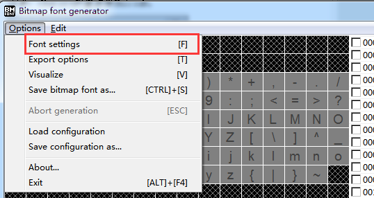

#The Making and Use of Bitmap Font

Used Starling or Cocos, or even Unity, you will certainly not be unfamiliar with the bitmap font, a simple picture, put in a custom text, you can make a good text display effect in the project. The LayaAir also supports the use and display of bitmap fonts. Below is the use of bitmap fonts in LayaAir.

###Making Bitmap Fonts

1. Write the text you need to export in a TXT text.

</br>

2. Select the file - > save it as a Unicode coded TXT file.

</br>

3. Download and install Bitmap Font Generator, a free bitmap font making tool under Windows.
Download address:[http://www.angelcode.com/products/bmfont/](http://www.angelcode.com/products/bmfont/install_bmfont_1.13.exe)

4. Open the software and select Opotion - > FontSetting to set the normal settings of fonts that need to be exported. After setting up, click OK button to save.

</br>

**Important parameters:**

Font: The font used for the exported bitmap font.
Size: Sets the font size used for the exported bitmap font. It is recommended to set the same size of fonts here when using them.
Height: Set the stretch height of the font and keep it at 100% by default.
 *Note: The value of Charset is Unicode.*

</br>

5. In the menu bar Edit - > Select chars from file, select the txt file you just created. If the prompt fails, check whether the txt file is unicode-coded and whether the font contains the font in the text.

</br>

6. Set export style, select Options - > Export Options in the menu bar, open Export Options to set export options, and click OK button to save after setting.

Padding: How much space is left in the inner border of the text, or in the surrounding area of the text. This property is very important when making late style. It needs to reserve space for edge tracing, lighting and other special effects. For example, it is expected to add a 2px border and a 2px projection effect in the lower right corner, so padding: 2px 4PX 4PX 2px is set.
Bit depth: Must be 32 bits, otherwise there is no transparent layer.
Presets: Font initialization default color channel settings, that is, what the initial color settings of the font are, it is recommended to use white characters, can be directly set to white text with alpha, that is, white transparent bottom.
Font descriptor: Font description file, select xml.
Textures: Texture image format, select png.

</br>

7. Export bitmap fonts. Select Options - > Save bitmap font as... The export generates a font description file (. fnt format) and a font texture map file (. png format).


###Use bitmap fonts in LayaAir projects

1. Put resources in the output directory of the project.
Change the bitmap file to the same name (. FNT file and. PNG file) and put it in bin / H5 directory of layaair project.

</br>

Figure: Change the name of test_0.png to test.png to ensure the same name as the fnt file. Then put the test. PNG and test. FNT files in the H5 directory.

**Bitmap fonts are commonly used in LayaAir projects:**

1. Create bitmap font objects.

2. Load bitmap fonts and listen for completion.

3. Register bitmap fonts.

4. Use fonts.

The following is a complete example of the effect of running.

</br>

The complete code is as follows:


```typescript

module laya {
    import BitmapFont = Laya.BitmapFont;
    import Stage = Laya.Stage;
    import Text = Laya.Text;
    import Browser = Laya.Browser;
    import Handler = Laya.Handler;
    import WebGL = Laya.WebGL;

    export class Text_BitmapFont {
        private fontName: string = "diyFont";

        constructor()
        {
            // 不支持WebGL时自动切换至Canvas
            Laya.init(Browser.clientWidth, Browser.clientHeight, WebGL);

            Laya.stage.alignV = Stage.ALIGN_MIDDLE;
            Laya.stage.alignH = Stage.ALIGN_CENTER;

            Laya.stage.scaleMode = "showall";
            Laya.stage.bgColor = "#232628";
            this.loadFont();
        }

       private loadFont(): void {
            var bitmapFont: BitmapFont = new BitmapFont();
            bitmapFont.loadFont("test.fnt", new Handler(this, this.onFontLoaded, [bitmapFont]));
        }

        private onFontLoaded(bitmapFont: BitmapFont): void {
            bitmapFont.setSpaceWidth(10);
            Text.registerBitmapFont(this.fontName, bitmapFont);
            this.createText(this.fontName);
        }
        private createText(font: string): void {
            var txt: Text = new Text();
            txt.width = 250;
            txt.wordWrap = true;
            txt.text = "这是测试";
            txt.font = font;
            txt.leading = 5;
            txt.pos(Laya.stage.width - txt.width >> 1, Laya.stage.height - txt.height >> 1);
            Laya.stage.addChild(txt);
        }
    }
}
new laya.Text_BitmapFont();
```


### **Related interfaces in the Text class:**

**RegisterBitmapFont () method**

Public static function register BitmapFont (name: String, bitmap Font: BitmapFont): void

Register bitmap fonts.

parameter

Name: String - The name of a bitmap font.
BitmapFont: BitmapFont - BitmapFont font file.

**UnregisterBitmapFont () method**

Public static function unregisterBitmapFont (name: String, destory: Boolean = true): void

Remove the registered bitmap font file.

parameter

Name: String - The name of a bitmap font.
Destory: Boolean (default = true) - Whether to destroy the current font file.

###Relevant interfaces in the BitmapFont class:

**LoadFont () method**

Public function loadFont (path: String, complete: Handler): void

Load the bitmap font file by specifying the path of the bitmap font file.

parameter
Path: String - The path to a bitmap font file.
Comple: Handler - Callback after loading, notifying the upper font file that loading and parsing have been completed.

**ParseFont () method**

Public function parseFont (xml: XmlDom, texture: Texture): void

Parse font files.

parameter

Xml: XmlDom - Font file XML.
Texture: Texture - Texture of fonts.

**Destory () method**

Public function destory (): void

Destroy the bitmap font and call Text. unregisterBitmapFont by default.

**SetSpaceWidth () method**

Public function setSpaceWidth (space Width: Number): void

Set the width of the space (if there are spaces in the font library, you don't need to set them here).

parameter

SpaceWidth: Number - Width, in pixels.


###Use bitmap fonts in LayaAir IDE

1. Place the font file in the resource directory (laya/assets/) of the LayaAir IDE project to ensure that the two file names are identical, such as test.fnt and test.png, so that the bitmap font named test is automatically registered.

</br>

2. The font attribute value of the text component that will set the bitmap font is set to the name of the bitmap font that has been imported into the editor.

</br>

3. Before instantiating a page that uses bitmap fonts in program code, it is necessary to create and register the bitmap fonts used in the page.